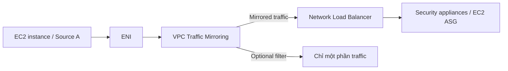

# 342. VPC Traffic Mirroring

## 🎯 Giới thiệu
VPC Traffic Mirroring là một tính năng bảo mật giúp **capture** và **inspect** network traffic trong VPC theo cách **không ảnh hưởng** đến hoạt động của nguồn traffic.

- Mục tiêu: phân tích traffic mạng một cách **non-intrusive**
- Traffic được **mirror** đến các security appliances do bạn quản lý
- Có thể chọn:
  - **Source ENIs**: nơi lấy traffic
  - **Targets**: nơi nhận traffic, যেমন **own ENIs** hoặc **Network Load Balancer**
- Có thể dùng **filter** để chỉ lấy một phần traffic cần thiết

## 1. Cách hoạt động
Ví dụ trong transcript:

- Một **EC2 instance** có **ENI** gắn vào
- EC2 đang có cả **inbound** và **outbound traffic**
- Bạn muốn phân tích traffic này mà không làm gián đoạn EC2
- Thiết lập **VPC Traffic Mirroring**
- Traffic từ Source A được mirror đến **Network Load Balancer**
- Phía sau NLB là **Auto Scaling Group** các EC2 instances có cài **security software**
- Source A vẫn hoạt động bình thường, không biết traffic của nó đang bị mirror

## 2. Phạm vi áp dụng
- Không chỉ áp dụng cho **một source**
- Có thể mirror traffic từ **nhiều sources**
- Có thể dùng khi:
  - Source và target ở **cùng VPC**
  - Hoặc ở **different VPC** nếu đã bật **VPC Peering**

## 3. Use cases chính
VPC Traffic Mirroring được dùng cho:

- **Content inspection**
- **Threat monitoring**
- **Troubleshooting** từ góc nhìn network

## 📊 Bảng tóm tắt
| Tiêu chí | Mô tả |
|----------|------|
| Mục đích | Capture và inspect network traffic trong VPC mà không ảnh hưởng source |
| Source | **Source ENIs** của EC2 hoặc các nguồn traffic khác |
| Target | **Own ENIs** hoặc **Network Load Balancer** |
| Tính chất | **Non-intrusive**, source vẫn hoạt động bình thường |
| Lọc traffic | Có thể dùng **filter** để chọn một phần traffic |
| Phạm vi | Một source hoặc nhiều sources |
| Điều kiện VPC | Cùng VPC hoặc khác VPC nếu có **VPC Peering** |
| Use cases | Content inspection, threat monitoring, troubleshooting |

## 💡 Mẹo ghi nhớ cho kỳ thi AWS
- Nhớ cụm: **mirror traffic, not interrupt source**
- **Source ENI** là nơi lấy traffic, **Target** là nơi phân tích
- Nếu thấy câu hỏi về:
  - giám sát traffic
  - phân tích gói tin
  - security appliance
  - không muốn ảnh hưởng EC2
  thì nghĩ đến **VPC Traffic Mirroring**
- Có thể dùng **Network Load Balancer** làm target
- Có **optional filter** nếu chỉ cần một phần traffic

## ✅ Kết luận
VPC Traffic Mirroring là giải pháp để **sao chép traffic trong VPC** sang nơi phân tích như **Network Load Balancer** hoặc ENIs khác, phục vụ **security**, **monitoring**, và **troubleshooting** mà không làm gián đoạn nguồn traffic.
