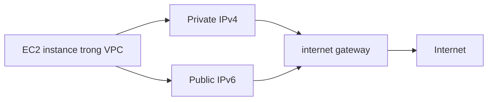
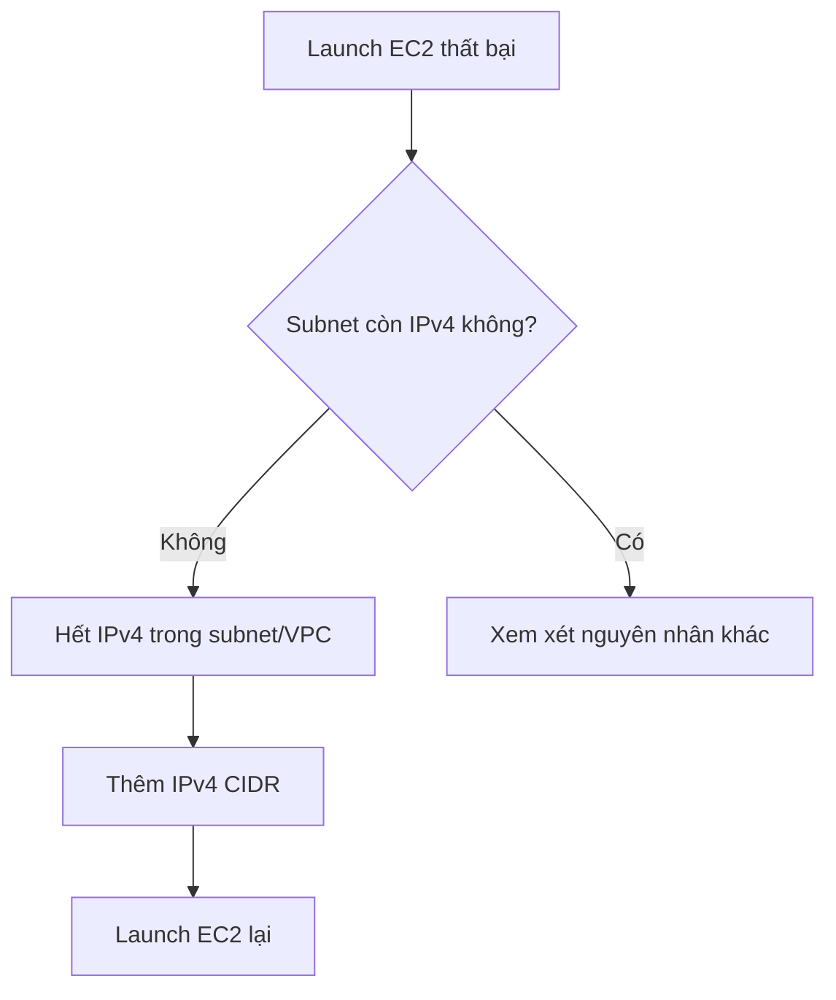

# 343. IPv6 for VPC

## 🎯 Giới thiệu
- IPv4 được thiết kế với khoảng 4.3 tỷ địa chỉ, nhưng đã dần cạn kiệt.
- IPv6 là thế hệ kế tiếp của IPv4, được tạo ra để mở rộng không gian địa chỉ.
- Trong AWS, mọi IPv6 address đều là **public** và **internet-routable**.
- Nội dung trọng tâm của bài:
  - Bật IPv6 trong VPC
  - Chế độ **dual-stack**
  - Cách xử lý lỗi khi launch EC2 trong subnet đã hết IPv4

## 1. IPv6 là gì trong AWS? 🌐
- IPv6 cung cấp số lượng địa chỉ cực lớn: `3.4 x 10^38` unique IP addresses.
- Định dạng IPv6 gồm 8 nhóm hexadecimal.
- Không cần nhớ cách cấu thành chi tiết, chỉ cần nhận biết được đây là IPv6.
- Điểm quan trọng trong AWS:
  - IPv6 luôn là **public**
  - IPv6 có thể dùng để truy cập internet

## 2. IPv6 trong VPC và dual-stack 🖧
- IPv4 **không thể bị disable** trong VPC và subnets.
- Có thể **enable IPv6** cho VPC để chạy **dual-stack mode**.
- Khi launch EC2 trong VPC:
  - EC2 sẽ có ít nhất một **private internal IPv4**
  - Và một **public IPv6**
- EC2 có thể giao tiếp ra internet bằng:
  - IPv4
  - IPv6
- **internet gateway** hỗ trợ kết nối cho cả IPv4 và IPv6.

## 3. Tình huống troubleshooting IPv6 🚨
- Nếu VPC đã enable IPv6 nhưng không launch được EC2 trong subnet:
  - **Không phải** do hết IPv6
  - Mà thường là do **hết IPv4** trong subnet
- Lý do:
  - IPv4 vẫn bắt buộc tồn tại trong VPC và subnets
  - IPv6 space rất lớn nên gần như không phải nguyên nhân gây hết địa chỉ
- Cách xử lý:
  - Tạo thêm **IPv4 CIDR** cho subnet / VPC
  - Sau đó có thể launch EC2 tiếp với dải IPv4 mới

## 📊 Bảng tóm tắt
| Tiêu chí | Mô tả |
|----------|------|
| Mục đích IPv6 | Thay thế IPv4 khi IPv4 dần cạn kiệt |
| Số lượng địa chỉ | `3.4 x 10^38` unique IP addresses |
| IPv6 trong AWS | Mọi IPv6 address đều public và internet-routable |
| IPv4 trong VPC | Không thể disable |
| Cấu hình thường gặp | Dual-stack: private IPv4 + public IPv6 |
| Kết nối internet | Thông qua internet gateway hỗ trợ cả IPv4 và IPv6 |
| Lỗi thường gặp | Không launch được EC2 do hết IPv4, không phải hết IPv6 |
| Cách khắc phục | Thêm IPv4 CIDR vào subnet/VPC |

## 💡 Mẹo ghi nhớ cho kỳ thi AWS
- Nhớ câu chốt: **IPv6 trong AWS là public**.
- **IPv4 không thể disable** trong VPC và subnets.
- Nếu EC2 launch fail trong IPv6-enabled VPC, hãy nghĩ ngay đến **hết IPv4**.
- **internet gateway** hỗ trợ cả **IPv4** và **IPv6**.
- Từ khóa nên nhớ: **dual-stack**, **IPv4 CIDR**, **public IPv6**, **internet-routable**.

## ✅ Kết luận
- IPv6 được dùng để mở rộng địa chỉ IP khi IPv4 cạn kiệt.
- Trong AWS, VPC có thể bật IPv6 để chạy dual-stack cùng IPv4.
- EC2 trong VPC sẽ có private IPv4 và public IPv6, kết nối ra internet qua internet gateway.
- Khi gặp lỗi launch EC2, nguyên nhân thường là **hết IPv4**, và cách xử lý là thêm **IPv4 CIDR**.
