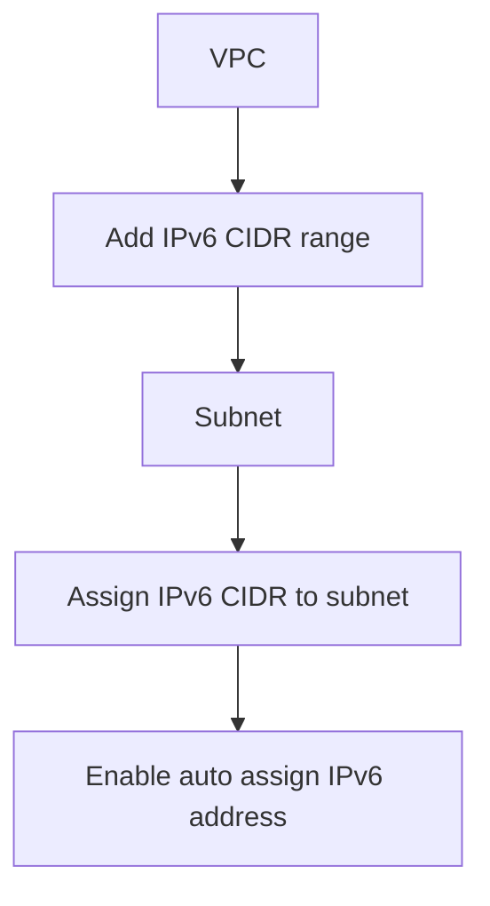

# 344. IPv6 for VPC - Hands On

## 🎯 Giới thiệu
- Bài thực hành này minh họa cách bật và sử dụng IPv6 trong VPC, subnet và EC2 instance.
- Trọng tâm là cách:
  - thêm IPv6 CIDR vào VPC
  - gán IPv6 CIDR cho subnet
  - cấp IPv6 address cho EC2 instance
  - cập nhật Security Group và route table để kết nối bằng IPv6
- Điểm cần nhớ cho kỳ thi AWS: IPv6 có thể mở rộng khả năng địa chỉ, nhưng EC2 vẫn luôn cần IPv4 address.

## 1. Bật IPv6 cho VPC và subnet
- Trong VPC, cần thêm một `IPv6 CIDR range`.
- Có thể chọn:
  - `Amazon-provided CIDR block`
  - hoặc CIDR do người dùng cung cấp
- Sau khi thêm IPv6 CIDR vào VPC, cần gán IPv6 CIDR đó cho từng subnet.
- Với subnet, có thể bật tùy chọn `auto assign IPv6 address`.

## 2. Gán IPv6 cho EC2 instance
- Sau khi subnet đã có IPv6 CIDR, vào `EC2 instance` để:
  - chọn `Networking`
  - mở `Manage IP addresses`
- Interface `eth0` ban đầu chưa có IPv6 address.
- Có thể gán thêm một IPv6 address theo kiểu `auto assigned`.
- Sau khi lưu, instance như `BastionHost` sẽ có IPv6 address.

- Ý nghĩa thực tế:
  - Nếu máy cá nhân của bạn cũng có IPv6, bạn có thể SSH trực tiếp vào EC2 bằng IPv6 address.
  - Nếu nhà mạng chưa hỗ trợ IPv6, thì không thể dùng cách này cho đến khi IPv6 được cung cấp.

## 3. Security Group, route table và giới hạn IPv4
- Để SSH bằng IPv6, Security Group phải cho phép inbound `SSH` từ `anywhere IPv6`.
- Không chỉ mở `0.0.0.0/0` cho IPv4, mà còn phải thêm IPv6 CIDR tương ứng.
- Trong route table của public subnet, xuất hiện route cho IPv6 CIDR với mục tiêu `local`.
- Điều này có nghĩa:
  - các EC2 instances có IPv6 address có thể giao tiếp với nhau qua IPv6
  - traffic trong CIDR đó vẫn ở `local`, không đi qua public internet

- Một điểm rất quan trọng:
  - Dù subnet có rất nhiều IPv6 addresses, EC2 instance vẫn cần IPv4 address
  - Nếu IPv4 addresses trong subnet bị dùng hết, bạn vẫn phải gán thêm CIDR block mới để tiếp tục tạo EC2 instances

## 📊 Bảng tóm tắt
| Tiêu chí | Mô tả |
|----------|------|
| Mục tiêu | Bật và sử dụng IPv6 trong VPC hands-on |
| VPC | Thêm `IPv6 CIDR range` cho VPC |
| Subnet | Gán IPv6 CIDR cho subnet và bật `auto assign IPv6 address` |
| EC2 | Gán IPv6 address cho interface `eth0` của instance |
| Security Group | Mở `SSH` từ `anywhere IPv6` để kết nối bằng IPv6 |
| Route table | IPv6 CIDR được route `local` trong VPC |
| Lưu ý thi AWS | EC2 vẫn cần IPv4 address, IPv4 exhaustion vẫn là vấn đề |

## 💡 Mẹo ghi nhớ cho kỳ thi AWS
- `VPC -> Subnet -> EC2` là chuỗi phải làm theo khi bật IPv6.
- Nhớ 3 bước chính:
  - thêm IPv6 CIDR vào `VPC`
  - gán IPv6 CIDR cho `Subnet`
  - cấp IPv6 address cho `EC2`
- Nếu không SSH được bằng IPv6, kiểm tra:
  - máy của bạn có IPv6 hay không
  - Security Group đã mở `anywhere IPv6` chưa
- `local` route với IPv6 CIDR cho thấy traffic nội bộ VPC không đi ra internet.
- Dù dùng IPv6, đừng quên EC2 vẫn tiêu thụ IPv4 address.

## ✅ Kết luận
- IPv6 trong VPC được triển khai theo luồng: thêm IPv6 CIDR vào VPC, gán cho subnet, rồi cấp IPv6 address cho EC2 instance.
- Muốn kết nối bằng IPv6 cần đồng thời cấu hình Security Group và có IPv6 trên máy client.
- Route table sẽ giữ traffic IPv6 trong phạm vi `local` của VPC.
- Điểm thi quan trọng nhất: IPv6 không thay thế hoàn toàn IPv4 đối với EC2 trong bài thực hành này.
