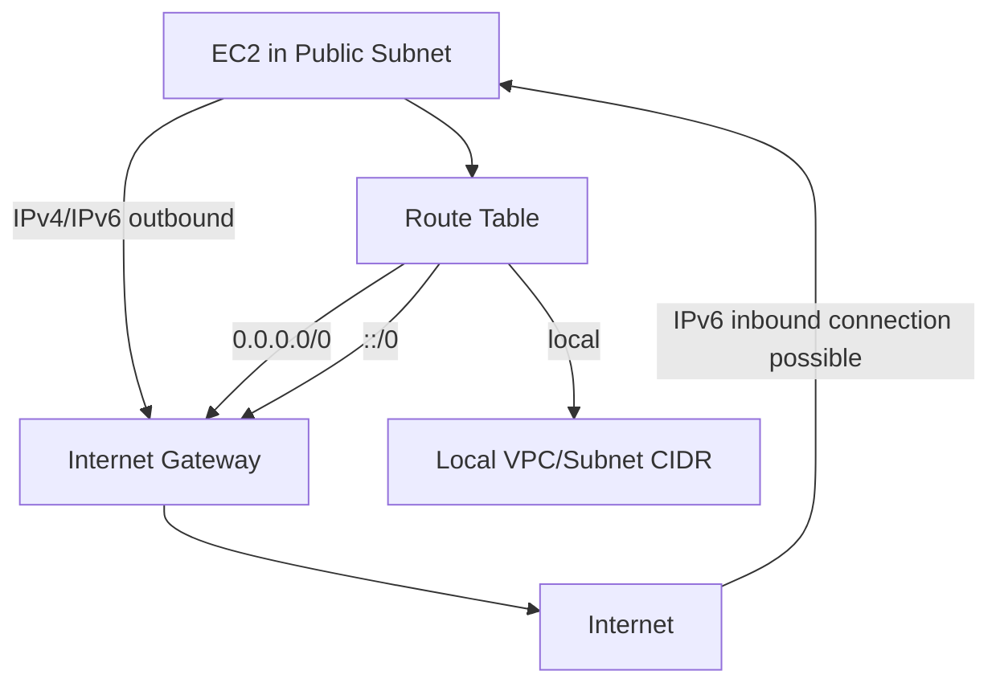
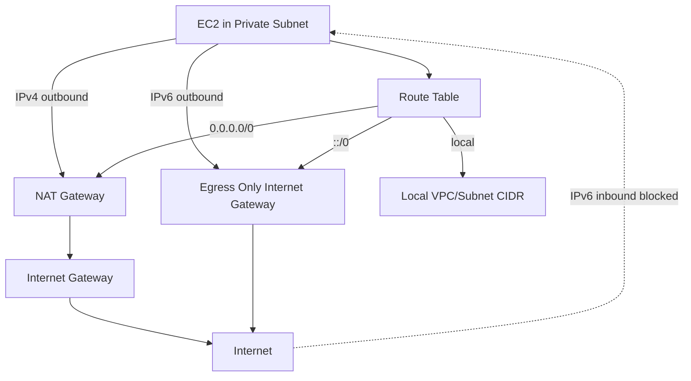

# 345. Egress Only Internet Gateway

## 🎯 Giới thiệu
- **Egress Only Internet Gateway** là thành phần dùng **chỉ cho IPv6 traffic**.
- Nó **giống NAT gateway nhưng dành cho IPv6**:
  - **NAT gateway**: cho **IPv4**
  - **Egress Only Internet Gateway**: cho **IPv6**
- Mục đích chính:
  - Cho phép instance trong VPC **outbound connection over IPv6**
  - **Ngăn internet khởi tạo kết nối IPv6 ngược vào instance**
- Để hoạt động, cần **update route tables**.

## 1. Luồng kết nối trong public subnet 🌐
- Với **public subnet**, EC2 instance có thể đi ra internet qua **Internet Gateway**.
- Vì gắn với Internet Gateway, internet cũng có thể **initiate connection** vào instance qua IPv6.
- Route table của public subnet:
  - `local` cho traffic IPv4/IPv6 nội bộ trong CIDR của VPC/subnet
  - `0.0.0.0/0` đi qua **Internet Gateway** cho toàn bộ IPv4
  - `::/0` đi qua **Internet Gateway** cho toàn bộ IPv6
- Kết quả:
  - Public subnet hỗ trợ internet access **2 chiều** theo mô tả trong transcript.

## 2. Luồng kết nối trong private subnet 🔒
- Với **private subnet**, EC2 instance **không có Internet Gateway trực tiếp**.
- Mục tiêu là:
  - Có thể **ra internet**
  - Không cho internet **initiate connection** vào instance
- Theo transcript:
  - **IPv4** dùng **NAT gateway**
    - Instance → NAT gateway → Internet Gateway → Internet
  - **IPv6** dùng **Egress Only Internet Gateway**
    - Instance → Egress Only Internet Gateway → Internet
- Route table của private subnet:
  - `local` cho traffic nội bộ
  - `0.0.0.0/0` trỏ tới **NAT gateway**
  - `::/0` trỏ tới **Egress Only Internet Gateway**

## 3. Điểm khác biệt cần nhớ khi ôn thi AWS 🧠
- **Internet Gateway**
  - Dùng cho **IPv4 và IPv6**
  - Cho phép kết nối ra/vào khi subnet là public
- **NAT Gateway**
  - Dùng cho **IPv4**
  - Hỗ trợ instance private subnet đi ra internet mà không nhận kết nối khởi tạo từ internet
- **Egress Only Internet Gateway**
  - Dùng cho **IPv6**
  - Chỉ cho phép **outbound IPv6**
  - Chặn internet **initiate IPv6 connection** vào instance

## 📊 Bảng tóm tắt
| Tiêu chí | Mô tả |
|----------|------|
| Loại traffic | Chỉ **IPv6** |
| Mục đích | Cho phép outbound IPv6, chặn inbound IPv6 từ internet |
| So sánh với NAT gateway | NAT gateway cho **IPv4**, Egress Only Internet Gateway cho **IPv6** |
| Cấu hình cần thiết | Cập nhật **route tables** |
| Public subnet | `::/0` đi qua **Internet Gateway** |
| Private subnet | `::/0` đi qua **Egress Only Internet Gateway** |
| IPv4 trong private subnet | `0.0.0.0/0` đi qua **NAT gateway** |

## 💡 Mẹo ghi nhớ cho kỳ thi AWS
- Nhớ công thức:
  - **NAT = IPv4**
  - **Egress Only IGW = IPv6**
- Nếu đề bài nói:
  - **private subnet**
  - **outbound only**
  - **IPv6**
  - thì đáp án rất dễ là **Egress Only Internet Gateway**
- Nếu đề bài nói:
  - **private subnet**
  - **outbound only**
  - **IPv4**
  - thì nghĩ đến **NAT gateway**
- Route quan trọng cần nhớ:
  - `0.0.0.0/0` = IPv4 default route
  - `::/0` = IPv6 default route

## ✅ Kết luận
- **Egress Only Internet Gateway** là giải pháp cho **IPv6 outbound-only** trong VPC.
- Nó tương tự **NAT gateway** nhưng dành riêng cho **IPv6**.
- Điểm cốt lõi để ôn thi: **cho phép đi ra, không cho internet đi vào khởi tạo kết nối IPv6**.
