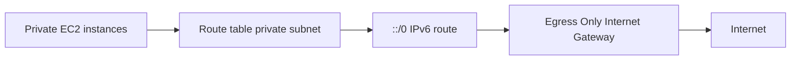

# 346. Egress Only Internet Gateway Hands On

## 🎯 Giới thiệu
- Bài thực hành này minh họa cách tạo và cấu hình **Egress Only Internet Gateway** trong **VPC**.
- Mục tiêu là cho các instance trong **private subnet** truy cập Internet qua **IPv6** nhưng vẫn **không thể bị truy cập từ bên ngoài**.

## 1. Tạo Egress Only Internet Gateway
- Trong **VPC**, tạo một **Egress Only Internet Gateway** mới.
- Đặt tên là `DemoEIGW`.
- Attach gateway này vào `DemoVPC`.
- Sau khi tạo, gateway đã được gắn vào VPC sẵn sàng sử dụng.

## 2. Cấu hình Route Table cho private subnet
- Cần chỉnh **route table** của **private subnets**.
- Không áp dụng cho **public subnets**.
- Thêm route cho mọi lưu lượng **IPv6** với đích `::/0`.
- Route này sẽ trỏ đến **Egress Only Internet Gateway**.
- Lưu thay đổi để kích hoạt luồng đi ra Internet qua IPv6.

## 3. Kết quả đạt được
- Các **EC2 instances** trong **private subnet** có thể truy cập Internet qua **IPv6**.
- Chúng vẫn **không reachable từ Internet**.
- Đây là cách cấu hình đơn giản nhưng đúng mục tiêu của **Egress Only Internet Gateway**.

## 📊 Bảng tóm tắt
| Tiêu chí | Mô tả |
|----------|------|
| Thành phần | **Egress Only Internet Gateway** |
| Phạm vi áp dụng | **VPC** |
| Khu vực cấu hình | **Route table** của **private subnet** |
| Route dùng | `::/0` cho **IPv6** |
| Mục tiêu | Cho phép outbound Internet qua IPv6 |
| Bảo mật | Instance **không bị truy cập ngược từ Internet** |

## 💡 Mẹo ghi nhớ cho kỳ thi AWS
- **Egress Only Internet Gateway** = chỉ cho **egress** với **IPv6**.
- Gắn vào **VPC** rồi sửa **route table** của **private subnet**.
- Nhớ route quan trọng là `::/0`.
- Dùng cho trường hợp muốn **ra Internet nhưng không cho vào từ Internet**.

## ✅ Kết luận
- Bài lab cho thấy quy trình rất ngắn gọn: tạo **Egress Only Internet Gateway**, attach vào **VPC**, rồi thêm route `::/0` vào **private subnet route table**.
- Kết quả là instance private có thể đi ra Internet bằng **IPv6** nhưng vẫn được bảo vệ khỏi truy cập từ bên ngoài.
