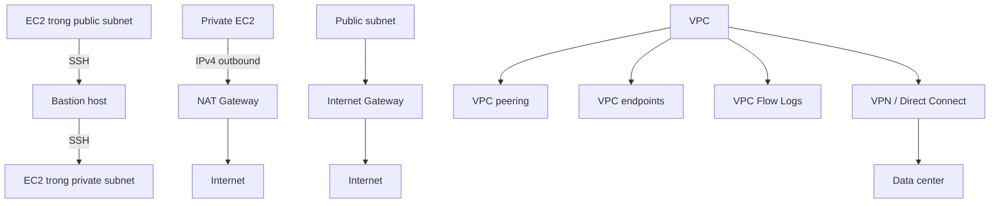

# 348. VPC Section Summary

## 🎯 Giới thiệu
- Phần này tóm tắt các khái niệm cốt lõi của **VPC** và các dịch vụ mạng liên quan trong AWS.
- Nội dung trọng tâm xoay quanh: **CIDR**, **subnet**, **route table**, **Internet Gateway**, **NAT Gateway**, **NACL**, **Security Group**, **VPC peering**, **VPC endpoints**, **VPC Flow Logs**, **VPN**, **Direct Connect**, **PrivateLink**, **Transit Gateway**, **IPv6**.
- Đây là phần nhiều acronyms và khái niệm mới, nên cần ôn lại nhiều lần để nắm chắc.

## 1. Nền tảng của VPC và Subnet 🌐
- **CIDR** là một dải IP.
- **VPC (Virtual Private Cloud)** hoạt động với cả **IPv4** và **IPv6**.
- **Subnet** gắn với một **AZ** và được xác định bằng CIDR.
- Có **public subnet** và **private subnet**.
- Muốn subnet trở thành **public subnet**:
  - Gắn **Internet Gateway**
  - Tạo route từ public subnet đến **Internet Gateway**
  - Khi bật phù hợp, có thể có internet access cho cả **IPv4** và **IPv6**
- **Route tables** rất quan trọng để điều khiển luồng mạng trong VPC:
  - Route đến **Internet Gateway**
  - Route cho **VPC peering connections**
  - Route cho **VPC endpoints**
  - Và các luồng mạng khác trong VPC

## 2. Truy cập vào tài nguyên private và kiểm soát traffic 🔐
- **Bastion host** là một **public EC2 instance** mà ta SSH vào được.
- Bastion host sau đó SSH vào các **EC2 instances** nằm trong **private subnet**.
- **NAT Instance**:
  - Là **EC2 instance** trong public subnet
  - Dùng để cấp internet access cho EC2 private subnet
  - Đang cũ và bị deprecate dần
  - Cần tắt **source/destination check**
  - Cần chỉnh **security group rules**
- **NAT Gateway**:
  - Được AWS managed
  - Cung cấp internet access có khả năng scale cho private EC2 instances
  - Dùng khi target của request là **IPv4 address**
- **NACL (Network ACL)**:
  - Là firewall rule ở **subnet level**
  - Điều khiển inbound và outbound access
  - Là **stateless**, nên inbound và outbound luôn được xét riêng
  - Cần chú ý **ephemeral ports**
- **Security Group**:
  - Áp dụng ở **EC2 instance level**
  - Là **stateful**
  - Nếu inbound được cho phép thì outbound tự được phép, và ngược lại

## 3. Kết nối VPC, giám sát và mạng nâng cao 🚀
- **VPC peering**:
  - Dùng để nối 2 VPC với nhau
  - Chỉ hoạt động khi CIDR **không overlap**
  - Là **non-transitive**
  - Nếu cần kết nối 3 VPC thì cần 3 peering connections
- **VPC endpoints**:
  - Cho phép truy cập private tới AWS services từ trong VPC
  - Ví dụ được nhắc: **Amazon S3**, **DynamoDB**, **CloudFormation**, **SSM**
  - **Gateway endpoints**: dùng cho **S3** và **DynamoDB**
  - Các dịch vụ còn lại là **interface endpoints**
- **VPC Flow Logs**:
  - Cung cấp metadata ở mức log cho tất cả packets trong VPC
  - Ghi nhận **accept** và **reject**
  - Có thể tạo ở mức **VPC**, **subnet**, hoặc **ENI**
  - Có thể gửi đến **Amazon S3** rồi phân tích bằng **Athena**
  - Hoặc gửi đến **CloudWatch Logs** rồi phân tích bằng **CloudWatch Log Insights**
- Kết nối VPC với data center có 2 cách:
  - **Site-to-site VPN**
    - Đi qua public internet
    - Cần **Virtual Private Gateway** ở AWS
    - Cần **Customer Gateway** ở data center
    - Có thể dùng **VPN CloudHub** để tạo mô hình hub-and-spoke nếu có nhiều VPN connections
  - **Direct Connect**
    - Kết nối private, không đi qua public internet
    - Mất thời gian thiết lập
    - Cần nối data center tới **Direct Connect location**
    - Được mô tả là secure hơn và ổn định hơn
- **Direct Connect Gateway**:
  - Dùng để setup Direct Connect cho nhiều VPC ở nhiều AWS regions
- **PrivateLink / VPC endpoint services**:
  - Cho phép kết nối private đến service do chính bạn tạo trong VPC, từ customer VPC
  - Không cần **VPC peering**, public internet, **NAT Gateway**, hoặc route tables
  - Thường dùng với **Network Load Balancer** và **ENI**
  - Giúp expose service cho rất nhiều customer VPC mà không lộ mạng
- **ClassicLink**:
  - Dùng để connect **EC2-Classic** instances privately vào VPC
  - Sắp bị deprecated
- **Transit Gateway**:
  - Là transitive peering connection cho **VPC**, **VPN**, và **Direct Connect**
  - Cho phép mọi thứ flow qua nó
- **Traffic Mirroring**:
  - Copy network traffic từ **ENIs** sang nơi khác để phân tích
- **IPv6 trong VPC**:
  - Có cách enable IPv6
  - Có **egress-only Internet Gateway**
  - Tương tự **NAT Gateway** nhưng dành cho **IPv6 traffic out** ra internet

## Mermaid

## 📊 Bảng tóm tắt
| Tiêu chí | Mô tả |
|----------|------|
| CIDR | Dải IP dùng trong VPC/subnet |
| VPC | Virtual Private Cloud, hỗ trợ IPv4 và IPv6 |
| Subnet | Gắn với AZ, có public/private subnet |
| Public subnet | Có route đến Internet Gateway |
| NAT Gateway | AWS managed, cho private EC2 outbound internet với IPv4 |
| NACL | Stateless, kiểm soát ở subnet level |
| Security Group | Stateful, áp dụng ở EC2 instance level |
| VPC peering | Kết nối 2 VPC, non-transitive, CIDR không overlap |
| VPC endpoints | Truy cập private tới AWS services như S3, DynamoDB |
| VPC Flow Logs | Ghi accept/reject traffic metadata ở VPC/subnet/ENI |
| Site-to-site VPN | Đi qua public internet, dùng Virtual Private Gateway và Customer Gateway |
| Direct Connect | Kết nối private, không qua public internet |
| PrivateLink | Expose service private tới customer VPC |
| Transit Gateway | Transitive connection cho VPC, VPN, Direct Connect |
| IPv6 egress-only IGW | Cho IPv6 outbound ra internet |

## 💡 Mẹo ghi nhớ cho kỳ thi AWS
- **Security Group = stateful**, **NACL = stateless**.
- **Security Group** áp dụng ở **EC2 instance level**, còn **NACL** ở **subnet level**.
- **VPC peering** chỉ nối 2 VPC và **không transitive**.
- **NAT Gateway** dùng cho **IPv4 outbound** từ private subnet.
- **Gateway endpoints** chỉ nhắc tới **S3** và **DynamoDB**.
- **VPC Flow Logs** không cho nội dung packet, mà cho metadata và trạng thái **accept/reject**.
- **Site-to-site VPN** đi qua public internet, còn **Direct Connect** là private.
- **PrivateLink** không cần VPC peering, public internet, NAT Gateway, hay route tables.
- **Transit Gateway** là lựa chọn khi cần mô hình kết nối linh hoạt và transitive.
- **ClassicLink** và **NAT Instance** đều là các nội dung cũ/deprecate, dễ bị hỏi theo hướng nhận biết.

## ✅ Kết luận
- Phần VPC tập trung vào cách AWS tổ chức mạng, định tuyến, kiểm soát truy cập và kết nối private.
- Trọng tâm ôn thi là phân biệt rõ: **public vs private subnet**, **Security Group vs NACL**, **VPC peering vs Transit Gateway**, **VPN vs Direct Connect**, và **NAT Gateway vs NAT Instance**.
- Nắm được các luồng kết nối và vai trò của từng thành phần sẽ giúp làm bài trắc nghiệm AWS chính xác hơn.
