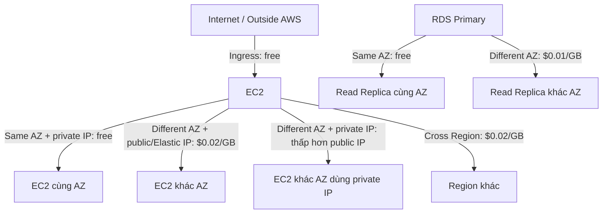
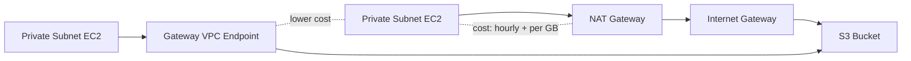

# 349. Networking Costs in AWS

## 🎯 Giới thiệu
Bài này tóm tắt các nguyên tắc **networking cost** trong AWS theo cách đơn giản để ôn thi:

- Chi phí mạng thường tính theo **per gigabyte**
- Mục tiêu là:
  - giảm **egress traffic**,
  - ưu tiên **private IP**,
  - tối ưu kiến trúc để giữ dữ liệu trong AWS càng nhiều càng tốt
- Nhiều chi phí phụ thuộc vào:
  - cùng **AZ** hay khác **AZ**
  - cùng **Region** hay khác **Region**
  - dùng **public IP**, **Elastic IP**, **NAT Gateway**, **VPC Endpoint**, **CloudFront**, **Direct Connect** hay không

## 1. 🧩 Chi phí traffic giữa EC2, AZ và Region
Các quy tắc chính:

- **Incoming traffic vào EC2**: miễn phí
- **EC2 cùng AZ, dùng private IP**: miễn phí
- **EC2 khác AZ, cùng Region**:
  - dùng **public IP / Elastic IP**: khoảng **$0.02 per GB**
  - dùng **private IP**: rẻ hơn, khoảng **một nửa**
- **Traffic giữa hai Region**: khoảng **$0.02 per GB**
- **Read replica RDS**:
  - cùng **AZ**: không tốn network cost để replicate
  - khác **AZ**: khoảng **$0.01 per GB**

### Mermaid: luồng traffic cơ bản

## 2. 🚀 Cách tối ưu chi phí mạng và egress traffic
Ý chính của phần này:

- **Egress traffic** = outbound traffic, tức là từ AWS ra ngoài
- **Ingress traffic** = inbound traffic, tức là từ ngoài vào AWS, thường miễn phí
- Mục tiêu: giữ dữ liệu và xử lý **ở trong AWS** càng nhiều càng tốt

### Ví dụ được nêu trong bài
- Nếu application ở **corporate data center** query database trong AWS:
  - lấy ra **100 MB** từ AWS
  - chỉ trả lại **50 KB** cho user
  - => egress cost rất cao
- Nếu chuyển application lên **EC2 trong AWS**:
  - giữ dữ liệu trong cùng **AZ**
  - DB query data transfer có thể **free**
  - chỉ gửi kết quả nhỏ ra ngoài
  - => chi phí giảm mạnh

### Direct Connect
- Nếu dùng **Direct Connect**
- cần chọn **Direct Connect location** co-located trong cùng **AWS Region**
- mục tiêu là có **lower cost for egress network**

## 3. 💾 Chi phí S3, CloudFront, NAT Gateway và VPC Endpoint
### S3 và CloudFront
- **Data vào S3**: miễn phí
- **Download từ S3 ra internet**: khoảng **$0.09 per GB**
- **S3 Transfer Acceleration**:
  - nhanh hơn khoảng **50% to 500%**
  - có thêm chi phí khoảng **$0.04 to $0.08 per GB**
- **S3 -> CloudFront**: miễn phí
- **CloudFront -> internet**: khoảng **$0.085 per GB**
- **Request vào CloudFront**: rẻ hơn S3, khoảng **7 lần rẻ hơn**
- **Cross Region Replication cho S3**: khoảng **$0.02 per GB**

### NAT Gateway vs Gateway VPC Endpoint
- Dùng **NAT Gateway** để private subnet đi ra internet rồi vào S3:
  - **$0.045 per hour** cho NAT Gateway
  - **$0.045 per GB** data processed qua NAT Gateway
  - **$0.09 per hour** cho data transfer out to S3 cross-region
  - nếu **same region** thì phần này là **$0**
- Dùng **Gateway VPC Endpoint** để truy cập S3 privately:
  - **không có cost** cho Gateway Endpoint
  - trả **$0.01 per GB** data transferred in and out của S3 bucket trong **same region**
- Kết luận của bài:
  - **VPC Endpoint** thường rẻ hơn đáng kể so với **NAT Gateway** khi chỉ cần truy cập **S3**

### Mermaid: so sánh luồng truy cập S3

## 📊 Bảng tóm tắt
| Tiêu chí | Mô tả |
|----------|------|
| Ingress vào EC2 | Miễn phí |
| EC2 cùng AZ, private IP | Miễn phí |
| EC2 khác AZ, public/Elastic IP | Khoảng $0.02/GB |
| EC2 khác AZ, private IP | Rẻ hơn public IP, dùng internal AWS network |
| Cross Region traffic | Khoảng $0.02/GB |
| RDS read replica cùng AZ | Không tốn network cost |
| RDS read replica khác AZ | Khoảng $0.01/GB |
| Egress traffic | Outbound từ AWS ra ngoài, thường tốn phí |
| S3 download ra internet | Khoảng $0.09/GB |
| S3 Transfer Acceleration | Nhanh hơn, nhưng thêm $0.04 - $0.08/GB |
| S3 -> CloudFront | Miễn phí |
| CloudFront -> internet | Khoảng $0.085/GB |
| CloudFront request | Rẻ hơn S3, khoảng 7 lần |
| S3 Cross Region Replication | Khoảng $0.02/GB |
| NAT Gateway | $0.045/giờ + $0.045/GB |
| Gateway VPC Endpoint | Không mất phí endpoint, chỉ $0.01/GB với S3 same region |

## 💡 Mẹo ghi nhớ cho kỳ thi AWS
- Ưu tiên **private IP** thay vì **public IP** khi traffic nội bộ
- Nếu workload cần trao đổi nhiều, đặt tài nguyên trong **same AZ** để tiết kiệm chi phí
- Nhớ trade-off: **rẻ hơn** thường đổi lấy **ít high availability hơn**
- **Egress** thường tốn tiền, nên cố giữ traffic trong AWS
- **CloudFront** giúp:
  - giảm latency nhờ caching
  - giảm chi phí request và data transfer so với truy cập trực tiếp S3
- Khi truy cập **S3** từ private subnet:
  - **Gateway VPC Endpoint** thường rẻ hơn **NAT Gateway**
- Với **Direct Connect**, chọn location cùng **AWS Region** để tối ưu chi phí egress

## ✅ Kết luận
Bài này tập trung vào cách AWS tính **networking cost** và cách tối ưu:

- dùng **private IP** khi có thể
- giảm traffic qua **public internet**
- giữ dữ liệu trong **same AZ** hoặc trong **AWS**
- dùng đúng dịch vụ như **CloudFront**, **VPC Endpoint**, **Direct Connect** để giảm chi phí

Điểm quan trọng cho exam là hiểu mối quan hệ giữa **kiến trúc mạng** và **chi phí per GB**.
