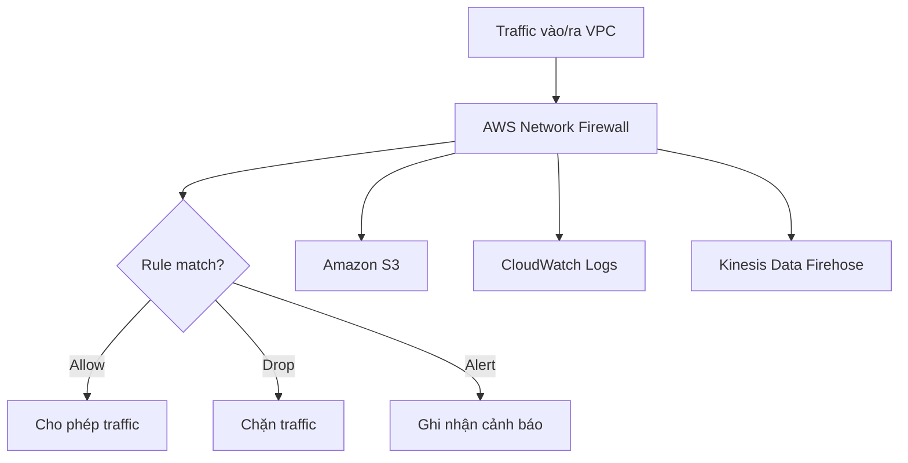

# 350. AWS Network Firewall

## 🎯 Giới thiệu
- **AWS Network Firewall** là dịch vụ dùng để bảo vệ **toàn bộ VPC** bằng firewall ở cấp **VPC level**.
- Nó cung cấp bảo vệ từ **layer 3 đến layer 7**, cho phép kiểm tra nhiều loại traffic theo nhiều hướng khác nhau.
- Đây là lựa chọn khi muốn kiểm soát network traffic một cách **chi tiết** và **phức tạp hơn** so với các cơ chế đã biết như:
  - `Network ACLs`
  - `Security Groups`
  - `AWS WAF`
  - `AWS Shield`
  - `AWS Firewall Manager`

## 1. Phạm vi bảo vệ 🔒
- Bảo vệ **toàn VPC** bằng firewall bao quanh VPC.
- Có thể kiểm tra traffic:
  - **VPC to VPC traffic**
  - **Outbound to internet**
  - **Inbound from internet**
  - Traffic **từ/đến Direct Connect**
  - Traffic **từ/đến Site-to-Site VPN**
- Nói cách khác, mọi traffic đi vào, đi ra hoặc đi giữa các kết nối liên quan đến VPC đều có thể được inspect.

## 2. Rule và khả năng kiểm soát 🧩
- AWS Network Firewall cho phép tạo **rules** để kiểm soát hành vi network.
- Hỗ trợ **fine-grained controls** trên nhiều loại traffic.
- Có thể quản lý **hàng nghìn rules** ở cấp VPC.
- Lọc theo:
  - **IP**
  - **Port**
  - **Protocol**
  - **Domain**
  - **Regex pattern matching**
- Có thể áp dụng hành vi:
  - `Allow`
  - `Drop`
  - `Alert`
- Ví dụ được nhắc trong transcript:
  - Có thể **disable SMB protocol** cho outbound communication.
  - Có thể chỉ cho phép outbound traffic đến một domain nội bộ hoặc một `third party software repository` được phép.

## 3. Kiến trúc và tích hợp vận hành 🛠️
- Bên trong, AWS Network Firewall dùng **AWS Gateway Load Balancer**.
- Khác với việc tự triển khai **third-party appliance**, AWS sẽ **quản lý appliance** giúp người dùng.
- Rule có thể được **centrally managed** trên:
  - nhiều **accounts**
  - nhiều **VPCs**
- Việc quản lý tập trung này được thực hiện qua **AWS Firewall Manager**.
- Các rule match có thể được gửi tới:
  - `Amazon S3`
  - `CloudWatch Logs`
  - `Kinesis Data Firehose`
- Điều này hỗ trợ phân tích và quan sát traffic tốt hơn.

## 📊 Bảng tóm tắt
| Tiêu chí | Mô tả |
|----------|------|
| Mục đích | Bảo vệ toàn bộ VPC bằng firewall |
| Mức bảo vệ | Layer 3 đến Layer 7 |
| Phạm vi traffic | Inbound, outbound, VPC to VPC, Direct Connect, Site-to-Site VPN |
| Cách kiểm soát | Rule theo IP, port, protocol, domain, regex |
| Hành vi xử lý | `Allow`, `Drop`, `Alert` |
| Quản lý tập trung | Qua `AWS Firewall Manager` across multiple accounts và VPCs |
| Nội bộ triển khai | Dùng `AWS Gateway Load Balancer` |
| Logging/analysis | `Amazon S3`, `CloudWatch Logs`, `Kinesis Data Firehose` |

## 💡 Mẹo ghi nhớ cho kỳ thi AWS
- Nhớ cụm từ: **“Network Firewall = bảo vệ cả VPC”**.
- `AWS WAF` tập trung vào HTTP requests cho dịch vụ cụ thể, còn **AWS Network Firewall** tập trung vào **network traffic của toàn VPC**.
- Nếu đề bài nhắc đến:
  - bảo vệ **VPC level**
  - lọc traffic theo **IP/port/protocol/domain**
  - **allow/drop/alert**
  - inspect traffic nhiều hướng  
  thì nghĩ ngay đến **AWS Network Firewall**.
- Khi thấy yêu cầu quản lý nhiều VPC, nhiều account, hãy nhớ **AWS Firewall Manager**.
- Khi thấy log cần đẩy ra phân tích, nhớ 3 đích:
  - `S3`
  - `CloudWatch Logs`
  - `Kinesis Data Firehose`

## ✅ Kết luận
- **AWS Network Firewall** là firewall quản lý bởi AWS để bảo vệ **toàn bộ VPC**.
- Dịch vụ này cho phép **traffic filtering** và **flow inspection** với rule rất chi tiết.
- Đây là kiến thức quan trọng cho AWS exam khi cần phân biệt giữa các lớp bảo vệ mạng trong AWS.
