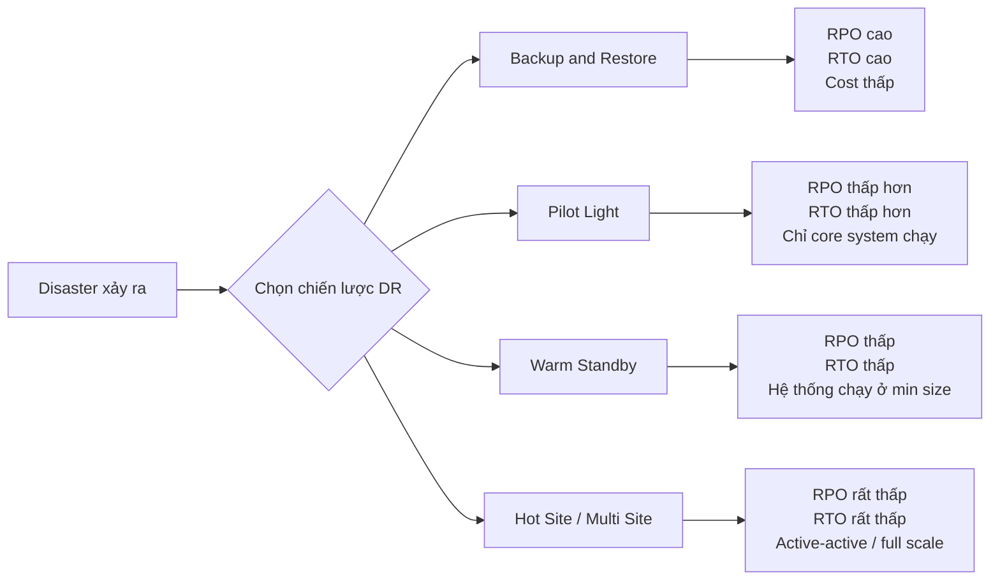

# 351. Disaster Recovery in AWS

## 🎯 Giới thiệu
- **Disaster Recovery (DR)** là phần rất quan trọng trong AWS, và đây là nội dung có thể xuất hiện trong exam.
- **Disaster** là bất kỳ sự kiện nào gây ảnh hưởng tiêu cực đến **business continuity** hoặc **finances** của công ty.
- Mục tiêu của **disaster recovery** là chuẩn bị sẵn và khôi phục hệ thống sau sự cố.
- Transcript nhấn mạnh 3 bối cảnh DR:
  - **on-premise to on-premise**
  - **hybrid recovery**: on-premise là chính, cloud là phương án dự phòng
  - **full cloud**: từ **AWS region A** sang **AWS region B**

## 1. Khái niệm cốt lõi: RPO và RTO
- **RPO (Recovery Point Objective)**:
  - Xác định mức **data loss** có thể chấp nhận được.
  - Nói cách khác: dữ liệu có thể quay lại tối đa bao xa trong quá khứ.
  - Ví dụ backup mỗi giờ thì khi sự cố xảy ra có thể mất 1 giờ dữ liệu.
- **RTO (Recovery Time Objective)**:
  - Xác định lượng **downtime** có thể chấp nhận khi khôi phục.
  - Nói cách khác: mất bao lâu để hệ thống chạy lại sau sự cố.
- Quan hệ quan trọng trong exam:
  - **RPO/RTO càng nhỏ** thì kiến trúc càng phức tạp và **cost** thường càng cao.

## 2. Các chiến lược Disaster Recovery
- Bốn chiến lược chính:
  - **Backup and Restore**
  - **Pilot Light**
  - **Warm Standby**
  - **Hot Site / Multi Site**
- Thứ tự chi phí và mức độ sẵn sàng:
  - **Backup and Restore**: rẻ nhất, RTO cao nhất
  - **Pilot Light**: tốt hơn Backup and Restore
  - **Warm Standby**: tốn hơn, khôi phục nhanh hơn
  - **Hot Site / Multi Site**: đắt nhất, RTO thấp nhất

### 2.1 Backup and Restore
- Phù hợp khi chấp nhận **high RPO** và **high RTO**.
- Cách làm:
  - Backup dữ liệu lên **S3**
  - Dùng **AWS Storage Gateway**
  - Dùng **Lifecycle Policy** để chuyển sang **Glacier**
  - Có thể dùng **Snowball** để đẩy nhiều dữ liệu lên cloud theo định kỳ
  - Với cloud resources như **EBS**, **RDS**, **Redshift**:
    - tạo **snapshots** định kỳ
    - khi sự cố xảy ra thì restore từ snapshot
    - dùng **AMIs** để tạo lại **EC2 instances**
- Ý nghĩa:
  - Rẻ
  - Không duy trì nhiều hạ tầng chạy sẵn
  - Nhưng khôi phục chậm

### 2.2 Pilot Light
- Một phiên bản nhỏ của hệ thống luôn chạy trong cloud.
- Chỉ giữ **critical core systems** luôn sẵn sàng.
- Ví dụ:
  - dữ liệu critical được replicate liên tục sang **RDS**
  - **EC2** chưa chạy cho đến khi có disaster
  - **Route 53** dùng để failover sang cloud
- Ý nghĩa:
  - **RPO thấp hơn**
  - **RTO thấp hơn**
  - Vẫn tiết kiệm chi phí vì chỉ phần cốt lõi chạy liên tục

### 2.3 Warm Standby
- Toàn bộ hệ thống đã chạy nhưng ở **minimum size**.
- Khi có sự cố, hệ thống được scale lên theo production load.
- Ví dụ:
  - **Route 53** failover sang **ELB**
  - **RDS secondary database** đã chạy sẵn
  - **EC2 Auto Scaling group** chạy ở mức tối thiểu
- Ý nghĩa:
  - Đắt hơn Pilot Light
  - RPO/RTO tốt hơn
  - Phù hợp khi cần khả năng khôi phục nhanh hơn

### 2.4 Hot Site / Multi Site
- Hệ thống production scale chạy đầy đủ ở cả hai nơi.
- Mô hình có thể là:
  - **on-premise + AWS**
  - hoặc **multi-region** trong full cloud
- Đặc điểm:
  - **active-active**
  - **Route 53** có thể route request đến cả hai bên
  - data replication diễn ra liên tục
- Ý nghĩa:
  - **RTO rất thấp**: phút hoặc giây
  - **cost rất cao**
  - phù hợp khi yêu cầu sẵn sàng rất cao

## 3. Kỹ thuật hỗ trợ Disaster Recovery
- Các kỹ thuật trong transcript được chia theo mục đích:

| Mục đích | Công cụ / Dịch vụ trong transcript |
|---|---|
| Backup | `EBS Snapshots`, `RDS automated snapshots`, `RDS backups` |
| Lưu trữ backup | `S3`, `S3 IA`, `Glacier` |
| Di chuyển backup | `Lifecycle Policy`, `Cross Region Replication` |
| On-premise lên cloud | `Snowball`, `Storage Gateway` |
| High Availability | `Route 53`, `RDS Multi-AZ`, `ElastiCache Multi-AZ`, `EFS`, `S3` |
| Network recovery | `Direct Connect`, `site-to-site VPN` |
| Replication | `RDS Replication (Cross Region)`, `Aurora Global Databases`, DB replication software |
| Automation | `CloudFormation`, `Elastic Beanstalk`, `CloudWatch`, `Lambda` |
| Chaos testing | Netflix `simian army`, tự ý terminate `EC2 instances` để test resilience |

### Điểm nhấn thi AWS
- **Route 53** rất hữu ích để migrate DNS từ region này sang region khác.
- **RDS Multi-AZ**, **ElastiCache Multi-AZ**, **EFS**, **S3** là các dịch vụ có tính **high availability** cao khi được bật đúng cách.
- Nếu **Direct Connect** bị down, có thể dùng **site-to-site VPN** làm phương án dự phòng.
- **CloudFormation** và **Elastic Beanstalk** giúp tạo lại môi trường nhanh.
- **CloudWatch alarms** có thể trigger việc reboot hoặc recovery cho **EC2**.
- **Lambda** có thể dùng để tự động hóa toàn bộ infrastructure recovery.
- **Chaos testing** là cách chủ động tạo sự cố để kiểm tra hệ thống có chịu lỗi được không.

## 📊 Bảng tóm tắt
| Tiêu chí | Mô tả |
|----------|------|
| Disaster | Sự kiện gây ảnh hưởng xấu đến business continuity hoặc finances |
| RPO | Mức data loss chấp nhận được |
| RTO | Mức downtime chấp nhận được |
| Backup and Restore | Rẻ, đơn giản, RPO cao, RTO cao |
| Pilot Light | Chỉ core system chạy sẵn, RPO/RTO thấp hơn Backup and Restore |
| Warm Standby | Hệ thống chạy min size, sẵn sàng scale lên khi có sự cố |
| Hot Site / Multi Site | Active-active, full production scale, RTO rất thấp nhưng cost rất cao |
| Backup tools | EBS Snapshots, RDS snapshots, S3, Glacier, Snowball, Storage Gateway |
| HA / Recovery tools | Route 53, Multi-AZ, Cross Region Replication, CloudFormation, CloudWatch, Lambda |

## 💡 Mẹo ghi nhớ cho kỳ thi AWS
- Nhớ thứ tự: **Backup and Restore < Pilot Light < Warm Standby < Hot Site/Multi Site**
- **RPO** = mất bao nhiêu dữ liệu, **RTO** = downtime bao lâu.
- Nếu đề bài ưu tiên **chi phí thấp** và chấp nhận khôi phục chậm, nghĩ ngay đến **Backup and Restore**.
- Nếu chỉ cần giữ **critical core** chạy sẵn, nghĩ đến **Pilot Light**.
- Nếu cần **full system** chạy ở mức tối thiểu, chọn **Warm Standby**.
- Nếu cần **near-zero downtime**, chọn **Hot Site / Multi Site**.
- Với câu hỏi về **backup**, nhớ các từ khóa: **S3**, **Glacier**, **Snapshots**, **Lifecycle Policy**, **Snowball**.
- Với câu hỏi về **failover DNS**, nhớ **Route 53**.
- Với câu hỏi về tự động hóa khôi phục, nhớ **CloudFormation**, **CloudWatch**, **Lambda**.
- Với câu hỏi về kiểm tra độ chịu lỗi, nhớ **chaos testing** và ví dụ **Netflix simian army**.

## ✅ Kết luận
- Disaster Recovery trong AWS xoay quanh việc cân bằng giữa **cost**, **RPO**, và **RTO**.
- Exam thường kiểm tra khả năng chọn đúng chiến lược DR theo yêu cầu thực tế.
- Cần nhớ rõ 4 mô hình DR, các dịch vụ hỗ trợ backup/replication/failover, và vai trò của automation trong khôi phục hệ thống.
