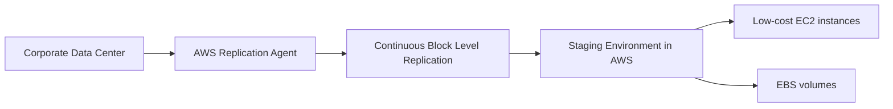
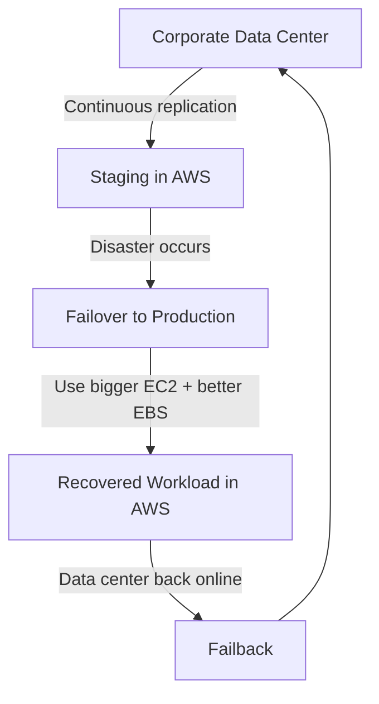

# 352. Elastic Disaster Recovery (DRS)

## 🎯 Giới thiệu
- **Elastic Disaster Recovery (DRS)** là dịch vụ AWS giúp **khôi phục nhanh** các **physical, virtual, và cloud based servers** vào AWS khi xảy ra sự cố.
- Dịch vụ này trước đây có tên **CloudEndure Disaster Recovery**, sau đó được AWS đổi tên thành **Elastic Disaster Recovery**.
- Mục tiêu chính là hỗ trợ **disaster recovery** cho các hệ thống quan trọng như:
  - **Oracle**
  - **MySQL**
  - **SQL Server**
  - Ứng dụng doanh nghiệp như **SAP**
- DRS cũng phù hợp khi cần bảo vệ dữ liệu trước các cuộc tấn công, ví dụ như **ransomware**.

## 1. Cách DRS hoạt động
- DRS thực hiện **continuous block level replication** từ **corporate data center** lên AWS.
- Trên hạ tầng nguồn có một **AWS replication agent**.
- Agent này giúp sao chép liên tục dữ liệu đĩa của:
  - **operating system**
  - **apps**
  - **database**
- Dữ liệu được replicate vào một **staging environment** trong AWS.
- Môi trường staging dùng tài nguyên chi phí thấp gồm:
  - **EC2 instances**
  - **EBS volumes**

## 2. Failover và Failback
- Khi data center gặp **disaster**, có thể thực hiện **failover** từ staging sang production trong vài phút.
- Quá trình failover bao gồm:
  - tạo **bigger EC2 instances**
  - dùng **better EBS volumes**
- Sau đó hệ thống có thể hoạt động trong AWS như một phương án khôi phục.
- Khi **corporate data center** hoặc nơi vận hành ban đầu trở lại bình thường, có thể thực hiện **failback**.
- **Failback** nghĩa là hệ thống quay trở lại môi trường ban đầu và tiếp tục vận hành bình thường.

## 3. Ý nghĩa ôn thi AWS
- Nhớ rằng **DRS = disaster recovery nhanh cho server** vào AWS.
- Điểm cốt lõi cần nhớ:
  - có **replication agent**
  - **continuous replication**
  - staging dùng **EC2** và **EBS**
  - hỗ trợ **failover** nhanh
  - hỗ trợ **failback** khi hệ thống gốc hồi phục
- Đây là một dịch vụ AWS giúp nâng cao khả năng khôi phục sau sự cố cho server và dữ liệu quan trọng.

## 📊 Bảng tóm tắt
| Tiêu chí | Mô tả |
|----------|------|
| Tên dịch vụ | **Elastic Disaster Recovery (DRS)** |
| Tên cũ | **CloudEndure Disaster Recovery** |
| Mục đích | Khôi phục nhanh server vào AWS khi có sự cố |
| Đối tượng hỗ trợ | **physical, virtual, cloud based servers** |
| Cơ chế chính | **continuous block level replication** |
| Thành phần | **AWS replication agent**, **staging environment**, **EC2**, **EBS** |
| Failover | Chuyển từ staging sang production trong vài phút |
| Failback | Quay lại hệ thống ban đầu khi data center phục hồi |
| Ví dụ use case | **Oracle**, **MySQL**, **SQL Server**, **SAP**, chống **ransomware** |

## 💡 Mẹo ghi nhớ cho kỳ thi AWS
- Ghi nhớ chuỗi: **Agent → Replication → Staging → Failover → Failback**
- Nếu đề bài nhắc đến:
  - **continuous replication**
  - **disaster recovery cho server**
  - **failover nhanh vào AWS**
  - **staging environment với EC2 và EBS**
  
  thì hãy nghĩ đến **Elastic Disaster Recovery (DRS)**.
- Từ khóa quan trọng nhất để phân biệt:
  - **replication agent**
  - **block level replication**
  - **staging environment**
  - **failover / failback**

## ✅ Kết luận
- **Elastic Disaster Recovery (DRS)** là dịch vụ AWS dùng để sao chép liên tục server từ môi trường gốc vào AWS và cho phép **khôi phục nhanh** khi có sự cố.
- Dịch vụ này tập trung vào **replication**, **failover**, và **failback**, rất quan trọng khi ôn thi AWS về chủ đề **disaster recovery**.
