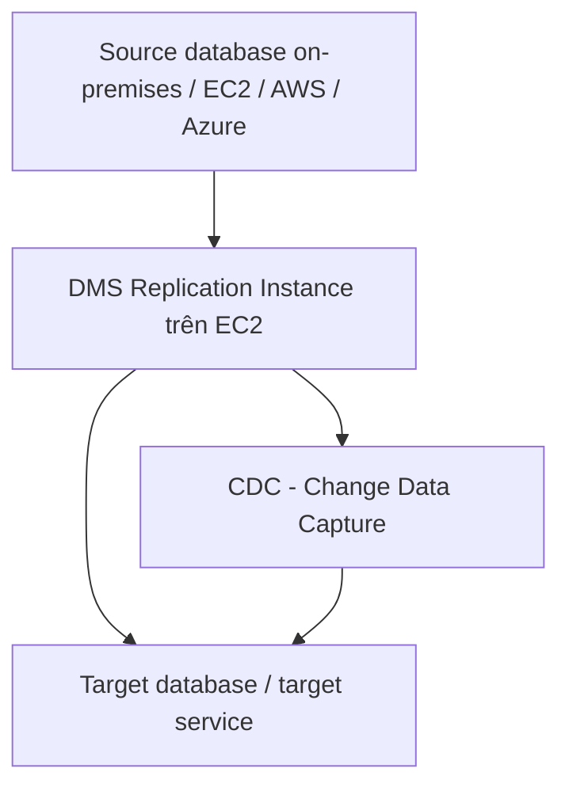
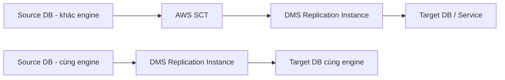

# 353. Database Migration Service (DMS)

## 🎯 Giới thiệu
- **AWS Database Migration Service (DMS)** dùng để migrate database từ **on-premises** lên **AWS Cloud** một cách **nhanh** và **an toàn**.
- Trong quá trình migration, **source database vẫn available**.
- DMS được mô tả là:
  - **Resilient**
  - **Self-healing**
- DMS hỗ trợ:
  - **Homogeneous migration**: cùng engine, ví dụ `Oracle -> Oracle`, `Postgres -> Postgres`
  - **Heterogeneous migration**: khác engine, ví dụ `Microsoft SQL Server -> Aurora`
- DMS hỗ trợ **continuous data replication** bằng **CDC (Change Data Capture)**.

## 1. Cách DMS hoạt động
- Để dùng DMS, cần tạo một **EC2 instance**.
- EC2 instance này sẽ chạy **DMS software** và thực hiện **replication tasks**.
- Mô hình đơn giản:
  - **Source database** ở on-premises
  - **DMS trên EC2** liên tục pull dữ liệu từ source
  - Dữ liệu được đẩy sang **target database**
- Ý chính cần nhớ: DMS là công cụ để **copy/migrate dữ liệu** từ source sang target trong khi hệ thống nguồn vẫn chạy.

## 2. Source, Target và AWS SCT
- **Source** mà DMS có thể đọc:
  - On-premises databases
  - EC2-based databases
  - `Oracle`, `Microsoft SQL Server`, `MySQL`, `MariaDB`, `PostgreSQL`, `MongoDB`, `SAP`, `DB2`
  - `Azure SQL Database`
  - `Amazon RDS` including `Aurora`
  - `Amazon S3`
  - `DocumentDB`
- **Target** mà DMS có thể ghi tới:
  - On-premises và EC2-based databases
  - `Oracle`, `Microsoft SQL Server`, `MySQL`, `MariaDB`, `PostgreSQL`, `SAP`
  - `Amazon RDS`
  - `Redshift`
  - `DynamoDB`
  - `Amazon S3`
  - `Kinesis Data Streams`
  - `Apache Kafka`
  - `DocumentDB`
  - `Amazon Neptune`
  - `Redis`
  - `Babelfish`

- Khi **source engine khác target engine**, phải dùng **AWS SCT (Schema Conversion Tool)**:
  - SCT sẽ **convert database schema** từ engine này sang engine khác
- Ví dụ:
  - `SQL Server` hoặc `Oracle -> MySQL`, `PostgreSQL`, `Aurora`
  - `Teradata` hoặc `Oracle -> Amazon Redshift`
- Nếu migrate **cùng database engine** thì **không cần SCT**:
  - Ví dụ: `on-premises PostgreSQL -> RDS PostgreSQL`
- Điểm thi cần nhớ:
  - **Khác engine = cần SCT**
  - **Cùng engine = không cần SCT**

## 3. Continuous Replication và Multi-AZ
- Với **continuous replication**, flow điển hình là:
  - Source database ở **corporate data center**
  - **AWS SCT** được cài trên server, best practice là **on-premises**
  - SCT thực hiện **schema conversion**
  - Sau đó tạo **DMS replication instance**
  - DMS làm **full load** và **CDC**
  - Dữ liệu được migrate sang **Amazon RDS** hoặc target khác
- Nếu source và target là **khác loại database**, SCT là phần bắt buộc trước khi DMS chạy tốt.
- DMS có **Multi-AZ deployment**:
  - Có **DMS replication instance** ở một AZ
  - Có **synchronous replication** sang AZ khác làm **standby replica**
- Lợi ích của Multi-AZ:
  - **Resilience** khi một AZ gặp sự cố
  - **Data redundancy**
  - Giảm **IO freezes**
  - Giảm **latency spikes**

## 📊 Bảng tóm tắt
| Tiêu chí | Mô tả |
|----------|------|
| Mục đích | Migrate database từ on-premises lên AWS Cloud |
| Công cụ chính | `AWS DMS` |
| Khi source và target khác engine | Cần `AWS SCT` |
| Khi source và target cùng engine | Không cần `SCT` |
| Cơ chế đồng bộ | `CDC (Change Data Capture)` |
| Thành phần chạy DMS | `EC2 instance` |
| Tính sẵn sàng | `Multi-AZ deployment` |
| Lợi ích Multi-AZ | Resilience, data redundancy, giảm IO freezes, giảm latency spikes |
| Source/Target | Hỗ trợ nhiều database và dịch vụ AWS như `RDS`, `Aurora`, `Redshift`, `DynamoDB`, `S3`, `Kafka`, `Neptune` |

## 💡 Mẹo ghi nhớ cho kỳ thi AWS
- **DMS = migrate dữ liệu**, không phải tự convert schema.
- **SCT = convert schema** khi **engine khác nhau**.
- Nhớ câu chốt:
  - **Same engine -> DMS only**
  - **Different engine -> SCT + DMS**
- **CDC** là từ khóa quan trọng cho **continuous replication**.
- **DMS chạy trên EC2** theo mô tả trong transcript.
- **Multi-AZ** giúp tăng độ tin cậy và giảm gián đoạn khi AZ gặp lỗi.

## ✅ Kết luận
- **AWS DMS** là dịch vụ dùng để migrate database sang AWS một cách nhanh và an toàn.
- DMS hỗ trợ cả **homogeneous** và **heterogeneous migration**, có **CDC** cho replication liên tục.
- Khi **khác engine**, cần thêm **AWS SCT** để chuyển schema.
- Với **Multi-AZ**, DMS tăng độ bền vững và giảm rủi ro gián đoạn trong quá trình migration.
