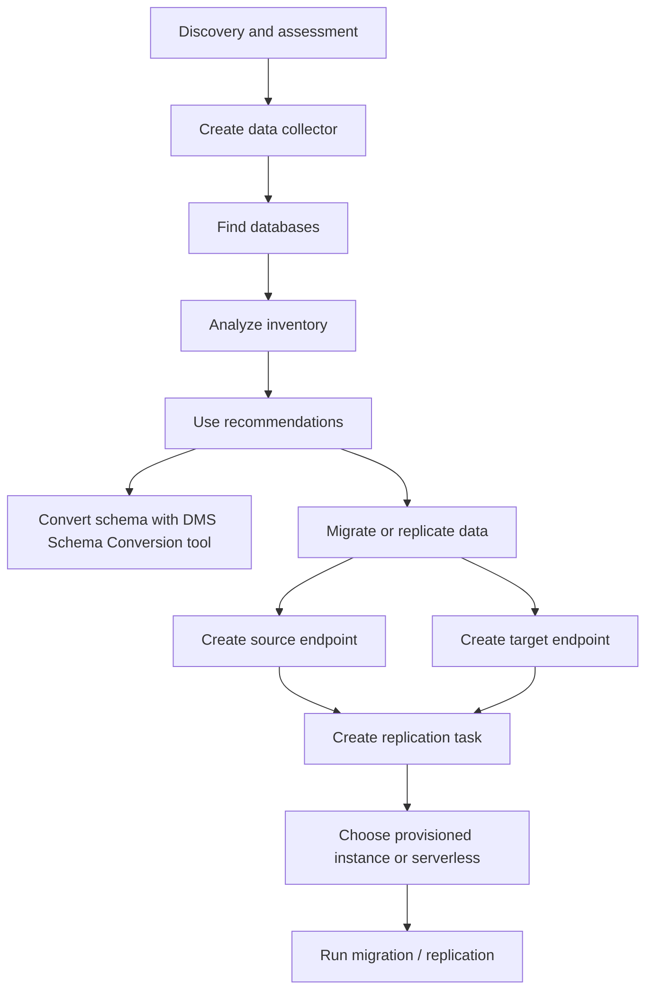

# 354. Database Migration Service (DMS) - Hands On

## 🎯 Giới thiệu
AWS DMS được dùng để **migrate** hoặc **replicate** data từ **source** sang **target**. Trong transcript, phần quan trọng không nằm ở trang overview mà ở menu bên trái, nơi bạn thực hiện các bước chính của DMS.

- Có thể dùng cho:
  - **Discovery and assessment**
  - **Convert or move to managed**
  - **Migrate or replicate data**
- Có 2 hướng triển khai được nhắc đến:
  - **Provisioned**
  - **Serverless**
- Nếu cần convert schema, dùng **DMS Schema Conversion tool**
- Nếu không convert schema, có thể làm **homogeneous data migration**

## 1. Quy trình tổng quan của DMS
DMS được mô tả như một chuỗi bước từ chuẩn bị nguồn và đích cho đến chạy migration task.

- **Discovery and assessment**:
  - Tạo **data collector**
  - Tìm database
  - Phân tích inventory
  - Dùng recommendations
- **Convert or move to managed**:
  - Convert schema bằng **DMS Schema Conversion tool**
  - Sau đó move data vào AWS
- **Migrate or replicate data**:
  - Chọn **source endpoint** và **target endpoint**
  - Tạo **replication task**

## 2. Endpoints: nguồn và đích
Muốn move data bằng DMS thì phải tạo endpoint cho cả **source** và **target**.

### Source endpoint
- Nhập **identifier**
- Chọn **source engine**
  - Ví dụ trong transcript: **Amazon Aurora MySQL**
- Nhập các thông tin cấu hình của endpoint
- Có thể **test endpoint connection** để kiểm tra replication instance có kết nối được với source hay không

### Target endpoint
- Chọn **target engine**
  - Ví dụ trong transcript: **DynamoDB**
- Nhập cấu hình liên quan
- Có thể test connection tương tự
- Giao diện bên phải cung cấp thêm thông tin và **best practices**

### Ý chính cần nhớ
- DMS luôn có khái niệm **source endpoint** và **target endpoint**
- Endpoints là nền tảng để task có thể đọc từ source và ghi sang target

## 3. Replication instance, task mode và kiểu migration
Sau khi có 2 endpoint, bạn tạo **replication task**.

### Replication instance
- Có thể tạo **replication instance** như một **physical server**
- Có thể chọn size của server
- Có thể estimate **instance class** và **storage**
- Khi cấu hình, transcript nhắc tới:
  - **high availability**
  - **networking type**
  - **subnet group**
  - **security groups**
- Với workload lớn hơn, có thể cần instance lớn hơn

### Serverless
- Nếu dùng **serverless**, không cần provision instance
- DMS tự điều chỉnh **compute**
- Đây là lựa chọn đơn giản hơn theo transcript

### Task mode và loại xử lý
Khi tạo task, bạn sẽ chọn:
- **Source database endpoint**
- **Target database endpoint**
- **Task mode**
  - **Provisioned**: chọn replication instance đã tạo
  - **Serverless**: DMS tự lo compute

### Kiểu migrate/replicate
Transcript nhấn mạnh 3 lựa chọn:
- **Migrate data once**
- **Migrate and replicate**
  - Full load trước
  - Sau đó thay đổi ở source sẽ được replicate
  - Đây là **CDC**
- **Just replicate**
  - Chỉ replicate trong một khoảng thời gian

## 📊 Bảng tóm tắt
| Tiêu chí | Mô tả |
|----------|------|
| Mục đích | **Migrate** hoặc **replicate** data giữa source và target |
| Chuẩn bị | Có thể làm **discovery and assessment** trước khi migrate |
| Schema | Dùng **DMS Schema Conversion tool** nếu cần convert schema |
| Endpoint | Phải tạo cả **source endpoint** và **target endpoint** |
| Compute | Có 2 cách: **Provisioned** hoặc **Serverless** |
| Task mode | Chọn endpoint, chọn instance nếu provisioned, rồi chạy replication task |
| Kiểu đồng bộ | Có thể migrate một lần, migrate + replicate với **CDC**, hoặc chỉ replicate |

## 💡 Mẹo ghi nhớ cho kỳ thi AWS
- **DMS = source endpoint + target endpoint + replication task**
- Nhớ rõ 2 chế độ:
  - **Provisioned**: phải chọn replication instance
  - **Serverless**: không cần provision instance
- Nếu nghe đến **CDC**, hãy liên tưởng tới chế độ **migrate and replicate**
- Nếu có nhắc **schema conversion**, transcript đang nói tới **DMS Schema Conversion tool**
- Nếu không convert schema, transcript gọi đây là **homogeneous data migration**

## ✅ Kết luận
AWS DMS trong bài hands-on này được mô tả như một service để di chuyển dữ liệu theo luồng rõ ràng: tạo **source/target endpoints**, chọn **Provisioned** hoặc **Serverless**, rồi chạy **replication task**. Điểm cần nhớ cho ôn thi là DMS hỗ trợ cả **full load**, **CDC**, và có thể dùng **DMS Schema Conversion tool** khi cần convert schema.
