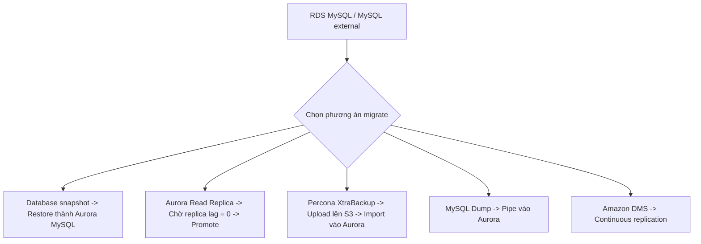

# 355. RDS & Aurora Migrations

## 🎯 Giới thiệu
Bài giảng này nói về các cách **migrate database sang Amazon Aurora MySQL** và **Aurora PostgreSQL**. Đây là nội dung có thể xuất hiện trong exam, nên cần nhớ các luồng migrate chính, thời điểm có downtime, và công cụ được dùng trong từng trường hợp.

## 1. Migrate từ RDS MySQL sang Aurora MySQL
- **Cách 1: Database snapshot**
  - Tạo snapshot từ **RDS MySQL**
  - Restore snapshot đó thành **Aurora MySQL**
  - Có thể có **downtime** vì cần dừng hoạt động trên MySQL nguồn trước khi migrate

- **Cách 2: Aurora Read Replica**
  - Tạo **Amazon Aurora Read Replica** trên RDS MySQL
  - Chờ **replica lag = 0**
  - Sau đó **promote** replica thành **database cluster** riêng
  - Cách này mất thời gian hơn snapshot và có thể phát sinh **network cost** do replication

## 2. Migrate từ MySQL bên ngoài RDS sang Aurora MySQL
- **Percona XtraBackup**
  - Dùng **Percona XtraBackup utility** để tạo backup file
  - Upload backup file lên **Amazon S3**
  - Aurora có thể **directly import** file này vào **new Aurora MySQL DB cluster**
  - Chỉ hỗ trợ **Percona XtraBackup utility**

- **MySQL Dump**
  - Chạy **MySQL Dump utility** trên MySQL database
  - Pipe output vào **existing Amazon Aurora database**
  - Cách này **mất nhiều thời gian**
  - Không tận dụng **Amazon S3**

- **Amazon DMS**
  - Dùng khi **cả hai database đều đang chạy**
  - Hỗ trợ **continuous replication** giữa hai database

## 3. Migrate sang Aurora PostgreSQL
- **Từ RDS PostgreSQL**
  - Có 2 lựa chọn tương tự:
    - Dùng **database snapshot** rồi restore thành **Amazon Aurora database**
    - Tạo **Amazon Aurora Read Replica** của PostgreSQL, chờ **replication lag = 0**, rồi promote thành cluster riêng

- **Từ PostgreSQL bên ngoài RDS**
  - Tạo backup của PostgreSQL
  - Put backup lên **Amazon S3**
  - Import dữ liệu bằng **AWS S3 Aurora extension**
  - Cách này sẽ tạo ra **new database**

- **Amazon DMS**
  - Có thể dùng để migrate **continuously** từ PostgreSQL sang **Amazon Aurora**

## 📊 Bảng tóm tắt
| Tiêu chí | Mô tả |
|----------|------|
| Migrate từ RDS MySQL | Snapshot restore hoặc Aurora Read Replica |
| Downtime | Snapshot có thể gây downtime |
| Read Replica | Chờ **replica lag = 0** rồi promote |
| MySQL external | Dùng **Percona XtraBackup** hoặc **MySQL Dump** |
| S3 usage | Có với **Percona XtraBackup** và PostgreSQL external backup |
| Import trực tiếp | Aurora có thể import backup từ S3 trong một số trường hợp |
| Continuous replication | Dùng **Amazon DMS** |
| PostgreSQL | Quy trình tương tự MySQL: snapshot, Read Replica, backup qua S3, DMS |

## 💡 Mẹo ghi nhớ cho kỳ thi AWS
- **Snapshot** = nhanh, nhưng có thể có **downtime**
- **Read Replica** = chờ **lag = 0** rồi **promote**
- **External MySQL** = nhớ **Percona XtraBackup -> S3 -> Aurora**
- **MySQL Dump** = **chậm**, không dùng **S3**
- **DMS** = dùng khi cần **continuous replication**
- Với **PostgreSQL**, nhớ quy trình gần như tương tự MySQL, đặc biệt là:
  - snapshot
  - Aurora Read Replica
  - backup lên **S3**
  - **DMS**

## ✅ Kết luận
Có nhiều cách migrate sang **Aurora MySQL** và **Aurora PostgreSQL**, nhưng ý chính cần nhớ là:
- **Snapshot** cho cách đơn giản hơn nhưng có thể downtime
- **Aurora Read Replica** cho cách đồng bộ hơn, cần đợi **replica lag = 0**
- **S3-based import** áp dụng cho một số trường hợp external database
- **Amazon DMS** dùng cho **continuous replication**
