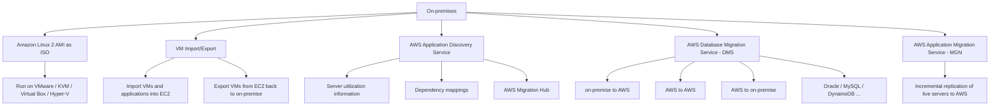

# 356. On-Premises Strategies with AWS

## 🎯 Giới thiệu
Bài giảng này nhấn mạnh các **AWS services** liên quan đến chiến lược **on-premises to cloud migration**. Mục tiêu là nhận diện nhanh tên dịch vụ và hiểu ở mức rất cao chúng dùng cho việc gì, để không bị bất ngờ khi gặp trong đề thi AWS.

## 1. Amazon Linux 2 AMI chạy trên on-premises
- Có thể tải **Amazon Linux 2 AMI** dưới dạng **virtual machine** ở định dạng **ISO**.
- Có thể nạp ISO này vào các phần mềm tạo VM phổ biến như:
  - **VMware**
  - **KVM**
  - **Virtual Box**
  - **Microsoft Hyper-V**
- Cách này cho phép chạy **Amazon Linux 2** trực tiếp trên **on-premise infrastructure**.
- Có thể cấu hình thêm như **user data**.

## 2. Các dịch vụ hỗ trợ di chuyển và khám phá hệ thống
- **VM Import/Export**
  - Dùng để migrate các **existing VMs and applications** vào **EC2**.
  - Cũng có thể dùng cho chiến lược **disaster recovery** bằng cách backup VM on-premise lên cloud.
  - Có thể **export** VM từ **EC2** ngược về môi trường on-premise.
- **AWS Application Discovery Service**
  - Thu thập thông tin về **on-premise servers** để lập kế hoạch migration.
  - Cung cấp mức rất cao về:
    - **server utilization information**
    - **dependency mappings**
- **AWS Migration Hub**
  - Dùng để theo dõi toàn bộ quá trình migration.
- **AWS Application Migration Service (MGN)**
  - Dùng cho **incremental replication** của **on-premises live servers** lên AWS.

## 3. Di chuyển database và workload giữa on-premises và AWS
- **AWS Database Migration Service (DMS)**
  - Có thể replicate theo các hướng:
    - **on-premise to AWS**
    - **AWS to AWS**
    - **AWS to on-premise**
  - Hữu ích khi đang chuyển dần workload lên AWS.
  - Hỗ trợ nhiều công nghệ database như:
    - **Oracle**
    - **MySQL**
    - **DynamoDB**
    - và các loại khác
  - Có thể dùng cho tình huống như migrate dữ liệu từ **MySQL** sang **DynamoDB**.
- Transcript cũng nhắc đến:
  - **Server Migration Service**
  - **DMS**
  - **SMS**
- Ý chính cần nhớ: các dịch vụ này đều liên quan đến **migration** từ góc nhìn **on-premises**.

## 📊 Bảng tóm tắt
| Tiêu chí | Mô tả |
|----------|------|
| Amazon Linux 2 on-premises | Có thể tải Amazon Linux 2 AMI dạng ISO và chạy trên VM như VMware, KVM, Virtual Box, Hyper-V |
| VM Import/Export | Migrate VM và application vào EC2, hoặc export ngược về on-premise |
| Application Discovery Service | Thu thập thông tin server utilization và dependency mappings để lập kế hoạch migration |
| Migration Hub | Theo dõi quá trình migration |
| DMS | Replicate database giữa on-premise, AWS và ngược lại; hỗ trợ nhiều engine như Oracle, MySQL, DynamoDB |
| MGN | Incremental replication của on-premises live servers lên AWS |

## 💡 Mẹo ghi nhớ cho kỳ thi AWS
- Nhìn thấy **on-premises** thì nghĩ ngay đến nhóm dịch vụ migration/discovery.
- **Discovery** để “khảo sát” hệ thống, **Migration Hub** để “theo dõi” migration.
- **VM Import/Export** liên quan đến VM đi vào và đi ra giữa **on-premise** và **EC2**.
- **DMS** là từ khóa mạnh cho **database replication** và có thể đi theo nhiều hướng.
- **MGN** gắn với **incremental replication** của server sống lên AWS.
- **Amazon Linux 2 AMI** có thể chạy on-premises dưới dạng VM, đây là một ý dễ ra thi.

## ✅ Kết luận
Các dịch vụ trong bài đều xoay quanh **on-premises strategy with AWS**: chạy **Amazon Linux 2** tại chỗ, di chuyển VM qua **EC2**, khám phá hệ thống trước migration, theo dõi migration tập trung, và replicate database/server bằng **DMS** và **MGN**. Chỉ cần nhớ tên dịch vụ và vai trò mức cao là đủ để nhận diện trong đề thi AWS.
