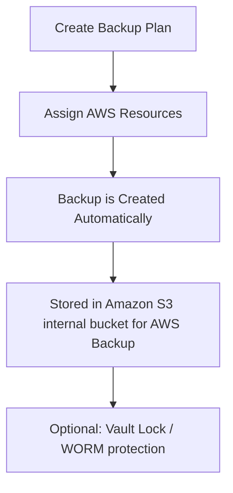

# 357. AWS Backup

## 🎯 Giới thiệu
AWS Backup là một **fully managed service** cho phép bạn **centrally manage** và **automate backups** trên nhiều AWS services.

Mục tiêu chính:
- Có **một nơi tập trung** để quản lý chiến lược backup
- Không cần **custom scripts** hay quy trình thủ công
- Dễ theo dõi, kiểm soát và chuẩn hóa backup cho nhiều tài nguyên

## 1. Phạm vi hỗ trợ và khả năng backup
AWS Backup hỗ trợ nhiều dịch vụ AWS phổ biến, bao gồm:
- **Amazon EC2**
- **EBS**
- **Amazon S3**
- **RDS** và các database engines được hỗ trợ
- **Aurora**
- **DynamoDB**
- **DocumentDB**
- **Amazon Neptune**
- **EFS**
- **FSx**, bao gồm **Lustre**
- **Windows File Server**
- **AWS Storage Gateway** như **Volume Gateway**

Các khả năng quan trọng:
- **Cross-region backups**: đẩy backup sang region khác cho chiến lược disaster recovery
- **Cross-account backups**: hỗ trợ backup giữa nhiều account
- **Point in time recovery** cho các service được hỗ trợ, ví dụ **Aurora**
- **On-demand backups** và **scheduled backups**

## 2. Backup Plans và quản lý tự động
AWS Backup cho phép tạo **Backup Plans** để định nghĩa chiến lược backup.

Các thành phần chính trong backup plan:
- **Frequency**: ví dụ mỗi 12 giờ, hằng tuần, hằng tháng, hoặc theo **cron expression**
- **Backup Window**: khung giờ thực hiện backup
- **Transition to Cold Storage**: chuyển backup sang Cold Storage ngay hoặc sau một khoảng thời gian
- **Retention Period**: thời gian giữ backup theo ngày, tuần, tháng, hoặc năm

Điểm đáng nhớ:
- Có thể dùng **tag-based backup policies**
- Chỉ backup các resource được gắn tag phù hợp, ví dụ tag **production**
- AWS Backup giúp gom toàn bộ chiến lược backup vào một nơi quản lý

## 3. Backup Vault và Vault Lock
Sau khi cấu hình, dữ liệu sẽ được backup và lưu vào **Amazon S3** trong một **internal bucket** dành riêng cho AWS Backup.

Một tính năng rất quan trọng là **Vault Lock**:
- Áp dụng chính sách **WORM**: **Write Once Read Many**
- Backup đã lưu trong **Backup Vault** sẽ **không thể bị xóa**
- Tăng khả năng bảo vệ khỏi:
  - xóa nhầm
  - thao tác xóa độc hại
  - thay đổi làm giảm hoặc sửa **retention period**
- Ngay cả **root user** cũng không thể xóa backup khi Vault Lock được bật

## 📊 Bảng tóm tắt
| Tiêu chí | Mô tả |
|----------|------|
| Loại dịch vụ | **Fully managed service** |
| Mục đích | Trung tâm hóa và tự động hóa backup cho AWS services |
| Hỗ trợ | EC2, EBS, S3, RDS, Aurora, DynamoDB, EFS, FSx, Neptune, DocumentDB, Storage Gateway, ... |
| Kiểu backup | **On-demand**, **scheduled**, **point in time recovery** cho dịch vụ hỗ trợ |
| Phạm vi | **Cross-region**, **cross-account** |
| Quản lý chính sách | **Backup Plans**, **tag-based backup policies** |
| Lưu trữ | Lưu vào **Amazon S3** internal bucket của AWS Backup |
| Bảo vệ backup | **Vault Lock** với **WORM** |
| Lợi ích lớn nhất | Tập trung, tự động, an toàn, dễ chuẩn hóa |

## 💡 Mẹo ghi nhớ cho kỳ thi AWS
- Nhớ AWS Backup là dịch vụ để **centralize + automate backups**
- Ghi nhớ 3 từ khóa hay hỏi thi:
  - **Backup Plans**
  - **Cross-region / Cross-account**
  - **Vault Lock / WORM**
- Nếu đề bài nói:
  - cần backup nhiều dịch vụ AWS ở một nơi
  - cần chính sách backup theo tag
  - cần chống xóa backup kể cả bởi root user
  thì nghĩ ngay đến **AWS Backup**
- **Cold Storage** và **Retention Period** là các tham số quan trọng trong chiến lược backup

## ✅ Kết luận
AWS Backup giúp bạn xây dựng chiến lược backup tập trung, tự động và có kiểm soát cho nhiều AWS services. Điểm cần nhớ nhất là **Backup Plans**, khả năng **cross-region/cross-account**, và cơ chế **Vault Lock** để bảo vệ backup khỏi việc bị xóa hoặc sửa đổi ngoài ý muốn.
