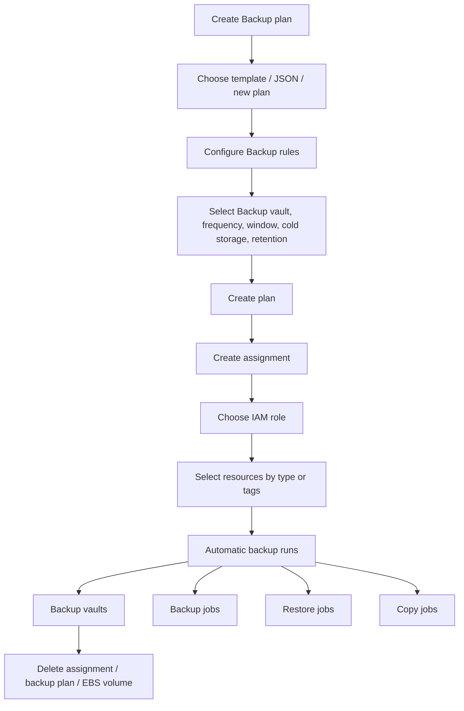

# 358. AWS Backup - Hands On

## 🎯 Giới thiệu
- Bài thực hành này minh họa cách dùng **AWS Backup** để:
  - Tạo **backup plan**
  - Gán tài nguyên bằng **assignments**
  - Theo dõi **backup jobs**, **restore jobs**, **copy jobs**
  - Xóa plan và assignment sau khi test
- Trọng tâm là cách AWS Backup hoạt động theo **template**, **backup rules**, **Backup vault**, và **tag-based selection**.

## 1. Tạo Backup Plan 🧩
- Vào **AWS Backup** và chọn **Create Backup plan**.
- Có 3 cách tạo plan:
  - Dùng **template**
  - Tạo plan mới từ đầu
  - Định nghĩa bằng **JSON**
- Trong bài, chọn template:
  - Ví dụ: **Daily-Monthly-1yr-Retention**
  - Đặt tên plan là **TestPlan**
- Khi vào **Backup rules**, có thể thấy:
  - Một plan có thể có **nhiều backup rules**
  - Ví dụ: **daily backups** và **monthly backups**

### Các thuộc tính chính của Backup rule
- **Backup vault**: nơi lưu backup
  - Có thể dùng vault mặc định do AWS tạo
  - Hoặc tự tạo vault riêng
- **Backup frequency** và **Backup window**
  - Ví dụ: bắt đầu lúc **5:00 AM UTC**
  - Có thể cấu hình **start within eight hours**
- **Cold storage transition**
  - Có thể chọn không chuyển
  - Hoặc chuyển sau một khoảng thời gian
- **Retention period**
  - Ví dụ:
    - Daily backup: giữ **5 weeks**
    - Monthly backup: chuyển sang cold storage sau **1 month** và giữ **1 year**
- Có thể **copy backups** sang nơi khác, ví dụ **another region** để phục vụ **disaster recovery**

## 2. Assign Resources cho Backup Plan 🔗
- Sau khi tạo plan, cần **assign resources**.
- Đặt tên assignment, ví dụ: **TestAssignments**
- **IAM role**
  - Có thể dùng **default role**
  - AWS sẽ tạo role với quyền phù hợp
- **Resource selection** có 2 cách:
  - **Include all resource types**
  - **Include specific resource types**
    - Ví dụ chỉ chọn **DynamoDB table**
- Với cách chọn tất cả resource types, thường kết hợp với **tags**

### Cơ chế theo tags
- Ví dụ:
  - Key: `environment`
  - Value: `production`
- Tài nguyên nào có tag phù hợp sẽ được backup tự động
- Ví dụ trong bài:
  - Tạo một **EBS volume** trong **EC2**
  - Gán tag `environment=production`
  - Volume đó sẽ được backup bởi plan vì khớp tag

### Ý nghĩa thực hành
- Có thể tạo **multiple assignments**
- Đây là cách AWS Backup tự động áp dụng policy backup cho các tài nguyên phù hợp

## 3. Jobs, Settings và Xóa Cấu Hình 🛠️
- Sau khi assignment xong, backup sẽ chạy tự động
- Backup được lưu trong **Backup vaults**
- Các loại job chính:
  - **backup jobs**
  - **restore jobs**
  - **copy jobs**
- Mục **settings** liên quan đến:
  - **backup policies**
  - **cross account monitoring**
  - **cross account backups**

### Xóa tài nguyên sau khi thử nghiệm
- Nên **xóa EBS volume** nếu không cần nữa, hoặc chờ một ngày để kiểm tra backup
- Sau đó:
  - Xóa **assignment**
  - Xóa **Daily Backup rules** hoặc xóa trực tiếp **Backup plan**
- Khi xóa, chỉ cần nhập đúng **tên backup plan** rồi xác nhận delete

## 📊 Bảng tóm tắt
| Tiêu chí | Mô tả |
|----------|------|
| Cách tạo plan | Template, JSON, hoặc tạo mới |
| Backup rules | Một plan có thể có nhiều rule như daily và monthly |
| Backup vault | Nơi lưu backup, có thể dùng mặc định hoặc tự tạo |
| Retention | Quy định thời gian giữ backup |
| Cold storage | Có thể chuyển backup sang cold storage sau một thời gian |
| Copy backup | Có thể copy sang region khác cho disaster recovery |
| Gán tài nguyên | Dùng all resource types hoặc specific resource types |
| Tag-based backup | Backup tự động theo tag như `environment=production` |
| IAM role | Có thể dùng default role do AWS tạo |
| Jobs | Backup jobs, restore jobs, copy jobs |
| Dọn dẹp | Xóa assignment, backup plan, và EBS volume khi test xong |

## 💡 Mẹo ghi nhớ cho kỳ thi AWS
- **Backup plan** là phần định nghĩa chính sách.
- **Assignment** là phần gán tài nguyên vào plan.
- **Tag** là cách tự động hóa backup rất hay gặp trong thực hành.
- **Backup vault** là nơi chứa backup.
- Nhớ 3 nhóm job:
  - **backup**
  - **restore**
  - **copy**
- Khi thấy mô tả về **disaster recovery**, hãy nghĩ đến việc **copy backups to another region**.
- Khi làm bài thi, nếu gặp hỏi về cách backup tự động theo điều kiện, hãy chú ý đến **tags** và **resource selection**.

## ✅ Kết luận
- AWS Backup cho phép tạo **backup plan**, cấu hình **backup rules**, và gán tài nguyên bằng **IAM role** cùng **tags**.
- Bản thực hành này cho thấy quy trình đầy đủ từ tạo plan, gán resource, chạy backup tự động, đến xóa cấu hình sau khi kiểm tra xong.
- Điểm quan trọng nhất để ôn thi là phân biệt rõ **plan**, **assignment**, **vault**, và cách backup tự động theo **tag**.
