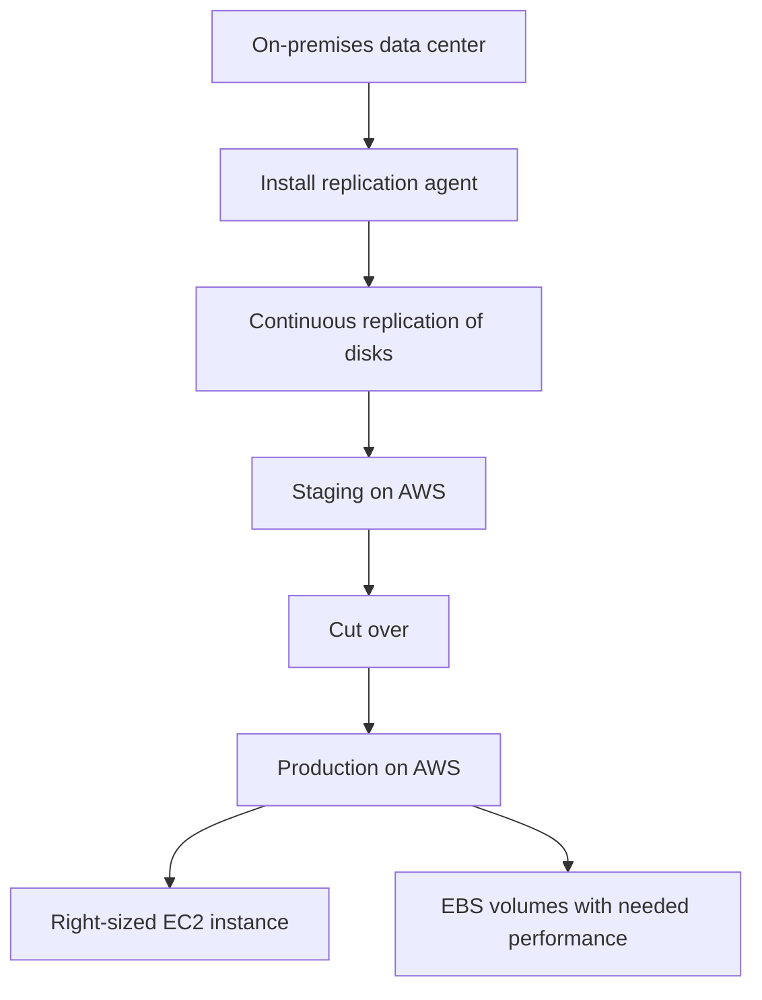

# 359. Application Migration Service (MGN)

## 🎯 Giới thiệu
- Trong hành trình lên cloud, nếu bạn **start fresh** thì không cần migration.
- Nhưng nếu đang có **on-premises servers** và **data centers**, bạn cần lập kế hoạch migration lên AWS.
- Một bước chuẩn bị quan trọng là dùng **AWS Application Discovery Service** để:
  - scan servers
  - thu thập **server utilization data**
  - thu thập **dependency mapping**
- Dữ liệu này giúp xác định:
  - cần migrate những gì
  - nên migrate cái gì trước
- Kết quả từ Discovery Service có thể xem trong **AWS Migration Hub**.

## 1. AWS Application Discovery Service 🔍
- Có 2 cách discovery:
  - **Agentless Discovery using a Connector**
    - cung cấp thông tin về **virtual machines**
    - xem được **configuration**
    - xem được **performance history**
    - ví dụ: **CPU, memory, disk usage**
  - **Application Discovery Agent**
    - cài agent داخل virtual machines
    - cung cấp nhiều cập nhật và thông tin hơn
    - ví dụ: **system configuration**, **performance**, **processes**, và chi tiết các **network connections**
- Mục tiêu chính là hiểu hệ thống được kết nối với nhau như thế nào để phục vụ migration.

## 2. AWS Application Migration Service (MGN) 🚚
- Đây là cách đơn giản nhất để move từ **on-premises** sang **AWS**.
- Tên cũ là **CloudEndure Migration**.
- MGN dùng cho **rehosting**, còn gọi là **lift-and-shift**.
- Có thể convert:
  - physical servers
  - virtual servers
  - workloads từ other clouds
  - để chạy natively trên AWS

## 3. Flow migration với MGN 🔄
- Bạn cài **replication agent** trên data center.
- Agent thực hiện **continuous replication** của disks.
- Dữ liệu được replicate sang:
  - **low-cost EC2 instances**
  - **EBS volumes**
- Khi sẵn sàng **cut over**:
  - chuyển từ **staging** sang **production**
  - dùng **EC2 instance** lớn hơn theo đúng size cần thiết
  - dùng **EBS volumes** phù hợp với performance yêu cầu
- Cách này giúp:
  - **minimal downtime**
  - **reduced costs**
  - giảm nhu cầu thuê engineer phức tạp vì service tự động hóa phần lớn công việc

## 📊 Bảng tóm tắt
| Tiêu chí | Mô tả |
|----------|------|
| Mục đích | Migrate từ on-premises lên AWS |
| Bước chuẩn bị | Dùng **AWS Application Discovery Service** để thu thập utilization và dependency mapping |
| Cách discovery | **Agentless Discovery using a Connector** hoặc **Application Discovery Agent** |
| Nơi xem kết quả | **AWS Migration Hub** |
| Công cụ migrate chính | **AWS Application Migration Service (MGN)** |
| Tên cũ | **CloudEndure Migration** |
| Kiểu migration | **Rehosting / lift-and-shift** |
| Cơ chế hoạt động | **Continuous replication** từ disks sang AWS |
| Cut over | Chuyển từ **staging** sang **production** |
| Lợi ích | **Minimal downtime**, **reduced costs**, tự động hóa cao |

## 💡 Mẹo ghi nhớ cho kỳ thi AWS
- **Discovery trước, migration sau**: dùng **Application Discovery Service** để hiểu hệ thống, rồi mới dùng **MGN** để move.
- **MGN = lift-and-shift**: từ physical, virtual, hoặc other clouds sang AWS.
- Nhớ chuỗi chính: **Agent/Connector -> replication -> staging -> cut over -> production**.
- **Migration Hub** là nơi xem dữ liệu kết quả từ discovery.
- Các keyword hay xuất hiện trong câu hỏi: **continuous replication**, **minimal downtime**, **EBS**, **EC2**, **rehosting**.

## ✅ Kết luận
- **AWS Application Discovery Service** giúp phân tích hệ thống trước khi migrate.
- **AWS Application Migration Service (MGN)** là cách đơn giản nhất để thực hiện **rehosting / lift-and-shift** lên AWS.
- Điểm cốt lõi của MGN là **replicate liên tục**, sau đó **cut over** sang production trên **EC2** và **EBS** phù hợp.
