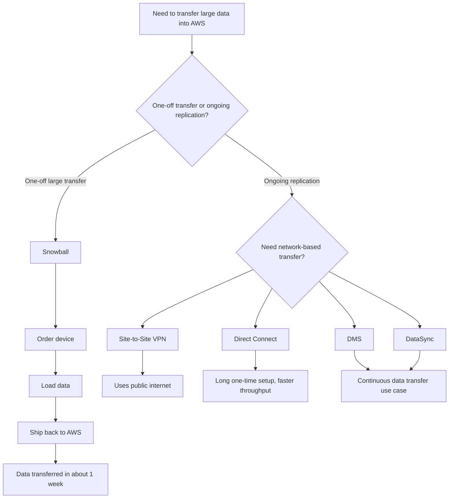

# 360. Transferring Large Datasets into AWS

## 🎯 Giới thiệu
Bài giảng này tóm tắt các cách chuyển **large datasets** vào AWS và cách chọn phương án phù hợp dựa trên **constraint** như:
- Dung lượng dữ liệu
- Tốc độ kết nối hiện có
- Thời gian thiết lập
- Tính chất **one-off transfer** hay **ongoing replication**

Mục tiêu khi ôn thi là nhận diện nhanh dịch vụ/giải pháp nào là **easiest**, **fastest** hoặc **most reliable** cho từng tình huống.

## 1. Các cách chuyển dữ liệu lớn vào AWS 🚚
### 1.1 Public Internet / Site-to-Site VPN
- Có thể dùng **public internet** hoặc **Site-to-Site VPN**.
- Ưu điểm lớn nhất: **immediate to set up**, có thể dùng ngay kết nối hiện có.
- Nhược điểm: với dữ liệu rất lớn và đường truyền chậm, thời gian chuyển có thể cực kỳ lâu.

Ví dụ trong transcript:
- Chuyển **200 TB** qua đường truyền **100 Mbps** có thể mất khoảng **185 days**.
- Kết luận: phù hợp khi dữ liệu không quá lớn hoặc không bị áp lực thời gian.

### 1.2 AWS Direct Connect
- Dùng một đường truyền riêng đã provisioned, ví dụ **1 Gbps**.
- Ưu điểm: nhanh hơn internet thường.
- Nhược điểm: **long, one-time setup** nếu chưa có sẵn.
- Trong ví dụ:
  - Nhanh hơn khoảng **10 lần** so với 100 Mbps.
  - Vẫn mất khoảng **18.5 days** để chuyển 200 TB.

### 1.3 AWS Snowball
- Phù hợp cho **one-off large transfers**.
- Quy trình:
  - Order Snowball
  - AWS delivery
  - Load data
  - Ship back to AWS
  - Data transferred
- Thời gian end-to-end trong transcript: khoảng **1 week**.
- Đây là lựa chọn rất hữu ích để tăng tốc **first data transfer into AWS**.
- Nếu có **database** được chuyển qua Snowball, có thể kết hợp với **DMS** để chuyển phần dữ liệu còn lại sau đó.

## 2. Chọn giải pháp theo use case 🔎
### 2.1 One-off transfer
- Nếu là một lần chuyển dữ liệu rất lớn:
  - Ưu tiên **Snowball**
- Nếu cần thiết lập nhanh và dữ liệu không quá lớn:
  - Có thể dùng **public internet** hoặc **Site-to-Site VPN**
- Nếu đã có hạ tầng kết nối sẵn và muốn tốc độ ổn định hơn:
  - Có thể dùng **Direct Connect**

### 2.2 Ongoing replication
- Nếu cần sao chép dữ liệu liên tục hoặc định kỳ:
  - **Site-to-Site VPN**
  - **Direct Connect**
  - **DMS**
  - **DataSync**
- Lý do: các giải pháp này phù hợp hơn cho luồng dữ liệu lặp lại, không phải chỉ một lần chuyển lớn.

## 3. Luồng lựa chọn giải pháp ⚙️

## 📊 Bảng tóm tắt
| Tiêu chí | Mô tả |
|----------|------|
| Public Internet / Site-to-Site VPN | Dễ thiết lập ngay, nhưng có thể rất chậm với dữ liệu lớn |
| Direct Connect | Nhanh hơn, nhưng cần thời gian setup ban đầu dài |
| Snowball | Phù hợp cho one-off large transfers, end-to-end khoảng 1 tuần |
| DMS | Có thể dùng cho phần dữ liệu còn lại sau Snowball hoặc cho ongoing replication |
| DataSync | Phù hợp cho chuyển dữ liệu liên tục |
| Best for large first transfer | Snowball |
| Best for continuous transfer | Site-to-Site VPN, Direct Connect, DMS, DataSync |

## 💡 Mẹo ghi nhớ cho kỳ thi AWS
- **Small / immediate setup**: nghĩ đến **public internet** hoặc **Site-to-Site VPN**.
- **Large one-time data migration**: nghĩ ngay đến **Snowball**.
- **Need faster network pipe, but setup is okay**: nghĩ đến **Direct Connect**.
- **Ongoing replication**: ưu tiên **VPN**, **Direct Connect**, **DMS**, **DataSync**.
- Mẹo nhớ nhanh:
  - **Snowball = ship the data**
  - **Direct Connect = dedicated line**
  - **VPN = quick setup over public internet**
  - **DMS / DataSync = ongoing transfer**

## ✅ Kết luận
Khi chuyển **large datasets into AWS**, lựa chọn đúng phụ thuộc vào:
- **Tốc độ cần thiết**
- **Thời gian setup**
- **Kích thước dữ liệu**
- **One-off transfer** hay **ongoing replication**

Trong transcript này:
- **Snowball** là giải pháp nổi bật nhất cho **một lần chuyển dữ liệu lớn**
- **Direct Connect** tốt hơn internet thường nhưng cần setup lâu
- **Site-to-Site VPN**, **DMS**, và **DataSync** phù hợp hơn cho các luồng chuyển dữ liệu liên tục
