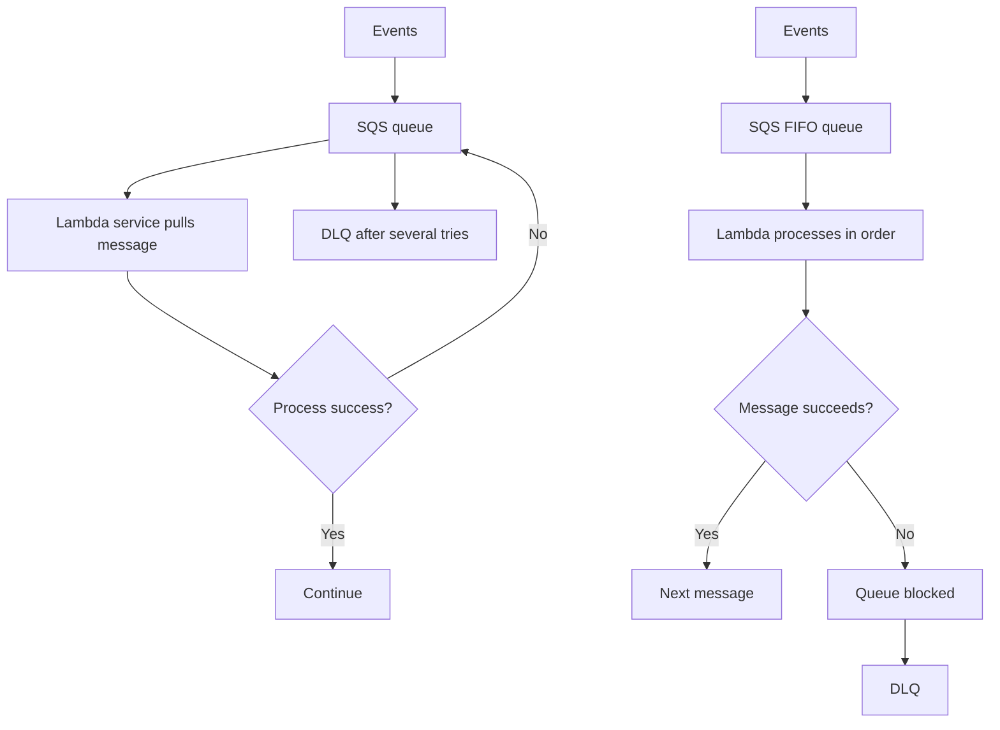
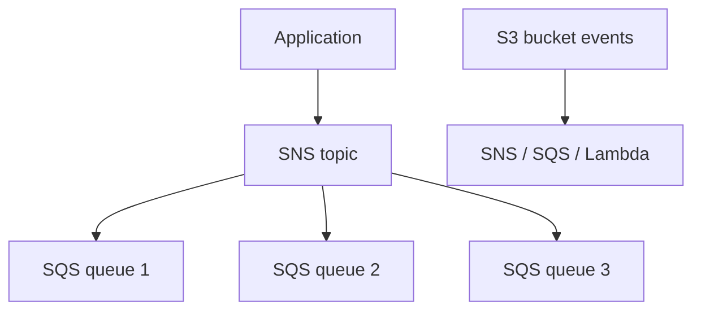
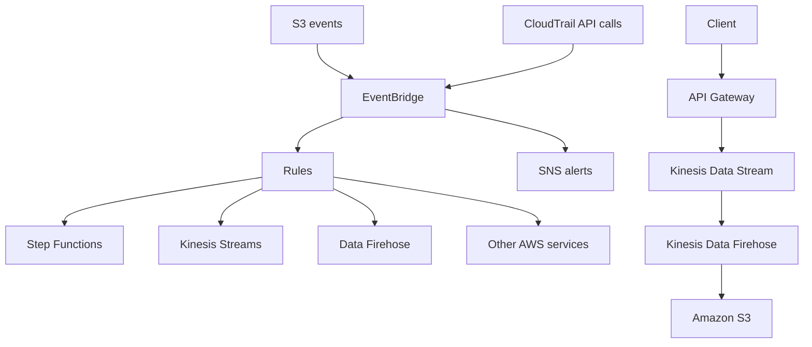

# 362. Event Processing in AWS

## 🎯 Giới thiệu
AWS có nhiều cách để xử lý event và tự động hóa hệ thống, tùy theo yêu cầu về:
- thứ tự xử lý
- retry behavior
- dead letter queue (DLQ)
- fan out đến nhiều đích
- filtering và routing

Transcript này tập trung vào các mô hình phổ biến như `SQS`, `Lambda`, `SNS`, `S3 event notifications`, `EventBridge`, `CloudTrail`, `API Gateway`, `Kinesis Data Stream`, `Kinesis Data Firehose`, và `S3`.

## 1. `SQS` + `Lambda` và `DLQ` 📨
Khi dùng `SQS` với `Lambda`:
- Event được đẩy vào `SQS queue`
- `Lambda service` sẽ pull message từ queue
- Nếu có lỗi, message có thể được đưa lại vào queue để retry
- Có thể xảy ra vòng lặp retry gần như vô hạn nếu một message bị lỗi nặng

Cách xử lý:
- Cấu hình `DLQ` trên phía `SQS`
- Sau một số lần thử, ví dụ `five tries`, message sẽ được chuyển sang `dead letter queue`

### `SQS FIFO` + `Lambda`
- `FIFO` = `first in, first out`
- Message được xử lý theo đúng thứ tự
- Nếu một message không xử lý được:
  - cả queue có thể bị block
  - quá trình xử lý sẽ bị kẹt vì phải giữ thứ tự
- Cũng có thể dùng `DLQ` để đẩy message lỗi ra ngoài và cho hệ thống tiếp tục xử lý

## 2. `SNS` + `Lambda`, `Fan Out` và `S3 event notifications` 📣
### `SNS` + `Lambda`
- Message đi vào `SNS`
- `SNS` gửi asynchronous sang `Lambda`
- Retry behavior khác với `SQS`
- `Lambda` retry nội bộ `three times`
- Nếu vẫn thất bại:
  - message bị discard
  - hoặc cấu hình `DLQ` ở phía `Lambda service`
- `DLQ` lúc này có thể đẩy message sang `SQS` để xử lý lại sau

### So sánh vị trí `DLQ`
- Với `SQS`: `DLQ` nằm ở phía `SQS`
- Với `Lambda`: `DLQ` nằm ở phía `Lambda`

### `Fan Out pattern`
Nếu một application muốn gửi cùng một message tới nhiều `SQS queues`:
- Cách làm thủ công là gửi lần lượt vào từng queue
- Cách này không reliable nếu application crash giữa chừng
- Giải pháp tốt hơn:
  - đặt `SNS topic` ở giữa
  - các `SQS queues` trở thành subscribers của `SNS topic`
  - application chỉ cần gửi vào `SNS`
  - `SNS` sẽ fan out message tới tất cả `SQS queues`

### `S3 event notifications`
Có thể phản ứng với các event trên `Amazon S3` như:
- object created
- object removed
- object restored
- replication happens

Có thể:
- filter theo name
- gửi sang `SNS`, `SQS`, hoặc `Lambda`
- tạo nhiều `S3 events` tùy nhu cầu

Lưu ý:
- Thường được deliver trong vài giây
- Đôi khi có thể mất một phút hoặc lâu hơn

## 3. `EventBridge`, `CloudTrail` và external events 🔄
### `EventBridge` cho `S3`
- Event từ `S3 bucket` có thể được gửi sang `Amazon EventBridge`
- Dùng `rules` để route tới hơn `18 AWS services`
- Có thể filter theo:
  - metadata
  - object-size
  - name
- Có thể gửi đến nhiều destinations cùng lúc như:
  - `Step Functions`
  - `Kinesis Streams`
  - `Data Firehose`

Ngoài routing, `EventBridge` còn có:
- archiving
- replaying
- reliable delivery of events

### `EventBridge` + `CloudTrail`
Có thể intercept API call bằng cách kết hợp `CloudTrail` với `EventBridge`.

Ví dụ:
- user xóa một table từ `DynamoDB`
- hành động đó được ghi trong `CloudTrail`
- `CloudTrail` tạo event trong `EventBridge`
- từ đó có thể tạo alert sang `SNS`

### External events vào AWS
Một luồng khác trong transcript:
- client gửi request vào `API Gateway`
- `API Gateway` gửi message vào `Kinesis Data Stream`
- record đi tới `Kinesis Data Firehose`
- dữ liệu cuối cùng có thể nằm trong `Amazon S3`

## 📊 Bảng tóm tắt
| Tiêu chí | Mô tả |
|----------|------|
| `SQS` + `Lambda` | `Lambda` pull message từ queue, retry khi lỗi, có thể dùng `DLQ` ở phía `SQS` |
| `SQS FIFO` + `Lambda` | Xử lý theo thứ tự `first in, first out`, một message lỗi có thể block cả queue |
| `SNS` + `Lambda` | Gửi asynchronous, retry nội bộ `three times`, `DLQ` nằm ở phía `Lambda` |
| `Fan Out pattern` | Dùng `SNS topic` để phân phối một message tới nhiều `SQS queues` |
| `S3 event notifications` | React với create/remove/restore/replication, gửi sang `SNS`, `SQS`, `Lambda` |
| `EventBridge` | Nhận event từ `S3`, filter bằng rules, route tới nhiều dịch vụ, có archiving/replay |
| `CloudTrail` + `EventBridge` | Intercept API call, ví dụ `DynamoDB delete table`, rồi tạo alert sang `SNS` |
| External events | `API Gateway` -> `Kinesis Data Stream` -> `Kinesis Data Firehose` -> `S3` |

## 💡 Mẹo ghi nhớ cho kỳ thi AWS
- `SQS` + `Lambda` thì nhớ: retry ở queue side, `DLQ` ở `SQS`.
- `SNS` + `Lambda` thì nhớ: asynchronous, retry ở `Lambda` side, `DLQ` ở `Lambda`.
- `FIFO` luôn gắn với ý tưởng `ordering`, nên một message lỗi có thể làm cả flow bị block.
- `Fan Out` nên nghĩ ngay đến `SNS topic` ở giữa và nhiều `SQS subscribers`.
- `S3 event notifications` là cách nhanh để phản ứng với event trên bucket.
- `EventBridge` hợp khi cần filtering mạnh hơn, nhiều destination, và các khả năng như archiving/replay.
- `CloudTrail` + `EventBridge` là pattern để bắt API call và tạo alert tự động.

## ✅ Kết luận
AWS có nhiều mô hình event processing khác nhau, mỗi mô hình phù hợp một nhu cầu riêng:
- cần queue và kiểm soát retry: dùng `SQS` + `Lambda`
- cần phân phối tới nhiều consumer: dùng `SNS` + `SQS` theo `Fan Out`
- cần phản ứng với thay đổi trên `S3`: dùng `S3 event notifications` hoặc `EventBridge`
- cần bắt API call và tạo automation: kết hợp `CloudTrail` với `EventBridge`

Điểm chính cần nhớ là: chọn kiến trúc theo cách retry, thứ tự xử lý, và vị trí đặt `DLQ`.
