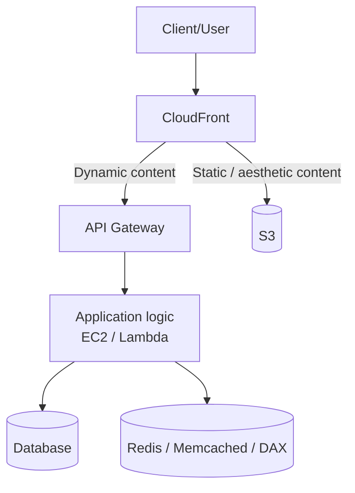

# 363. Caching Strategies in AWS

## 🎯 Giới thiệu
Bài này nói về các **caching strategies trên AWS** và cách chọn vị trí cache phù hợp trong một kiến trúc phổ biến.

Kiến trúc được nhắc đến:
- **CloudFront** đứng trước **API Gateway**
- **API Gateway** đứng trước **application logic** có thể là **EC2** hoặc **Lambda**
- Ứng dụng làm việc với **database**
- Có thể dùng cache nội bộ như **Redis**, **Memcached**, hoặc **DAX**
- Với nội dung tĩnh, client đi qua **CloudFront** và CloudFront lấy dữ liệu từ **S3**

## 1. 🧩 Cache tại edge với CloudFront
- **CloudFront** thực hiện cache ở **edge**, tức là gần user nhất.
- Nếu cache hit:
  - response rất nhanh
  - giảm latency rõ rệt
- Nhược điểm:
  - dữ liệu có thể **outdated** nếu backend đã thay đổi
- Vì vậy cần dùng **TTL** để làm mới cache thường xuyên.
- Đây là một bài toán cân bằng giữa:
  - cache nhiều ở edge
  - hay cache ở lớp ứng dụng

## 2. 🌐 Cache tại API Gateway
- **API Gateway** cũng có khả năng cache.
- Cache này là **regional**, vì API Gateway là **regional service**.
- Có thể dùng cache ở đây dù không dùng CloudFront.
- Nếu cache hit:
  - giảm network delay giữa client và API Gateway
- Đây là lớp cache trung gian cho các request API.

## 3. ⚙️ Cache trong application logic
- Lớp application logic thường dùng cache như:
  - **Redis**
  - **Memcached**
  - **DAX** nếu dùng **DynamoDB**
- Mục tiêu:
  - tránh truy vấn database lặp lại
  - lưu kết quả của các query thường xuyên hoặc query phức tạp vào **shared cache**
- Lợi ích:
  - giảm áp lực lên database
  - tăng khả năng đọc
- Transcript nhấn mạnh rằng **database không có caching capability** theo cách nói trong bài.

## 4. 📦 Không phải mọi nơi đều có cache
- **S3** không có caching capability theo nội dung bài.
- Không có một cách đúng duy nhất để cache.
- Càng đi sâu xuống các lớp sau:
  - có thể tăng **computation cost**
  - có thể tăng **latency**
- Cần quyết định:
  - cache ở đâu
  - cache cái gì
  - cache bao lâu
  - chấp nhận mức latency nào

## 📊 Bảng tóm tắt
| Tiêu chí | Mô tả |
|----------|------|
| CloudFront cache | Cache ở edge, gần user, phản hồi rất nhanh |
| Rủi ro CloudFront | Dữ liệu có thể cũ nếu backend đã đổi |
| TTL | Dùng để làm mới cache và lấy dữ liệu mới từ backend |
| API Gateway cache | Cache regional, giảm network delay |
| App cache | Dùng Redis, Memcached, DAX để tránh hit database nhiều lần |
| Mục tiêu app cache | Giảm pressure lên database, tăng read capacity |
| Database / S3 | Theo bài giảng, không có caching capability |
| Trade-off chung | Cân bằng giữa latency, cost, độ mới của dữ liệu và vị trí cache |

## 💡 Mẹo ghi nhớ cho kỳ thi AWS
- **CloudFront = edge cache** gần user nhất, nhanh nhất nhưng dễ stale hơn.
- **API Gateway cache = regional cache**, phù hợp cho API layer.
- **App cache = Redis / Memcached / DAX**, dùng để giảm load lên database.
- Nhớ công thức tư duy:
  - **càng gần user** → càng nhanh
  - **càng sâu vào backend** → càng linh hoạt nhưng có thể tốn latency/cost hơn
- Khi làm câu hỏi thi, hãy hỏi:
  - cache để tối ưu **latency** hay **database load**
  - dữ liệu có cần **fresh** không
  - request là **static content** hay **dynamic content**

## ✅ Kết luận
Caching trên AWS không có một đáp án cố định. Điểm quan trọng là chọn đúng lớp cache cho đúng mục tiêu:
- **CloudFront** cho edge caching
- **API Gateway** cho regional caching
- **Redis / Memcached / DAX** cho caching ở application layer

Quyết định cuối cùng phụ thuộc vào nhu cầu về **latency**, **cost**, **độ mới của dữ liệu**, và loại content mà hệ thống phục vụ.
