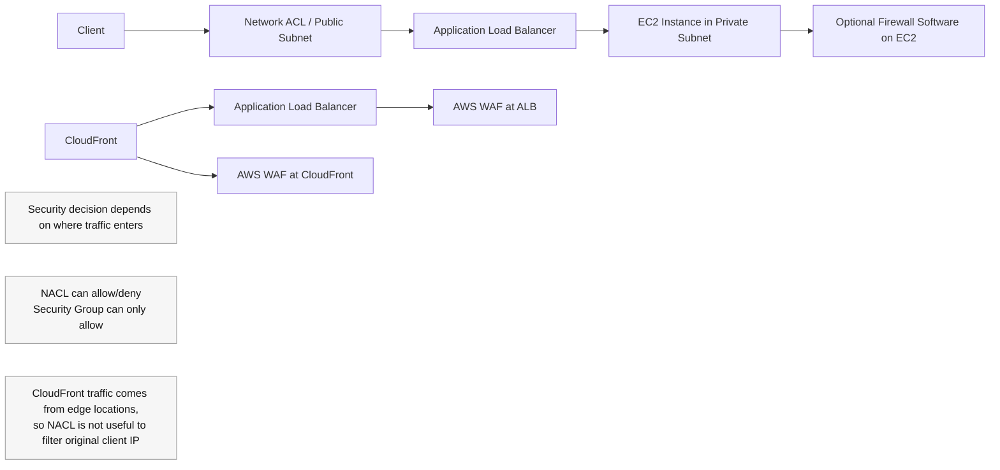

# 364. Blocking an IP Address in AWS

## 🎯 Giới thiệu
- Bài này giải thích cách **block / allow IP address** trong AWS theo từng lớp mạng và bảo mật.
- Ý chính: **vị trí bạn đặt rule** phải khớp với **đường đi của traffic**.
- Các lớp được nhắc đến:
  - **Network ACL (NACL)** ở **public subnet**
  - **Security Group** ở **ALB / EC2**
  - **Firewall software** trên **EC2 instance**
  - **AWS WAF** ở **Application Load Balancer** hoặc **CloudFront**
  - **Geo Restriction** ở **CloudFront**

## 1. 🛡️ Các lớp chặn IP trong kiến trúc EC2
- Nếu client truy cập trực tiếp vào **EC2 instance trong public subnet**:
  - **NACL** là tuyến phòng thủ đầu tiên.
  - Có thể viết **explicit allow / deny rules** để chặn hoặc cho phép IP.
- Nếu **default NACL** cho phép hết:
  - **Security Group** là tuyến phòng thủ thứ hai.
  - **Security Group không có deny rule**, chỉ có **allow rule**.
  - Muốn chặn gián tiếp thì chỉ **allow IP client cụ thể**.
- Nếu traffic vẫn đi tiếp tới EC2:
  - Có thể chạy **firewall software** trên instance.
  - Ưu điểm: kiểm soát nhiều hơn.
  - Nhược điểm: tốn **CPU cost** và có thể làm instance chậm hơn.

## 2. 🔀 ALB, private subnet và kiểm soát bảo mật
- Khi có **Application Load Balancer (ALB)**:
  - Client kết nối vào **ALB ở public subnet**.
  - ALB chuyển tiếp traffic đến **EC2 instance**.
- EC2 có thể nằm trong **private subnet**:
  - Tốt hơn cho bảo mật ứng dụng.
  - EC2 sẽ có **private IP**.
- Security Group của EC2 phải:
  - Chỉ **allow connections từ ALB**.
- ALB thực hiện **connection termination**:
  - Client connect đến ALB.
  - ALB connect đến EC2.
- Có thể quản lý bảo mật ở:
  - **ALB level** bằng **Security Group**
  - **Subnet level** bằng **NACL**
- Cách này cũng được nhắc là **tương tự cho NLB** về mặt security.

## 3. 🌐 WAF, CloudFront và Geo Restriction
- Có thể kết hợp **AWS WAF** với **ALB**:
  - Dùng để **IP address filtering**.
  - Có thêm nhiều tính năng bảo vệ khác ngoài IP filtering.
- Có thể kết hợp **AWS WAF** với **CloudFront**:
  - CloudFront gửi traffic từ **edge locations** vào ALB.
  - Khi đó **NACL không hữu ích** để lọc client traffic vì **client không đi trực tiếp vào AWS infra** theo cách đó.
  - Cần security ở **ALB level** bằng **Security Group** để chỉ allow **CloudFront public IPs**.
- Nếu traffic đến từ một **country** đang tấn công:
  - Có thể dùng **Geo Restriction** để block country đó.
- Một lớp phòng thủ khác:
  - Dùng **WAF** ở **CloudFront level** để làm firewall và IP filtering.

## 📊 Bảng tóm tắt
| Tiêu chí | Mô tả |
|----------|------|
| NACL | Tuyến phòng thủ đầu tiên ở public subnet, hỗ trợ **allow/deny** rõ ràng |
| Security Group | Chỉ có **allow rules**, không có deny |
| Firewall software trên EC2 | Kiểm soát sâu hơn nhưng tốn **CPU cost** |
| ALB | Client vào ALB, ALB chuyển tiếp đến EC2; có thể đặt security ở ALB level |
| Private subnet | Giúp EC2 an toàn hơn khi đặt sau ALB |
| AWS WAF | Có thể dùng cho **ALB** hoặc **CloudFront** để filter IP và tăng defense |
| CloudFront | Traffic đi từ edge locations, nên NACL không phải nơi phù hợp để lọc client IP |
| Geo Restriction | Chặn theo quốc gia ở CloudFront |
| Key exam idea | Chọn đúng lớp bảo vệ theo **đường đi của traffic** |

## 💡 Mẹo ghi nhớ cho kỳ thi AWS
- **NACL = allow + deny**, ở **subnet level**.
- **Security Group = only allow**, gắn với **instance / load balancer**.
- **ALB trước, EC2 sau**:
  - ALB ở public subnet.
  - EC2 có thể ở private subnet.
  - EC2 chỉ allow traffic từ ALB.
- **CloudFront đi từ edge locations**:
  - Nếu có CloudFront, đừng kỳ vọng **NACL** sẽ là nơi tốt nhất để lọc IP client.
  - Dùng **Security Group**, **WAF**, hoặc **Geo Restriction** tùy mục tiêu.
- Khi cần chặn IP, luôn hỏi:
  - Traffic đi vào từ đâu?
  - Rule nên đặt ở **subnet**, **load balancer**, hay **instance**?

## ✅ Kết luận
- Cách block IP trong AWS phụ thuộc vào **lớp bảo vệ** mà traffic đi qua.
- **NACL** cho phép/deny ở subnet, **Security Group** chỉ allow, **firewall software** trên EC2 cho kiểm soát sâu hơn nhưng tốn tài nguyên.
- Với **ALB** và **CloudFront**, **AWS WAF** là công cụ quan trọng để lọc IP và tăng cường bảo vệ.
- Bài học cốt lõi cho AWS exam: **luôn map rule bảo mật theo network path thực tế**.
