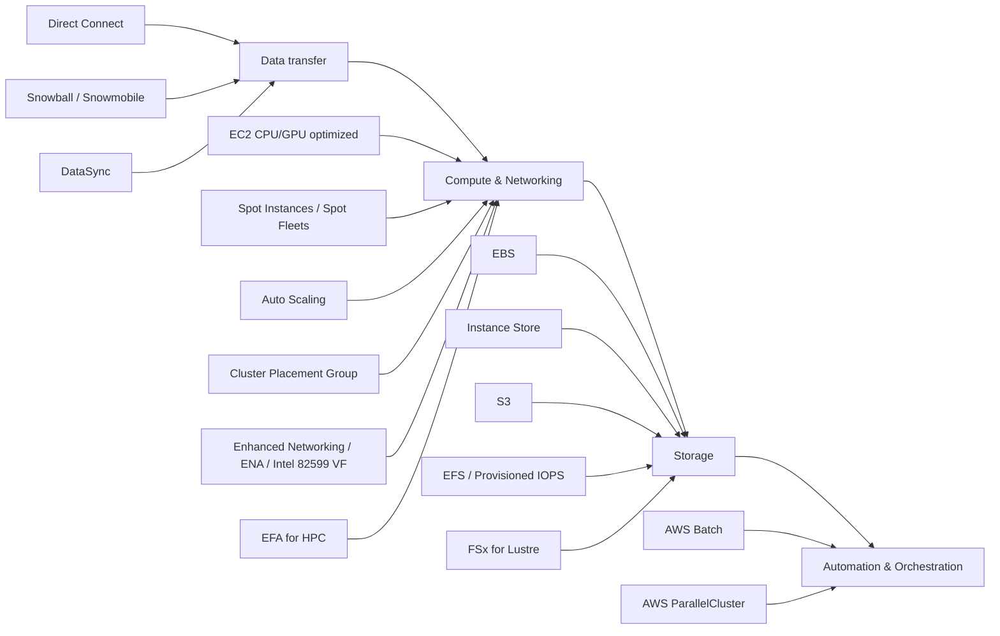

# 365. High Performance Computing (HPC) on AWS

## 🎯 Giới thiệu
- **HPC (High Performance Computing)** trên AWS là cách tận dụng cloud để:
  - tạo số lượng lớn tài nguyên rất nhanh
  - rút ngắn **time to results**
  - chỉ trả tiền cho phần đã dùng
  - xoá hạ tầng sau khi hoàn thành để không phát sinh chi phí thêm
- Đây là một use case rất phù hợp cho cloud và là chủ đề AWS exam có thể hỏi.

- Các bài toán HPC được nhắc đến trong transcript:
  - genomics
  - computational chemistry
  - financial risk modeling
  - weather prediction
  - machine learning
  - deep learning
  - autonomous driving

## 1. 🚚 Data Transfer vào AWS
- Mục tiêu đầu tiên trong HPC là đưa dữ liệu lớn vào AWS hiệu quả.
- Các dịch vụ được nhắc đến:
  - **Direct Connect**: chuyển dữ liệu với tốc độ gigabytes/second qua private secure network
  - **Snowball** và **Snowmobile**: dùng để di chuyển **PetaBytes** dữ liệu qua đường vật lý, phù hợp với transfer lớn hoặc one-off transfer
  - **DataSync**: cài agent để di chuyển lượng lớn dữ liệu giữa on-premise và **NFS/SMB systems** vào:
    - **S3**
    - **EFS**
    - **FSx for Windows**

## 2. 🖥️ Compute & Networking
- Thành phần compute chính:
  - **EC2**
  - **CPU optimized** hoặc **GPU optimized instances** tuỳ loại computation
- Tối ưu chi phí và mở rộng:
  - **Spot Instances** / **Spot Fleets** để tiết kiệm chi phí lớn
  - **Auto Scaling** để tự động scale fleet theo nhu cầu tính toán
- Tối ưu networking cho workload phân tán:
  - **EC2 placement group** loại **cluster**
    - giúp có network performance tốt nhất
    - low latency, ví dụ trong transcript là **10 gigabyte per second**
    - các instance nằm cùng rack, cùng **AZ**
- Nâng cao hiệu năng network của EC2:
  - **EC2 Enhanced Networking (SRI-IOV)**:
    - higher bandwidth
    - higher PPS (packet per second)
    - lower latency
  - Cách triển khai:
    - **Elastic Network Adapter (ENA)**: cách mới và phổ biến, tốc độ lên tới **100 gigabits per second**
    - **Intel 82599 VF**: cách cũ, legacy, tốc độ tới **10 gigabits per second**
- Tối ưu cao hơn cho HPC:
  - **Elastic Fabric Adapter (EFA)**
    - là ENA cải tiến dành riêng cho HPC
    - chỉ hoạt động trên **Linux**
    - phù hợp với **inter-node communication** và **tightly coupled workload**
    - dùng **MPI (Message Passing Interface)**
    - bypass underlying Linux OS để giảm latency và tăng độ tin cậy của transport

## 3. 💾 Storage & Tự động hóa
- Các lựa chọn lưu trữ được nhắc đến:
  - **EBS**
    - có thể scale tới **256,000 IOPS** với **io2 Block Express**
  - **Instance Store**
    - có thể lên tới **million of IOPS**
    - gắn với EC2 instance nên thấp latency hơn
    - nhưng có thể mất nếu mất instance
  - **S3**
    - dùng để lưu large blobs / large objects, không phải file system
  - **EFS**
    - IOPS scale theo tổng size của file system
    - có **provisioned IOPS mode** để tăng IOPS
  - **FSx for Lustre**
    - file system dành riêng cho HPC
    - HPC optimized
    - có thể đạt **millions of IOPS**
    - backend được backed by **S3**
- Automation & Orchestration:
  - **AWS Batch**
    - hỗ trợ **multi-node parallel jobs**
    - chạy job trên nhiều EC2 instances
    - tự schedule job và launch EC2 instance tương ứng
  - **AWS ParallelCluster**
    - open source cluster management tool để deploy HPC trên AWS
    - cấu hình bằng text files
    - tự động tạo:
      - VPC
      - Subnet
      - cluster types
      - instance types
    - trong exam có thể gặp yêu cầu dùng **ParallelCluster** cùng **EFA**
      - có tham số trong text files để enable **Elastic Fabric Adapter**
      - giúp tăng network performance của HPC cluster

## 📊 Bảng tóm tắt
| Tiêu chí | Mô tả |
|----------|------|
| Mục tiêu HPC | Tăng tốc computation bằng cách dùng nhiều tài nguyên trong thời gian ngắn và chỉ trả tiền phần đã dùng |
| Data transfer | **Direct Connect**, **Snowball/Snowmobile**, **DataSync** |
| Compute | **EC2** CPU/GPU optimized, **Spot Instances**, **Spot Fleets**, **Auto Scaling** |
| Networking | **Cluster placement group**, **Enhanced Networking (SRI-IOV)**, **ENA**, **Intel 82599 VF**, **EFA** |
| Storage | **EBS**, **Instance Store**, **S3**, **EFS**, **FSx for Lustre** |
| Automation | **AWS Batch**, **AWS ParallelCluster** |
| Điểm thi cần nhớ | Phân biệt **ENA** vs **EFA**, và hiểu **EFA + ParallelCluster** cho HPC |

## 💡 Mẹo ghi nhớ cho kỳ thi AWS
- Nhớ theo chuỗi tư duy: **Data transfer → Compute/Networking → Storage → Automation**
- **ENA** = enhanced networking phổ biến cho EC2, còn **EFA** = dành riêng cho HPC và workload tightly coupled
- **Cluster placement group** = tối ưu network performance cho EC2 instances giao tiếp nhiều với nhau
- **FSx for Lustre** = storage tối ưu cho HPC, backed by **S3**
- **AWS Batch** = chạy job song song đa EC2
- **ParallelCluster** = tool quản lý cluster HPC, có thể enable **EFA**
- Khi thấy bài toán cần di chuyển dữ liệu cực lớn, nghĩ đến:
  - **Direct Connect**
  - **Snowball/Snowmobile**
  - **DataSync**

## ✅ Kết luận
- HPC trên AWS không phải một dịch vụ đơn lẻ mà là sự kết hợp của nhiều dịch vụ và lựa chọn tối ưu.
- Trọng tâm của bài học là biết ghép đúng:
  - **data transfer**
  - **EC2 compute**
  - **network optimization**
  - **storage tối ưu**
  - **automation/orchestration**
- Với AWS exam, cần đặc biệt phân biệt rõ **ENA**, **EFA**, **cluster placement group**, **Batch**, và **ParallelCluster**.
