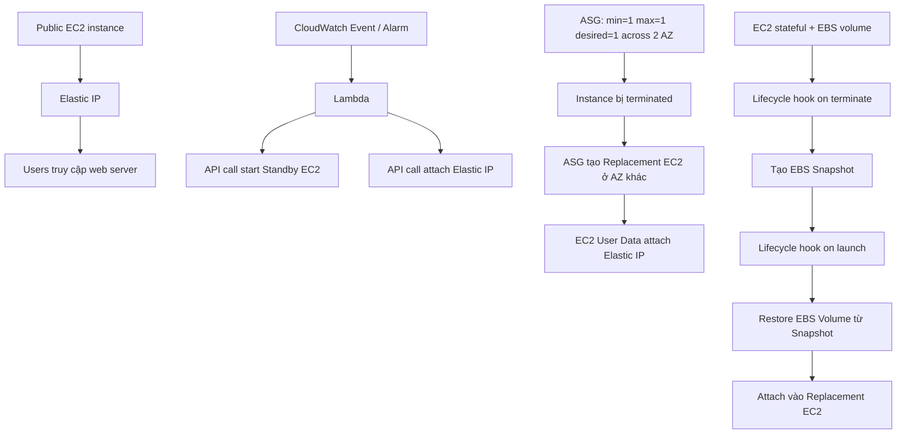

# 366. EC2 Instance High Availability

## 🎯 Giới thiệu
- EC2 instance mặc định chỉ chạy trong **one Availability Zone**, nên **không tự động highly available**.
- Mục tiêu của bài này là mô tả các cách **engineer** để tăng tính sẵn sàng cho EC2 instance.
- Các giải pháp trong transcript đều xoay quanh:
  - **Elastic IP**
  - **CloudWatch Event / CloudWatch Alarm**
  - **Lambda**
  - **Auto Scaling Group (ASG)**
  - **EC2 User Data**
  - **EC2 instance role**
  - **EBS Snapshot**
  - **Lifecycle hooks**

## 1. Kiến trúc EC2 High Availability với Standby instance
- Mô hình đầu tiên dùng:
  - **Public EC2 instance** chạy web server
  - **Elastic IP** để user truy cập trực tiếp
  - **Standby EC2 instance** để failover khi có sự cố
- Cách phát hiện sự cố:
  - **CloudWatch Event**: ví dụ instance bị terminated
  - **CloudWatch Alarm**: ví dụ CPU lên tới **100%**
- Khi có tín hiệu lỗi:
  - **Lambda function** được trigger
  - Lambda có thể:
    - gọi API để **start Standby instance** nếu chưa chạy
    - gọi API để **attach Elastic IP** sang Standby instance
- Ý nghĩa:
  - User vẫn truy cập qua **Elastic IP**
  - Failover xảy ra ở backend, user ít thấy gián đoạn

## 2. Kiến trúc EC2 High Availability với Auto Scaling Group
- Mô hình thứ hai dùng **ASG** chạy trên **2 Availability Zones**.
- Cấu hình trong transcript:
  - **minimum = 1**
  - **maximum = 1**
  - **desired = 1**
- Kết quả:
  - Luôn chỉ có **1 EC2 instance** đang chạy trong toàn bộ ASG
  - Nếu instance hiện tại bị terminated, ASG sẽ:
    - tạo **Replacement EC2 instance**
    - có thể ở **AZ khác**
- Cơ chế gắn lại Elastic IP:
  - Khi instance mới khởi động, **EC2 User Data** sẽ chạy
  - User Data thực hiện API call để **attach Elastic IP**
  - Elastic IP được xác định dựa trên **Tags**
- Yêu cầu quan trọng:
  - EC2 instance phải có **instance role**
  - Role này cho phép thực hiện API call để attach Elastic IP
- Điểm chính:
  - Không cần CloudWatch Alarm/Event riêng
  - ASG tự phát hiện instance bị terminated và thay thế

## 3. Kiến trúc EC2 Stateful với EBS volume
- Transcripts mở rộng sang trường hợp **stateful EC2 instance** có **EBS volume**.
- Ví dụ được nêu:
  - EC2 instance giống như một **database**
  - Dữ liệu nằm trên **EBS Volume**
- Vấn đề:
  - **EBS Volume** bị khóa vào một **Availability Zone** cụ thể
- Cách xử lý khi instance bị terminated:
  - Dùng **ASG lifecycle hooks** trên event **termination**
  - Chạy script để:
    - tạo **EBS Snapshot** từ volume hiện tại
    - tag snapshot phù hợp
- Khi ASG launch replacement instance:
  - Dùng **lifecycle hook on Launch**
  - Tạo **EBS Volume** mới từ snapshot
  - Đưa volume vào **đúng Availability Zone**
  - Attach volume vào **Replacement EC2 instance**
- Sau đó:
  - EC2 user data tiếp tục attach **Elastic IP**
  - Cần **instance role** để API call thành công
- Kết quả:
  - Dữ liệu EBS được snapshot và restore sang AZ khác
  - EC2 instance trở nên **highly available** dù có state

## 📊 Bảng tóm tắt
| Tiêu chí | Mô tả |
|----------|------|
| Mục tiêu | Biến EC2 instance từ single-AZ thành **highly available** |
| Cách 1 | Dùng **Standby EC2 + CloudWatch Event/Alarm + Lambda + Elastic IP** |
| Cách 2 | Dùng **ASG (min=1, max=1, desired=1) + 2 AZ + EC2 User Data** |
| Cách 3 | Dùng **ASG lifecycle hooks + EBS Snapshot + restore volume** |
| Vai trò của Elastic IP | Giữ một địa chỉ truy cập ổn định khi failover sang instance khác |
| Vai trò của Lambda | Thực hiện API call để start instance hoặc attach Elastic IP |
| Vai trò của User Data | Chạy script trên instance mới để attach Elastic IP |
| Vai trò của instance role | Cho phép EC2 thực hiện API call cần thiết |
| Vai trò của lifecycle hooks | Chặn/điều phối logic khi terminate hoặc launch instance |
| Với stateful workload | Phải snapshot EBS rồi restore sang AZ mới |

## 💡 Mẹo ghi nhớ cho kỳ thi AWS
- **Elastic IP = điểm truy cập cố định**, instance phía sau có thể thay đổi.
- **CloudWatch + Lambda** dùng khi muốn **tự động trigger failover** theo event hoặc alarm.
- **ASG min=1 max=1 desired=1** nghĩa là luôn chỉ có **1 instance**, nhưng ASG sẽ thay thế nó khi hỏng.
- **EC2 User Data** thường được dùng để chạy logic khởi tạo, như attach Elastic IP.
- **Instance role** là điều kiện để instance gọi API AWS thành công.
- Với **stateful + EBS**, nhớ:
  - **terminate event** -> tạo **Snapshot**
  - **launch event** -> restore **Volume** từ Snapshot
- Khi đề thi hỏi về high availability cho EC2, hãy nghĩ theo 3 lớp:
  - **monitoring**
  - **failover automation**
  - **data persistence/recovery**

## ✅ Kết luận
- EC2 instance mặc định không highly available vì chỉ chạy trong **one Availability Zone**.
- Có 3 hướng chính trong transcript:
  - **Standby instance** với **CloudWatch + Lambda**
  - **ASG** để tự động thay thế instance hỏng
  - **ASG + lifecycle hooks + EBS Snapshot** cho workload có trạng thái
- Điểm xuyên suốt là dùng **automation** để failover và giữ dịch vụ tiếp tục hoạt động qua **Elastic IP**.
