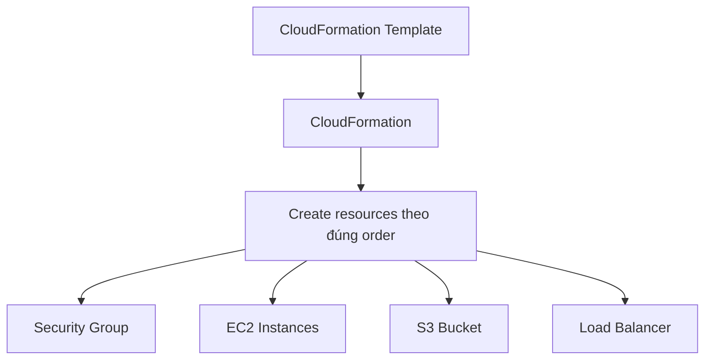

# 368. CloudFormation Intro

## 🎯 Giới thiệu
CloudFormation là công cụ rất quan trọng trong AWS để triển khai và quản lý infrastructure ở quy mô lớn. Điểm cốt lõi của nó là **declarative**: bạn chỉ cần mô tả **muốn có gì**, còn CloudFormation sẽ tự tạo các AWS resources theo đúng cấu hình và đúng thứ tự.

## 1. CloudFormation là gì?
- Là cách mô tả **AWS infrastructure as code**.
- Bạn khai báo các resource cần có, ví dụ:
  - `security group`
  - `EC2 instances`
  - `S3 bucket`
  - `load balancer`
- CloudFormation sẽ tự động tạo các thành phần này theo đúng dependency và cấu hình đã định nghĩa.
- Hầu hết AWS resources đều được hỗ trợ.
- Nếu một resource không được hỗ trợ, có thể dùng **custom resource**.

## 2. Lợi ích chính của CloudFormation
- **Infrastructure as Code**
  - Không tạo resource thủ công.
  - Mọi thay đổi đều đi qua code review.
- **Kiểm soát tốt hơn**
  - Dễ quản lý và chuẩn hóa hạ tầng.
- **Cost advantage**
  - Các resource trong stack được gắn tag tương tự nhau.
  - Có thể ước tính chi phí dễ hơn từ CloudFormation templates.
- **Saving strategy**
  - Có thể tự động xóa stack lúc `5:00 PM`.
  - Sau đó tạo lại lúc `8:00 AM` hoặc `9:00 AM`.
  - Giúp tiết kiệm chi phí vì không có resource hoạt động trong thời gian đó.
- **Productivity**
  - Dễ tạo và xóa resources.
  - Có thể destroy và recreate infrastructure rất nhanh.
- **Declarative programming**
  - Không cần tự tính thứ tự tạo phức tạp như `DynamoDB table` hay `EC2 instance` trước.
  - CloudFormation tự xử lý logic triển khai.

## 3. Khi nào dùng và cách nhìn architecture
- Dùng CloudFormation khi cần:
  - `Infrastructure as code`
  - lặp lại cùng một architecture ở nhiều môi trường khác nhau
  - triển khai ở nhiều region
  - triển khai ở nhiều AWS account
- Có thể dùng **Infrastructure Composer** để visualize template.
- Công cụ này giúp nhìn rõ:
  - resource nào đang có
  - quan hệ giữa các thành phần
  - cách các component được linked together

## 📊 Bảng tóm tắt
| Tiêu chí | Mô tả |
|----------|------|
| Bản chất | Declarative infrastructure as code |
| Cách hoạt động | Mô tả resource cần có, CloudFormation tự tạo theo đúng order |
| Lợi ích | Kiểm soát tốt, dễ review, tiết kiệm chi phí, tăng productivity |
| Hỗ trợ | Hầu hết AWS resources |
| Trường hợp đặc biệt | Dùng `custom resource` nếu resource chưa được hỗ trợ |
| Use case thi cử | Lặp lại architecture ở nhiều environment, region, account |
| Visualize | Dùng `Infrastructure Composer` để xem diagram và relations |

## 💡 Mẹo ghi nhớ cho kỳ thi AWS
- Nhớ từ khóa: **declarative**, **infrastructure as code**, **repeatable architecture**.
- Khi đề bài nói về:
  - tạo hạ tầng tự động
  - tái sử dụng template
  - triển khai giống nhau ở nhiều môi trường
  - quản lý theo code review  
  thì nghĩ ngay đến **CloudFormation**.
- Nếu resource không được support, đáp án thường liên quan đến **custom resource**.
- CloudFormation không chỉ tạo resource, mà còn giúp nhìn thấy **relationships** giữa các components trong kiến trúc.

## ✅ Kết luận
CloudFormation là nền tảng của **infrastructure as code** trên AWS. Nó cho phép mô tả hạ tầng theo kiểu declarative, tự động tạo resources theo đúng thứ tự, hỗ trợ đa số AWS services, và rất phù hợp khi cần triển khai lặp lại ở nhiều môi trường, region, hoặc account.
