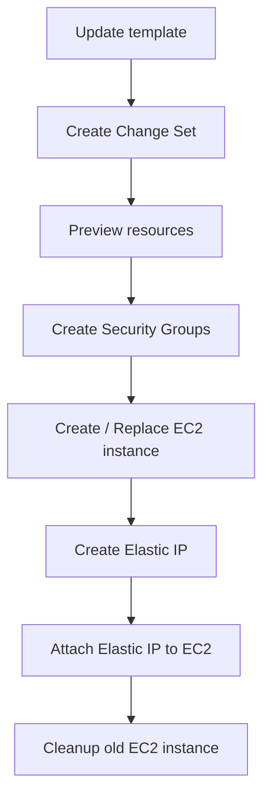

# 369. CloudFormation - Hands On

## 🎯 Giới thiệu
CloudFormation là dịch vụ **Infrastructure as Code** theo kiểu **declarative**: bạn chỉ cần mô tả **muốn gì**, CloudFormation sẽ tự triển khai và quản lý tài nguyên cho bạn.

Trong bài hands-on này:
- Tạo một **stack** từ file YAML
- Quan sát template bằng **Application Composer**
- Cập nhật stack bằng **change set**
- Theo dõi thứ tự tạo/xóa tài nguyên như **EC2**, **Security Group**, **Elastic IP**
- Hiểu vì sao **không nên chỉnh sửa tài nguyên thủ công** khi dùng CloudFormation

## 1. Tạo stack từ template YAML 🧱
- Chọn region **US East 1 (N. Virginia)** vì template chỉ hoạt động trong region này.
- Lý do phải ở **US East 1**:
  - `Availability Zone` được khai báo là **us-east-1a**
  - `AMI ID` là theo **region scope**
- Upload file template `0-just-EC2.yaml`
- Template này tạo một resource:
  - `My instance`
  - `Type`: **EC2 instance**
  - `Instance type`: **t2.micro**

### Ý nghĩa
- CloudFormation đọc YAML và tự tạo EC2 instance theo đúng cấu hình đã mô tả.
- Đây là ví dụ rõ ràng về **Infrastructure as Code**.

### Application Composer
- Có thể mở template trong **Application Composer**
- Công cụ này giúp:
  - nhìn template dưới dạng **visual**
  - xem lại code ở dạng **YAML/JSON**
  - thấy resource như một khối kiến trúc trực quan

## 2. Update stack và change set 🔄
Khi update stack, bài học dùng template `1-ec2-with-sg-eip` với cấu trúc đầy đủ hơn:
- Có phần **Parameters**
- Có **EC2 instance**
- Có **Elastic IP**
- Có 2 **Security Group**:
  - một cho **SSH**
  - một cho **server rules**

### Điểm quan trọng khi update
- CloudFormation tạo ra **change set**
- Change set cho biết chính xác:
  - resource nào được **Add**
  - resource nào được **Modify**
  - resource nào sẽ bị **Replacement**

### Kết quả trong bài
- `Elastic IP` được thêm mới
- `SSH security group` và `server security group` được thêm mới
- `My instance` bị đánh dấu **replacement true**
  - nghĩa là instance cũ sẽ bị xóa
  - một instance mới sẽ được tạo

### Mermaid flow

### Ý nghĩa ôn thi
- CloudFormation có thể suy ra thứ tự thực thi từ template
- Nó biết phải tạo resource nào trước, resource nào sau
- Nếu update làm thay đổi resource vật lý, CloudFormation có thể phải **replace** resource đó

## 3. Quản lý tài nguyên và xóa stack 🧹
- CloudFormation tự xử lý toàn bộ lifecycle của stack
- Trong bài:
  - instance cũ bị terminate
  - instance mới được tạo
  - `Elastic IP` được tạo và attach đúng vào EC2
- Có thể xem toàn bộ resource đã tạo ở tab **Resources**
- Có thể xem lại architecture trong **Application Composer**

### Điều cần nhớ
- Không nên chỉnh sửa thủ công tài nguyên bên ngoài CloudFormation
- Nếu muốn thay đổi, hãy:
  - update template
  - hoặc xóa toàn bộ stack bằng CloudFormation

### Khi delete stack
- CloudFormation sẽ xóa resources theo **đúng thứ tự**
- Tự xử lý cleanup thay vì bạn phải xóa từng resource bằng tay

## 📊 Bảng tóm tắt
| Tiêu chí | Mô tả |
|----------|------|
| Dịch vụ | **CloudFormation** |
| Kiểu triển khai | **Infrastructure as Code**, **declarative** |
| Input chính | Template **YAML** |
| Resource trong bài | **EC2**, **Security Group**, **Elastic IP** |
| Công cụ hỗ trợ | **Application Composer** |
| Cơ chế update | **Change set** |
| Trường hợp thay thế | `replacement true` khi cần tạo resource vật lý mới |
| Thao tác khuyến nghị | Update template hoặc delete stack bằng CloudFormation |

## 💡 Mẹo ghi nhớ cho kỳ thi AWS
- **CloudFormation = khai báo mong muốn, không thao tác tay**
- **Region matters**: template có thể phụ thuộc region, đặc biệt với **AMI ID**
- **Change set** cho bạn xem trước thay đổi trước khi apply
- Nếu thấy **replacement true**, hãy nghĩ ngay đến việc resource cũ có thể bị xóa và tạo mới
- Dùng **Application Composer** để nhìn tổng thể architecture nhanh hơn
- Khi dùng CloudFormation, ưu tiên:
  - update template
  - delete stack
  - tránh sửa trực tiếp resource ngoài stack

## ✅ Kết luận
Bài hands-on cho thấy CloudFormation có thể:
- tạo stack từ template
- triển khai EC2 và các tài nguyên liên quan
- cập nhật kiến trúc bằng change set
- quản lý thứ tự tạo/xóa tài nguyên tự động

Thông điệp chính: **CloudFormation giúp bạn quản lý hạ tầng bằng code, có cấu trúc, có thể lặp lại, và ít sai sót hơn thao tác thủ công.**
