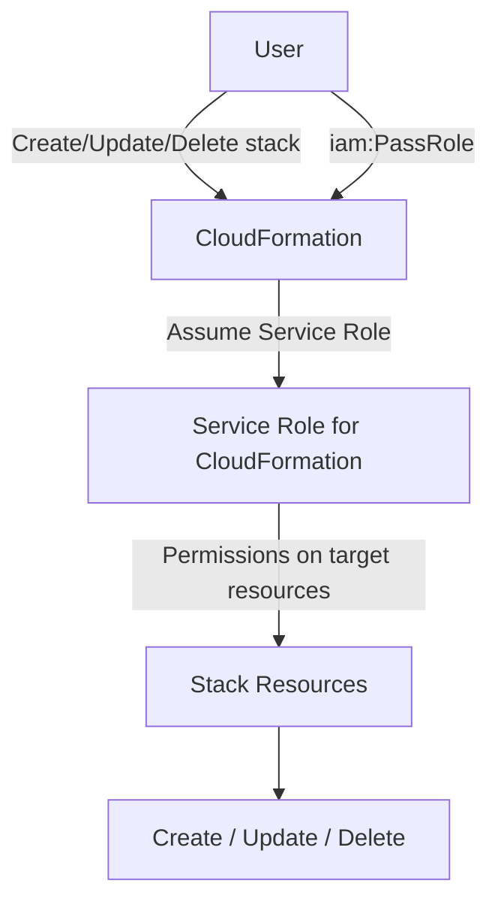

# 370. CloudFormation - Service Role

## 🎯 Giới thiệu
CloudFormation có thể dùng **service role** để thực hiện **create, update, delete** stack resources thay cho user. Đây là **IAM role** do bạn tạo riêng cho CloudFormation, giúp áp dụng **least privilege** khi user không cần quyền trực tiếp lên từng resource.

## 1. Service Role là gì? 🔐
- Là **IAM role** dành riêng cho **CloudFormation**.
- Cho phép CloudFormation thao tác trên resource của stack:
  - `create`
  - `update`
  - `delete`
- Hữu ích khi:
  - User chỉ được phép thao tác với CloudFormation
  - User không có quyền trực tiếp lên các resource bên dưới

## 2. Cách hoạt động của Service Role ⚙️
- User tạo stack trên CloudFormation.
- Nếu chỉ định `IAM role` trong phần permissions:
  - CloudFormation sẽ dùng role này cho **tất cả stack operations**
  - Không dùng quyền cá nhân của user nữa
- Nếu không chỉ định role:
  - CloudFormation dùng **personal permissions** của user

### Điểm mấu chốt trong flow
- User phải có quyền **`iam:PassRole`**
- `iam:PassRole` là quyền cần thiết để gán role cho một AWS service
- Service role sẽ quyết định CloudFormation được phép làm gì trên resource

## 3. Ví dụ trong transcript 🧩
- Tạo một role cho **AWS service = CloudFormation**
- Gán policy **S3 Full Access**
- Đặt tên ví dụ: `DemoRole for CFN with S3 capabilities`
- Khi tạo stack:
  - Có thể chọn role này trong phần **permissions**
  - Role sẽ được dùng cho mọi thao tác stack
- Vì role chỉ có quyền với **S3**:
  - Nếu stack tạo **S3 bucket** thì phù hợp
  - Nếu stack tạo **EC2 instance** thì stack có thể **fail** do thiếu quyền

## 📊 Bảng tóm tắt
| Tiêu chí | Mô tả |
|----------|------|
| Mục đích | Cho CloudFormation quyền thao tác trên resource thay cho user |
| Loại đối tượng | `IAM role` dành riêng cho CloudFormation |
| Quyền cần có của user | `iam:PassRole` |
| Lợi ích chính | Áp dụng **least privilege** |
| Phạm vi áp dụng | Dùng cho toàn bộ **stack operations** |
| Ví dụ trong transcript | Role có **S3 Full Access** nhưng không đủ quyền để tạo **EC2** |

## 💡 Mẹo ghi nhớ cho kỳ thi AWS
- Nhớ 3 ý chính:
  - **CloudFormation dùng service role**
  - User cần **`iam:PassRole`**
  - Role này quyết định quyền của CloudFormation khi thao tác với stack
- Nếu câu hỏi nói về:
  - User không có quyền trực tiếp lên resource
  - Muốn vẫn tạo/update/delete stack
  - Muốn **least privilege**
  - Thì đáp án rất dễ liên quan đến **CloudFormation Service Role**
- Nếu role được gán chỉ có quyền một dịch vụ như **S3**, stack có thể fail khi template tạo resource ngoài phạm vi đó

## ✅ Kết luận
**CloudFormation Service Role** là cách cấp quyền cho CloudFormation thao tác trên stack thay cho user, đồng thời giữ mô hình **least privilege**. Điểm cần nhớ nhất cho kỳ thi là: **user phải có `iam:PassRole`**, và **service role** sẽ là quyền CloudFormation dùng để tạo, cập nhật, hoặc xóa resource trong stack.
