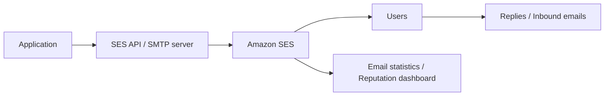

# 371. Amazon SES

## 🎯 Giới thiệu
Amazon SES (Simple Email Service) là một **fully managed service** cho phép ứng dụng **gửi email securely, globally và at scale**.  
Ứng dụng có thể dùng **SES API** hoặc **SMTP server**, sau đó Amazon SES sẽ gửi email hàng loạt đến người dùng.

## 1. Cách hoạt động của Amazon SES
- Ứng dụng gửi yêu cầu qua **SES API** hoặc **SMTP server**
- Amazon SES xử lý việc gửi email ra ngoài
- Hỗ trợ cả:
  - **Outbound emails**
  - **Inbound emails** để nhận phản hồi

## 2. Tính năng chính
- Có **reputation dashboard**
- Theo dõi:
  - Email có được mở hay không
  - **Performance insights**
  - **Anti-spam feedback**
  - Người nhận có đánh dấu email là spam hay không
- Cung cấp **email statistics**:
  - **Deliveries**
  - **Bounces**
  - **Feedback loop results**
  - **Open rate**

## 3. Bảo mật, IP và use cases
- Hỗ trợ chuẩn bảo mật gửi email hiện nay:
  - **DKIM**
  - **SPF**
- Có triển khai linh hoạt với:
  - **Shared IP**
  - **Dedicated IP**
  - **Customer-owned IP**
- Mục tiêu là gửi email từ **specific IP address**
- APIs có thể truy cập từ:
  - **Console**
  - **specific AWS APIs**
  - **SSTP protocol**
- Use cases chính:
  - **Transactional emails**
  - **Marketing email**
  - **Bulk emails communications**

## 📊 Bảng tóm tắt
| Tiêu chí | Mô tả |
|----------|------|
| Dịch vụ | **Amazon SES (Simple Email Service)** |
| Tính chất | **Fully managed service** |
| Mục đích | Gửi email **securely, globally, at scale** |
| Kết nối | **SES API** hoặc **SMTP server** |
| Hỗ trợ | **Outbound emails** và **Inbound emails** |
| Theo dõi | **Reputation dashboard**, **performance insights**, **anti-spam feedback** |
| Thống kê | **Deliveries**, **bounces**, **feedback loop results**, **open rate** |
| Bảo mật | **DKIM**, **SPF** |
| IP triển khai | **Shared IP**, **Dedicated IP**, **Customer-owned IP** |
| Use cases | **Transactional**, **marketing**, **bulk emails** |

## 💡 Mẹo ghi nhớ cho kỳ thi AWS
- Nhớ SES là dịch vụ gửi email của AWS, trọng tâm là **email at scale**
- **Outbound** và **inbound** đều được nhắc đến trong transcript
- Các từ khóa dễ hỏi thi:
  - **DKIM**
  - **SPF**
  - **Reputation dashboard**
  - **Bounces**
  - **Deliveries**
- Khi thấy bài toán về:
  - email giao dịch
  - email marketing
  - email số lượng lớn  
  hãy nghĩ ngay đến **Amazon SES**

## ✅ Kết luận
Amazon SES là dịch vụ gửi email được quản lý hoàn toàn, cho phép ứng dụng gửi email qua **API** hoặc **SMTP**, hỗ trợ **outbound/inbound emails**, cung cấp thống kê và phản hồi về uy tín email, đồng thời dùng cho **transactional**, **marketing** và **bulk emails**.
