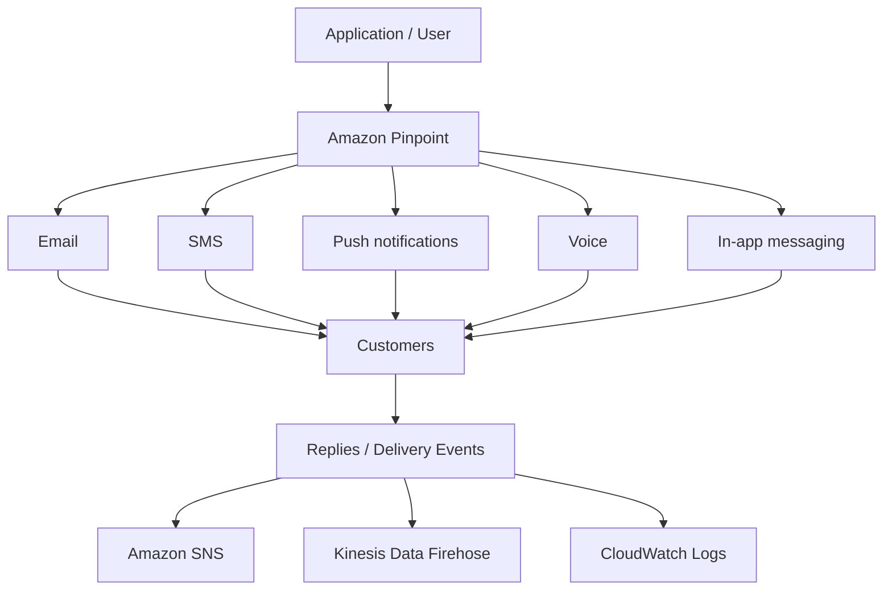

# 372. Amazon Pinpoint

## 🎯 Giới thiệu
Amazon Pinpoint là một **scalable inbound và outbound marketing communication service**.

- Dùng để gửi:
  - **email**
  - **SMS**
  - **push notifications**
  - **voice**
  - **in-app messaging**
- Một use case quan trọng là **SMS**.
- Cho phép **segment** và **personalize** nội dung theo từng nhóm khách hàng.
- Có thể xử lý tới **billions of messages per day**.

## 1. Chức năng chính của Amazon Pinpoint
Pinpoint hỗ trợ xây dựng chiến dịch giao tiếp marketing quy mô lớn:

- Tạo **groups** và **segments**
- Tạo **message templates**
- Thiết lập **delivery schedules**
- Chạy **full campaigns**
- Gửi **marketing email in bulk**
- Gửi **transactional SMS messages**
- Có thể **receive replies**

### Mermaid: luồng xử lý và event flow

## 2. Use cases và khả năng mở rộng
Amazon Pinpoint phù hợp khi cần:

- Chạy **marketing campaigns**
- Gửi **bulk email**
- Gửi **transactional SMS**
- Gửi thông điệp đến đúng nhóm khách hàng nhờ **segmentation**
- Cá nhân hóa nội dung theo **right content to customers**
- Xử lý phản hồi và các event như:
  - **text success**
  - **text delivered**
  - **replies**

Các event này được đẩy về:

- **Amazon SNS**
- **Kinesis Data Firehose**
- **CloudWatch Logs**

## 3. Pinpoint so với SNS và SES
Điểm khác biệt chính:

- Với **SNS** hoặc **SES**:
  - Ứng dụng phải tự quản lý:
    - **audience**
    - **content**
    - **delivery schedule**
  - Việc này có thể nhiều công sức và kém scalable hơn
- Với **Amazon Pinpoint**:
  - Service tự quản lý:
    - **message templates**
    - **delivery schedules**
    - **highly targeted segments**
    - **full campaigns**

👉 Có thể xem Pinpoint như **next evolution of SNS and SES** khi cần một **full-blown marketing communications service**.

## 📊 Bảng tóm tắt
| Tiêu chí | Mô tả |
|----------|------|
| Loại dịch vụ | Scalable inbound và outbound marketing communication service |
| Kênh hỗ trợ | Email, SMS, push notifications, voice, in-app messaging |
| Điểm mạnh | Segment, personalize, tạo campaigns, templates, schedules |
| Quy mô | Có thể scale tới billions of messages per day |
| Use cases | Marketing email in bulk, transactional SMS messages |
| Event output | SNS, Kinesis Data Firehose, CloudWatch Logs |
| So với SNS/SES | Pinpoint quản lý phần lớn workflow thay vì để application tự làm |

## 💡 Mẹo ghi nhớ cho kỳ thi AWS
- Nhớ Pinpoint là dịch vụ cho **marketing communications** quy mô lớn.
- Từ khóa quan trọng:
  - **segment**
  - **personalize**
  - **campaign**
  - **template**
  - **delivery schedule**
- Khi đề bài nhắc đến:
  - gửi **bulk marketing**
  - gửi **targeted messages**
  - cần **SMS** và **personalization**
  - cần theo dõi **delivery events**
  
  thì nghĩ ngay đến **Amazon Pinpoint**.
- Nếu câu hỏi so sánh với **SNS/SES**, nhớ:
  - **SNS/SES**: application tự quản lý audience/content/schedule
  - **Pinpoint**: service lo phần campaign và targeting

## ✅ Kết luận
Amazon Pinpoint là dịch vụ phù hợp cho **marketing communication** và **transactional messaging** ở quy mô lớn. Nó mạnh ở **segmentation**, **personalization**, **campaign management**, và có thể đẩy event về **SNS**, **Kinesis Data Firehose**, và **CloudWatch Logs** để xây automation.
