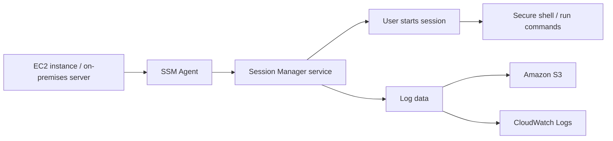

# 373. SSM Session Manager

## 🎯 Giới thiệu
SSM Session Manager là một tính năng của **Systems Manager** cho phép mở **secure shell** vào **EC2 instances** và **on-premises servers** mà không cần:
- **SSH access**
- **bastion host**
- **SSH keys**

Điểm chính trong transcript:
- Có thể đóng **port 22** trên EC2 để tăng bảo mật.
- **SSM Agent** trên instance sẽ kết nối với **Session Manager service**.
- Người dùng truy cập qua Session Manager để chạy lệnh trên instance.
- Hỗ trợ **Linux**, **macOS**, và **Windows**.
- Có thể gửi log tới **Amazon S3** hoặc **CloudWatch Logs**.

## 1. Cách hoạt động 🔐
Để Session Manager làm việc, EC2 instance cần:
- Cài **SSM Agent**
- Có **IAM instance profile / IAM role**
- Role này cho phép instance giao tiếp với **SSM service**

Trong transcript, policy được chọn là:
- **Amazon SSM managed instance core**

Quy trình khái quát:
- EC2 instance boot lên
- SSM Agent online
- Instance xuất hiện trong **Fleet Manager** dưới dạng **managed node**
- Người dùng bắt đầu session từ **Session Manager**
- Nhận được shell an toàn mà không cần SSH

## 2. Thiết lập trong demo 🧩
Trong ví dụ của transcript:
- Launch **EC2 instance**
- Chọn **Amazon Linux 2 AMI**
- Loại máy: **t2.micro**
- Không dùng **key pair**
- Tắt **SSH traffic**
- Security group không có inbound rule nào, gồm:
  - không **HTTP**
  - không **HTTPS**
  - không **SSH**

Sau đó:
- Tạo **IAM role**
- Chọn service: **Amazon EC2**
- Chọn permission: **Amazon SSM managed instance core**
- Gán role này vào EC2 instance

Mục đích:
- Cho phép EC2 instance nói chuyện với **Systems Manager**
- Kích hoạt khả năng dùng **SSM Session Manager**

## 3. Fleet Manager và Session Manager 📋
**Fleet Manager** là nơi các EC2 instances đã đăng ký với SSM xuất hiện dưới dạng **managed nodes**.

Trong transcript:
- Ban đầu chưa thấy managed node nào
- Khi instance boot xong, nó xuất hiện trong Fleet Manager
- Có thể xem:
  - trạng thái **running**
  - **SSM Agent online**
  - platform / OS
  - version của **SSM Agent**
  - link tới EC2 instance

Sau đó:
- Vào **Session Manager**
- Start session vào instance
- Mở được secure shell dù security group không có inbound rule

## 4. So sánh các cách truy cập EC2 ⚖️
| Cách truy cập | Cần SSH keys | Cần mở port 22 | Ghi chú |
|----------|------|------|------|
| SSH truyền thống | Có | Có | Dùng terminal và SSH keys |
| EC2 Instance Connect | Không | Có | Key được upload tạm thời lên instance |
| SSM Session Manager | Không | Không | Tạo secure shell trực tiếp qua Systems Manager |

## 📊 Bảng tóm tắt
| Tiêu chí | Mô tả |
|----------|------|
| Mục đích | Mở secure shell vào EC2 / on-premises server |
| Yêu cầu | **SSM Agent** + **IAM role** cho instance |
| Security | Không cần **SSH access**, **SSH keys**, hoặc **bastion host** |
| Port | Có thể đóng **port 22** |
| Hỗ trợ OS | **Linux**, **macOS**, **Windows** |
| Quản lý instance | Hiển thị trong **Fleet Manager** dưới dạng **managed nodes** |
| Logging | Gửi log tới **Amazon S3** hoặc **CloudWatch Logs** |

## 💡 Mẹo ghi nhớ cho kỳ thi AWS
- **SSM Session Manager = SSH không cần SSH**: nhớ trọng tâm là truy cập an toàn mà không mở **port 22**.
- Muốn dùng Session Manager thì instance phải có:
  - **SSM Agent**
  - **IAM role** phù hợp
- Nếu đề bài nhấn mạnh:
  - không muốn dùng **bastion host**
  - không muốn quản lý **SSH keys**
  - muốn audit/log session
  thì nghĩ ngay đến **SSM Session Manager**
- **Fleet Manager** là nơi thấy các instance đã được SSM quản lý.
- Logging sang **S3** hoặc **CloudWatch Logs** là điểm tăng bảo mật và kiểm soát.

## ✅ Kết luận
**SSM Session Manager** cho phép truy cập **EC2** và **on-premises servers** một cách an toàn, không cần **SSH keys**, không cần **bastion host**, và có thể đóng **port 22**. Cốt lõi của nó là **SSM Agent** trên instance, **IAM role** đúng quyền, và khả năng ghi log sang **Amazon S3** hoặc **CloudWatch Logs**.
