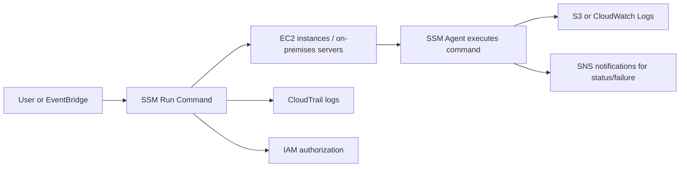
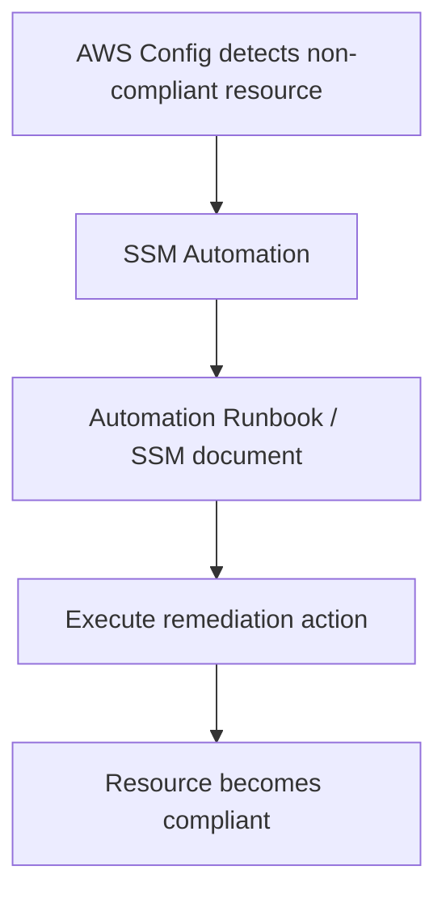

# 374. SSM Other Services

## 🎯 Giới thiệu
Trong bài này, nội dung tập trung vào một số dịch vụ khác trong **AWS Systems Manager (SSM)** có thể xuất hiện trong đề thi. Mục tiêu là nắm ý chính, cách dùng và các luồng xử lý quan trọng.

## 1. Run Command 🚀
- Dùng để thực thi **document**, tức là:
  - một **script**
  - hoặc một **command** đơn lẻ
- Chạy trên nhiều instance cùng lúc thông qua **resource groups**
- Áp dụng cho:
  - **EC2 instances**
  - **on-premises servers**
- Các máy này phải được đăng ký với **SSM Agent**

### Ý chính cần nhớ
- Không cần dùng **SSH**
- Lệnh được chạy qua **agent**, tương tự cơ chế của **Session Manager**
- Kết quả đầu ra có thể gửi tới:
  - **Amazon S3**
  - **CloudWatch Logs**
- Khi có lỗi hoặc trạng thái thay đổi, notification có thể gửi tới **Amazon SNS**
- Có tích hợp đầy đủ với:
  - **IAM** để bảo mật
  - **CloudTrail** để biết ai đã chạy lệnh nào
- Có thể được kích hoạt:
  - thủ công bởi người dùng
  - tự động qua **EventBridge**

### Mermaid: luồng Run Command

## 2. Patch Manager 🛠️
- Dùng để tự động hóa quá trình **patching managed instances**
- Áp dụng để cài đặt:
  - **operating system updates**
  - **application updates**
  - **security updates**
- Hỗ trợ:
  - **EC2 instances**
  - **on-premises servers**
  - hệ điều hành **Linux, Mac, Windows**

### Cách triển khai
- Có thể patch:
  - **on-demand**
  - theo lịch bằng **maintenance window**
- Có thể **scan** instance và tạo **patch compliance report**
  - để kiểm tra instance nào đã được patch đúng
  - và phát hiện thứ gì còn thiếu patch
- Lệnh liên quan được nhắc tới là **AWS-RunPatchBaseline**

## 3. Maintenance Windows và Automation ⏱️⚙️

### Maintenance Windows
- Dùng để định nghĩa lịch thực thi các tác vụ trên instance
- Trong một maintenance window sẽ có:
  - **schedule**: khi nào chạy
  - **duration**: chạy bao lâu
  - **target instances**: áp dụng cho instance nào
  - **tasks**: chạy tác vụ gì

### Automation
- Dùng để đơn giản hóa các tác vụ:
  - **maintenance**
  - **deployment**
- Áp dụng cho:
  - **EC2 instances**
  - hoặc các **AWS resources** khác
- Ví dụ trong transcript:
  - restart nhiều instance cùng lúc
  - tạo **AMI**
  - tạo **EBS snapshots**

### Automation Runbook
- Là các **SSM documents**
- Chứa các hành động predefined để SSM Automation thực thi

### Cách kích hoạt Automation
- **Console**
- **SDK**
- **CLI**
- **Amazon EventBridge**
- **Maintenance Windows**
- **AWS Config**

### Ý quan trọng về AWS Config
- Nếu **Config** phát hiện resource **non-compliant**
- Có thể tự động chạy **SSM Automation** để **remediate**

### Mermaid: luồng Automation/Remediation

## 📊 Bảng tóm tắt
| Tiêu chí | Mô tả |
|----------|------|
| Run Command | Chạy script hoặc command trên nhiều instance bằng **SSM Agent**, không cần **SSH** |
| Đầu ra Run Command | Có thể gửi tới **S3** hoặc **CloudWatch Logs** |
| Trạng thái Run Command | Notification có thể gửi qua **SNS** |
| Bảo mật và audit | Tích hợp **IAM** và **CloudTrail** |
| Patch Manager | Tự động patch **EC2** và **on-premises servers** |
| Hệ điều hành hỗ trợ | **Linux, Mac, Windows** |
| Patch mode | **On-demand** hoặc theo **maintenance window** |
| Compliance | Có thể scan và tạo **patch compliance report** |
| Maintenance Windows | Định nghĩa **schedule**, **duration**, target instances và tasks |
| Automation | Dùng cho maintenance/deployment như restart instance, tạo **AMI**, **EBS snapshots** |
| Kích hoạt Automation | Console, SDK, CLI, **EventBridge**, Maintenance Windows, **AWS Config** |
| Remediation | **AWS Config** có thể trigger **SSM Automation** khi resource non-compliant |

## 💡 Mẹo ghi nhớ cho kỳ thi AWS
- **Run Command** = chạy lệnh trên nhiều máy, **không cần SSH**
- **Patch Manager** = tự động **patch** instance và có **compliance report**
- **Maintenance Windows** = xác định **khi nào**, **trong bao lâu**, **trên máy nào**, **chạy gì**
- **Automation** = dùng **runbooks** để tự động hóa tác vụ quản trị
- Nhớ các tích hợp hay xuất hiện trong đề:
  - **S3 / CloudWatch Logs** cho output
  - **SNS** cho notification
  - **CloudTrail** cho audit
  - **EventBridge** để trigger tự động
  - **AWS Config** để remediation

## ✅ Kết luận
Các dịch vụ phụ trong **SSM** xoay quanh tự động hóa vận hành: chạy lệnh, vá lỗi hệ thống, lên lịch bảo trì và thực thi automation. Khi ôn thi, chỉ cần nắm rõ mục đích của từng dịch vụ, đầu ra của **Run Command**, cách **Patch Manager** hoạt động và vai trò của **Maintenance Windows** cùng **Automation**.
