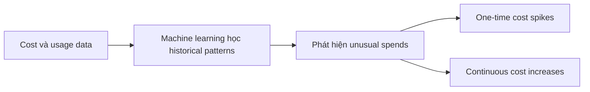
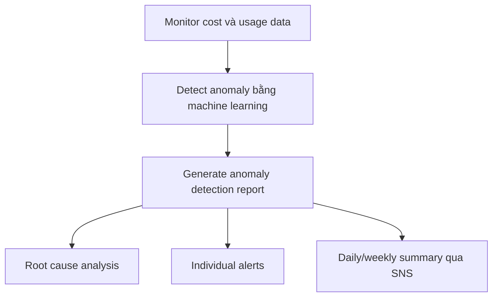

# 376. AWS Cost Anomaly Detection

## 🎯 Giới thiệu
AWS Cost Anomaly Detection là dịch vụ theo dõi **cost và usage data** một cách liên tục để phát hiện **unusual spends** bằng **machine learning**.  
Dịch vụ này học từ **historical patterns** riêng của từng tài khoản để nhận ra:
- **one-time cost spikes**
- **continuous cost increases**

Điểm quan trọng: bạn **không cần tự định nghĩa thresholds**.

## 1. Cách AWS Cost Anomaly Detection hoạt động
Dịch vụ sẽ học từ dữ liệu chi tiêu lịch sử và tự xác định điều gì là bất thường.

- Theo dõi liên tục, không cần cấu hình ngưỡng thủ công
- Tự phát hiện các biến động chi phí bất thường
- Dùng để nhận diện sớm các khoản tăng chi phí không mong muốn

## 2. Phạm vi theo dõi
AWS Cost Anomaly Detection có thể theo dõi:
- **AWS services**
- **member accounts**
- **cost allocation tags**
- **cost categories**

Điều này giúp phát hiện bất thường ở nhiều mức độ trong account.

## 3. Cảnh báo và phân tích nguyên nhân
Khi phát hiện bất thường, dịch vụ sẽ gửi **anomaly detection report** kèm **root cause analysis** để bạn biết vấn đề đến từ đâu.

Có 2 kiểu thông báo:
- **individual alerts**
- **daily hoặc weekly summary** qua **SNS**

### Mô hình tổng quát

## 📊 Bảng tóm tắt
| Tiêu chí | Mô tả |
|----------|------|
| Mục đích | Phát hiện chi phí bất thường trong AWS |
| Cách hoạt động | Dùng machine learning để học historical patterns |
| Phát hiện | One-time cost spikes và continuous cost increases |
| Cấu hình ngưỡng | Không cần define thresholds |
| Phạm vi theo dõi | AWS services, member accounts, cost allocation tags, cost categories |
| Kết quả | Anomaly detection report và root cause analysis |
| Thông báo | Individual alerts hoặc daily/weekly summary qua SNS |

## 💡 Mẹo ghi nhớ cho kỳ thi AWS
- Nhớ cụm từ khóa: **continuous monitoring + machine learning + no thresholds**
- Khi thấy câu hỏi về phát hiện **chi phí bất thường**, nghĩ ngay đến **AWS Cost Anomaly Detection**
- Dịch vụ này không chỉ cảnh báo mà còn cung cấp **root cause analysis**
- Nếu đề bài nhắc đến **daily/weekly summary** và **SNS**, đây là dấu hiệu rất mạnh của service này

## ✅ Kết luận
AWS Cost Anomaly Detection dùng **machine learning** để theo dõi chi phí AWS, phát hiện các **spike** hoặc **continuous increase** bất thường, và gửi **alerts** cùng **root cause analysis** để hỗ trợ phân tích nhanh.
