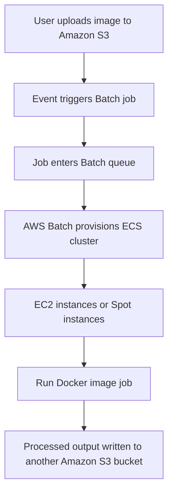

# 378. AWS Batch

## 🎯 Giới thiệu
AWS Batch là **fully managed Batch processing service** cho phép chạy **Batch processing ở mọi quy mô**. Dịch vụ này có thể xử lý **hàng trăm nghìn Batch jobs** rất dễ dàng.

**Batch job** là job có **điểm bắt đầu và kết thúc rõ ràng**, khác với job **continuous/streaming** vốn chạy liên tục.

## 1. AWS Batch hoạt động như thế nào
- Người dùng **submit** hoặc **schedule** các Batch jobs vào **Batch queue**.
- AWS Batch sẽ **dynamically launch EC2 instances hoặc Spot instances** để đáp ứng tải.
- Batch tự quyết định **đúng lượng compute và memory** cần thiết cho queue.
- Bạn chỉ tập trung vào **Batch jobs**, không phải lo nhiều về infrastructure.
- Job được định nghĩa bằng **Docker image**.
- Có thể chạy trên:
  - **ECS**
  - **EKS**
  - **Fargate**

## 2. Kiến trúc và ví dụ xử lý ảnh
Transcript đưa ví dụ:
- Ảnh do user upload vào **Amazon S3**
- Việc này kích hoạt **Batch job**
- AWS Batch tạo một **ECS cluster** gồm **EC2 instances** hoặc **Spot instances**
- Các instance chạy **Docker image** thực hiện xử lý ảnh
- Kết quả có thể được ghi sang một **Amazon S3 bucket** khác

Điểm chính cần nhớ:
- Batch tự động scale theo tải
- Tối ưu chi phí nhờ dùng **EC2/Spot instances**
- Phù hợp khi job có tính **batch**, không phải streaming

## 3. AWS Batch vs Lambda
| Tiêu chí | AWS Batch | Lambda |
|----------|-----------|--------|
| Thời gian chạy | **Không có time limit** | **15 minutes** |
| Runtime | Bất kỳ runtime nào, miễn đóng gói dưới dạng **Docker image** | Chỉ một số programming languages |
| Storage | Dùng storage từ **EC2 instance** như **EBS volume** hoặc **EC2 instance store** | Temporary storage hạn chế |
| Mô hình | **Managed service** dựa trên các EC2 instances thật | **Serverless** |
| Tài nguyên nền | **EC2 instances** do AWS quản lý | Không cần quản lý EC2 |

## 📊 Bảng tóm tắt
| Tiêu chí | Mô tả |
|----------|------|
| Loại dịch vụ | **Fully managed Batch processing service** |
| Mục đích | Chạy **Batch jobs** ở mọi quy mô |
| Đặc điểm Batch job | Có **start** và **end** rõ ràng |
| Cách chạy | Submit/schedule job vào **Batch queue** |
| Hạ tầng | AWS tự động tạo **EC2 instances** hoặc **Spot instances** |
| Đóng gói job | Dùng **Docker image** |
| Nơi chạy | **ECS**, **EKS**, hoặc **Fargate** |
| Lợi ích | Tối ưu chi phí, giảm gánh nặng quản lý infrastructure |
| So với Lambda | Không giới hạn 15 phút, linh hoạt runtime hơn |

## 💡 Mẹo ghi nhớ cho kỳ thi AWS
- **Batch = job có đầu và cuối**, không phải luồng chạy liên tục.
- Nhớ rằng AWS Batch **tự động provision EC2/Spot instances** theo tải.
- Nếu đề bài nói đến **Docker image + batch queue + autoscaling compute**, nghĩ ngay đến **AWS Batch**.
- Khi so với **Lambda**:
  - **Batch** phù hợp với job dài hơn, linh hoạt hơn về runtime và storage.
  - **Lambda** là serverless và bị giới hạn **15 minutes**.
- Nếu bài toán là xử lý ảnh từ **S3** theo kiểu batch, đây là mô hình rất điển hình của **AWS Batch**.

## ✅ Kết luận
AWS Batch là dịch vụ phù hợp để chạy **Batch jobs** ở quy mô lớn, tự động quản lý **EC2/Spot instances**, hỗ trợ chạy job bằng **Docker image** trên **ECS/EKS/Fargate**, và giúp bạn tập trung vào xử lý công việc thay vì quản lý hạ tầng.
