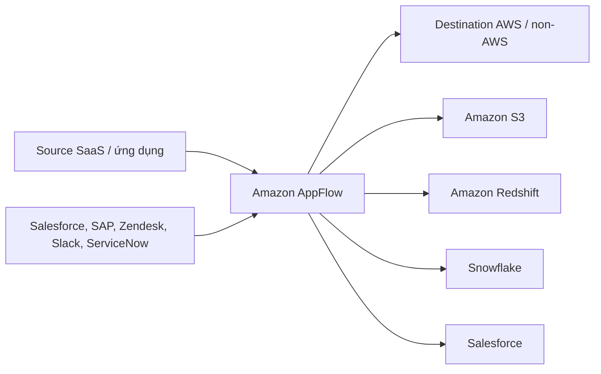

# 379. Amazon AppFlow

## 🎯 Giới thiệu
- **Amazon AppFlow** là dịch vụ **fully managed integration service** giúp truyền dữ liệu giữa các ứng dụng **Software-as-a-Service (SaaS)** và **AWS**.
- Mục tiêu của AppFlow là giúp việc tích hợp vốn phức tạp trở nên **dễ triển khai hơn**, không cần mất nhiều thời gian viết integration thủ công.
- Bạn có thể dùng AppFlow để lấy dữ liệu từ nhiều **source** và đẩy sang nhiều **destination** khác nhau ngay trong các account của mình.

## 1. Nguồn dữ liệu và đích dữ liệu
- **Source** có thể là:
  - `Salesforce`
  - `SAP`
  - `Zendesk`
  - `Slack`
  - `ServiceNow`
- Trong transcript, **Salesforce** được nhấn mạnh là một dịch vụ dễ xuất hiện trong exam.
- **Destination** có thể là:
  - `Amazon S3`
  - `Amazon Redshift`
  - Các đích **non-AWS** như `Snowflake` và `Salesforce`

## 2. Cách chạy integration
- AppFlow cho phép cấu hình integration chạy theo:
  - **schedule**
  - **specific events**
  - **on demand**
- Điều này giúp linh hoạt trong việc đồng bộ và chuyển dữ liệu theo nhu cầu sử dụng.

## 3. Tính năng và bảo mật
- AppFlow cung cấp các khả năng **data transformation** ngay trong dịch vụ, gồm:
  - **filtering**
  - **validation**
- Dữ liệu được **encrypted over the public internet**.
- Ngoài ra, có thể truyền dữ liệu **privately using PrivateLink**.
- Ý tưởng chính là:
  - không phải tự viết integration
  - tận dụng API có sẵn ngay lập tức
  - đưa dữ liệu vào các account của bạn một cách thuận tiện

## 📊 Bảng tóm tắt
| Tiêu chí | Mô tả |
|----------|------|
| Loại dịch vụ | `fully managed integration service` |
| Mục đích | Truyền dữ liệu giữa SaaS applications và AWS |
| Source tiêu biểu | `Salesforce`, `SAP`, `Zendesk`, `Slack`, `ServiceNow` |
| Destination tiêu biểu | `Amazon S3`, `Amazon Redshift`, `Snowflake`, `Salesforce` |
| Cách chạy | `schedule`, `specific events`, `on demand` |
| Tính năng xử lý dữ liệu | `filtering`, `validation` |
| Bảo mật truyền dữ liệu | Mã hóa qua public internet hoặc truyền riêng bằng `PrivateLink` |

## 💡 Mẹo ghi nhớ cho kỳ thi AWS
- Nhớ cụm từ khóa: **SaaS ↔ AWS** = `Amazon AppFlow`.
- Khi thấy câu hỏi về:
  - tích hợp dữ liệu giữa ứng dụng SaaS và AWS
  - muốn **không phải tự code integration**
  - cần chạy theo **schedule / event / on demand**
  thì hãy nghĩ đến **AppFlow**.
- Ghi nhớ các source quan trọng trong exam, đặc biệt là **Salesforce**.
- AppFlow không chỉ đẩy vào AWS mà còn có thể đẩy sang **non-AWS targets** như `Snowflake`.

## ✅ Kết luận
- **Amazon AppFlow** là dịch vụ tích hợp **fully managed** cho phép truyền dữ liệu giữa **SaaS applications** và **AWS**.
- Dịch vụ này hỗ trợ nhiều **source**, nhiều **destination**, có thể chạy linh hoạt theo **schedule**, **event**, hoặc **on demand**.
- Ngoài ra, AppFlow còn có **transformation**, **encryption**, và tùy chọn truyền riêng bằng **PrivateLink**.
