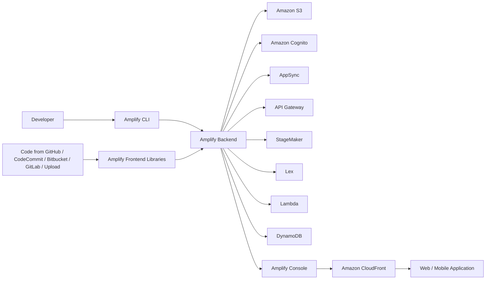

# 380. AWS Amplify

## 🎯 Giới thiệu
- **AWS Amplify** là một **web và mobile application development tool**.
- Mục tiêu của Amplify là gom nhiều phần của AWS vào **một nơi** để xây dựng ứng dụng web/mobile nhanh hơn.
- Có thể hiểu đơn giản là một **one-stop shop cho developers** để tạo, kết nối, và triển khai ứng dụng.

## 1. 🧱 Xây dựng Backend với Amplify CLI
- Developer dùng **Amplify CLI** để tạo **Amplify Backend**.
- Backend này sẽ dùng nội bộ nhiều AWS services quen thuộc:
  - **Amazon S3**: data storage
  - **Amazon Cognito**: identity
  - **AppSync**: APIs
  - **API Gateway**: APIs
  - **StageMaker**: machine learning
  - **Lex**: text detection
  - **Lambda**: functions data service
  - **DynamoDB**: data
- Amplify giúp cấu hình tập trung cho:
  - authentication
  - storage
  - API
  - CI/CD
  - PubSub
  - Analytics
  - AI/ML predictions
  - monitoring

## 2. 🔌 Kết nối Code và Frontend
- Code có thể lấy từ:
  - **GitHub**
  - **CodeCommit**
  - **Bitbucket**
  - **GitLab**
  - hoặc upload trực tiếp
- Sau đó, developer thêm **Amplify Frontend Libraries** để kết nối với **Amplify Backend**.
- Có frontend libraries cho:
  - web applications
  - mobile applications
  - nhiều framework khác nhau

## 3. 🚀 Deploy và Vai trò của Amplify
- Khi sẵn sàng, deploy bằng **Amplify Console**.
- Ứng dụng web/mobile được đưa ra ngoài qua **Amplify** và **Amazon CloudFront**.
- Transcript nhấn mạnh Amplify có thể được xem như **Elastic Beanstalk cho web và mobile applications**.
- Điểm chính cần nhớ: Amplify là lớp tổng hợp giúp developer tích hợp nhiều dịch vụ AWS vào cùng một workflow.

## 📊 Bảng tóm tắt
| Tiêu chí | Mô tả |
|----------|------|
| Bản chất | Tool phát triển ứng dụng web và mobile |
| Cách làm việc | Dùng **Amplify CLI** để tạo backend, rồi nối frontend vào backend |
| Dịch vụ tích hợp | **S3, Cognito, AppSync, API Gateway, StageMaker, Lex, Lambda, DynamoDB** |
| Khả năng cấu hình | Authentication, storage, API, CI/CD, PubSub, Analytics, AI/ML predictions, monitoring |
| Nguồn code | GitHub, CodeCommit, Bitbucket, GitLab, hoặc upload trực tiếp |
| Triển khai | Qua **Amplify Console** và **CloudFront** |
| Hình dung thi cử | Có thể coi như **Elastic Beanstalk** cho web/mobile applications |

## 💡 Mẹo ghi nhớ cho kỳ thi AWS
- Nhớ chuỗi tư duy: **CLI tạo Backend -> Frontend Libraries kết nối -> Console deploy -> CloudFront phân phối**.
- Nếu đề thi hỏi về một dịch vụ giúp developer **tập trung hóa việc xây dựng web/mobile app** với nhiều AWS services, nghĩ ngay đến **AWS Amplify**.
- Từ khóa dễ hỏi:
  - **Amplify CLI**
  - **Amplify Backend**
  - **Amplify Frontend Libraries**
  - **Amplify Console**
  - **CloudFront**
- Ghi nhớ câu so sánh trong transcript: **“Elastic Beanstalk for web and mobile applications”**.

## ✅ Kết luận
- **AWS Amplify** là công cụ giúp developer xây dựng và triển khai ứng dụng web/mobile bằng cách tích hợp nhiều AWS services vào một workflow thống nhất.
- Điểm cốt lõi cần nhớ là Amplify bao trọn **backend, frontend, và deployment**, rất hữu ích khi ôn thi AWS.
