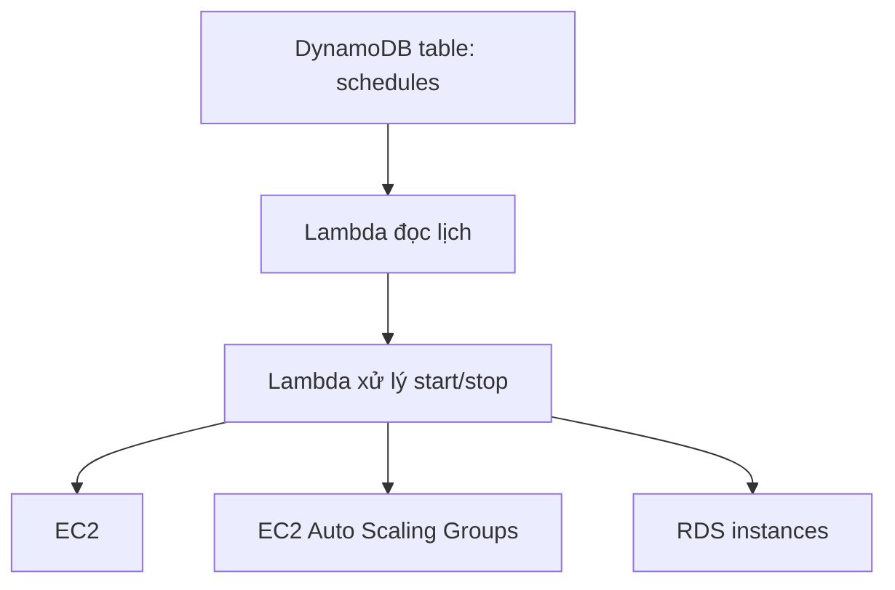

# 381. Instance Scheduler on AWS

## 🎯 Giới thiệu
- **Instance Scheduler on AWS** là một **AWS solution**, không phải một service riêng.
- Được triển khai thông qua **CloudFormation**.
- Mục tiêu chính: tự động **start/stop** tài nguyên AWS để **giảm chi phí**, có thể lên tới **70%** theo transcript.
- Ví dụ use case: tắt **EC2 instances** ngoài giờ làm việc của công ty.

## 1. Mục đích và phạm vi hỗ trợ
- Dùng để quản lý lịch chạy của các tài nguyên AWS theo schedule.
- Hỗ trợ:
  - **EC2 instances**
  - **EC2 Auto Scaling Groups**
  - **RDS instances**
  - Trong phần cấu hình còn thấy các lựa chọn như **RDS cluster**, **Neptune**, **DocumentDB**, **auto-scaling**
- Là một solution khá đầy đủ, **production ready**.
- Hỗ trợ **cross-account** và **cross-region** resources.

## 2. Cách hoạt động và kiến trúc
- Các schedule được lưu trong **DynamoDB table**.
- Một **Lambda function** sẽ đọc schedule từ DynamoDB.
- Sau đó nó kích hoạt các **Lambda khác** để tự động **start** hoặc **stop** các instance/tài nguyên cần thiết.

- Ý chính cần nhớ cho kỳ thi:
  - **DynamoDB** giữ lịch
  - **Lambda** điều phối hành động
  - Tự động **start/stop** để tiết kiệm chi phí

## 3. Triển khai và cấu hình
- Triển khai từ **AWS Management Console** bằng cách chọn **Launch solution**.
- Việc này đưa bạn vào **CloudFormation** với template và **Amazon S3 URL** được điền sẵn.
- Một số tham số cấu hình được nhắc đến:
  - **Tag key**: `Schedule`
  - Tần suất kiểm tra: **mỗi 5 phút**
  - **Default time zone**
  - Bật/tắt scheduling bằng **yes/no**
  - Chọn services cần áp dụng
  - **Tagging** khi instance được start/stop
  - Tùy chọn **snapshot** cho RDS khi stop
  - Các tùy chọn liên quan đến **ASG**
- Sau khi deploy, stack tạo ra nhiều resources.
- Trong đó nổi bật là:
  - **DynamoDB tables** cho config/schedule
  - Nhiều **Lambda functions** để thực thi scheduling

## 📊 Bảng tóm tắt
| Tiêu chí | Mô tả |
|----------|------|
| Bản chất | AWS solution, triển khai bằng CloudFormation |
| Mục tiêu | Tự động start/stop tài nguyên để giảm cost |
| Tài nguyên hỗ trợ | EC2, EC2 Auto Scaling Groups, RDS instances, RDS cluster, Neptune, DocumentDB |
| Cơ chế lưu lịch | DynamoDB table |
| Cơ chế xử lý | Lambda đọc schedule và kích hoạt Lambda khác |
| Đặc điểm | Cross-account, cross-region, production ready |
| Điểm cần nhớ | Dùng để tắt/mở tài nguyên theo lịch, ví dụ ngoài giờ làm việc |

## 💡 Mẹo ghi nhớ cho kỳ thi AWS
- Nhớ theo chuỗi: **CloudFormation -> DynamoDB -> Lambda -> start/stop resources**.
- Nếu đề bài nói về:
  - tự động tắt EC2/RDS theo giờ,
  - giảm chi phí,
  - lịch chạy theo business hours,
  thì nghĩ ngay đến **Instance Scheduler on AWS**.
- Trọng tâm thi thường là:
  - **đây là solution, không phải service**
  - **schedule nằm trong DynamoDB**
  - **Lambda thực hiện start/stop**
- Ghi nhớ các service chính: **EC2** và **RDS**.

## ✅ Kết luận
- **Instance Scheduler on AWS** là giải pháp triển khai bằng **CloudFormation** để tự động quản lý lịch **start/stop** tài nguyên AWS.
- Cốt lõi của solution là **DynamoDB** lưu schedule và **Lambda** thực thi hành động.
- Đây là một kiến thức quan trọng khi ôn thi vì nó gắn trực tiếp với bài toán **tiết kiệm chi phí** và quản trị tài nguyên theo lịch.
