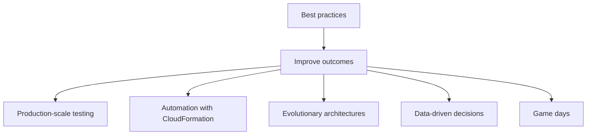

# 383. AWS Well-Architected Framework & Well-Architected Tool

## 🎯 Giới thiệu
- AWS Well-Architected Framework là một **framework** và cũng là một **tool** giúp bạn xây dựng ứng dụng tốt trên AWS.
- Mục tiêu chính:
  - Áp dụng **best practices**
  - Đưa kiến trúc đến **outcomes** tốt hơn
  - Đánh giá và cải thiện workload theo thời gian
- Ý tưởng trọng tâm:
  - Không đoán capacity, hãy dùng **auto scaling groups**
  - Test hệ thống ở **production scale**
  - Tự động hóa để dễ **architectural experimentation**
  - Cho phép **evolutionary architectures**
  - Dựa trên **data** để định hướng kiến trúc
  - Cải thiện qua **game days**

## 1. Các nguyên tắc chính của AWS Well-Architected Framework
- **Stop guessing capacity need**
  - Thay vì ước lượng thủ công, dùng **auto scaling groups** và các cơ chế tương tự.
- **Test systems at production scale**
  - Có thể dựng hạ tầng lớn nhanh chóng trên AWS, test xong rồi shut down sớm.
  - Không có lý do để không test ở quy mô production.
- **Automate experiments**
  - Dùng **CloudFormation template** để deploy dễ dàng sang nhiều môi trường và thử nghiệm.
- **Support evolutionary architectures**
  - Kiến trúc có thể thay đổi theo thời gian.
  - Ví dụ: bắt đầu với **EC2** + load balancer, rồi tiến tới kiến trúc serverless như **API Gateway** + **Lambda**.
- **Drive architecture using data**
  - Data rất quan trọng, đặc biệt khi di chuyển và lưu trữ dữ liệu.
- **Improve through game days**
  - Chủ động kiểm tra kiến trúc trong điều kiện thực tế như flash sale để tìm điểm cần cải thiện.

## 2. 6 pillars của AWS Well-Architected Framework
- Framework này có **6 pillars**:
  - **Operational excellence**
  - **Security**
  - **Reliability**
  - **Performance efficiency**
  - **Cost optimization**
  - **Sustainability**
- Cần nhớ **tên** của 6 pillars.
- Các pillars này không được xem như các yếu tố phải đánh đổi cứng nhắc, mà có tính **synergy**:
  - Cải thiện **operational excellence** có thể giúp **cost optimization**
  - Tăng **sustainability** có thể đi kèm **higher performance efficiency**
- Trong transcript, trọng tâm là nhận biết các tên pillar hơn là giải thích chi tiết từng pillar.

## 3. AWS Well-Architected Tool hoạt động như thế nào
- **AWS Well-Architected Tool** dùng để review architecture theo 6 pillars.
- Quy trình:
  - Chọn **workload**
  - Trả lời các câu hỏi
  - Review câu trả lời theo từng pillar
  - Nhận **advice**, **videos**, **documentation**, **reports**
  - Xem kết quả trên **dashboard**
- Khi tạo workload, bạn có thể khai báo:
  - Tên workload
  - Review owner
  - Môi trường như production
  - Region
  - Non-AWS regions, account IDs và thông tin hạ tầng khác
- Sau đó, bạn áp dụng các **lenses**:
  - **Well-Architected Framework lens**
  - **FTR lens**
  - **Serverless lens**
  - **SaaS lens**
  - Có thể tạo **custom lenses**
- Khi review:
  - Tool đặt câu hỏi theo từng pillar
  - Mỗi pillar có số lượng câu hỏi khác nhau
  - Trả lời xong sẽ nhận **recommendations**
- Kết quả review:
  - Có thể thấy **high risks** và **medium risks**
  - Có **improvement plan**
  - Bấm vào risk sẽ thấy phần recommendation và section tương ứng trong framework
- Mục tiêu cuối:
  - Workload trở nên **production ready**
  - Workload được xem là **compliant** và **well architected**

## 📊 Bảng tóm tắt
| Tiêu chí | Mô tả |
|----------|------|
| Framework | AWS Well-Architected Framework là framework + tool để xây dựng ứng dụng tốt trên AWS |
| Mục tiêu | Áp dụng best practices, review kiến trúc, nhận recommendations |
| Nguyên tắc | Không đoán capacity, test ở production scale, automate, evolutionary, data-driven, game days |
| 6 pillars | Operational excellence, Security, Reliability, Performance efficiency, Cost optimization, Sustainability |
| Well-Architected Tool | Dùng để review workload theo 6 pillars và nhận advice/report/dashboard |
| Lenses | Well-Architected Framework lens, FTR lens, Serverless lens, SaaS lens, custom lenses |
| Kết quả | High risks, medium risks, improvement plan, guidance để đạt production ready |

## 💡 Mẹo ghi nhớ cho kỳ thi AWS
- Nhớ đúng **6 pillars** của AWS Well-Architected Framework.
- Ghi nhớ luồng của **Well-Architected Tool**:
  - **Workload -> Questions -> Review by pillars -> Advice -> Dashboard**
- Khi thấy **CloudFormation**, hãy liên hệ với **automation** và **experimentation**.
- Khi thấy ví dụ từ **EC2** sang **API Gateway + Lambda**, hãy liên hệ với **evolutionary architecture**.
- Khi đề cập **high risks** và **improvement plan**, đó là dấu hiệu của quá trình review trong Well-Architected Tool.
- Nhớ rằng các pillars có thể hỗ trợ lẫn nhau, không chỉ là các mục phải cân bằng tách biệt.

## ✅ Kết luận
- AWS Well-Architected Framework cung cấp bộ nguyên tắc để thiết kế kiến trúc tốt trên AWS.
- AWS Well-Architected Tool là công cụ thực hành để review workload theo 6 pillars, xác định risk và nhận khuyến nghị cải thiện.
- Mục tiêu cuối cùng là đưa workload đến trạng thái **well architected**, **compliant**, và **production ready**.
