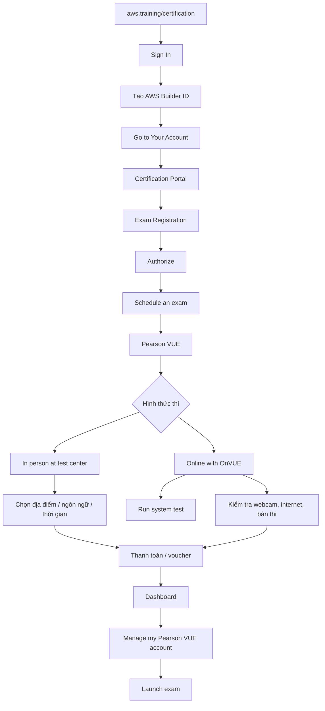

# 390. Exam Walkthrough and Signup

## 🎯 Giới thiệu
Bài này hướng dẫn cách:
- Đăng nhập vào AWS Certification portal
- Tạo **AWS Builder ID**
- Đăng ký và lên lịch thi qua **Pearson VUE**
- Chọn hình thức thi **in person** hoặc **online with OnVUE**
- Chuẩn bị trước ngày thi và khởi chạy bài thi khi sẵn sàng

## 1. Đăng nhập và vào Certification Portal
- Truy cập `aws.training/certification`
- Chọn **Sign In**
- Tạo **AWS Builder ID** để dùng cho AWS certifications
- Sau khi đăng nhập, chọn **Go to Your Account**
- Từ đây vào **certification portal**

## 2. Đăng ký và lên lịch thi
- Chọn **Exam Registration** rồi **schedule an exam**
- Một số kỳ thi cần **Authorize** trước khi đặt lịch
- Sau khi authorize, nút **Schedule** sẽ khả dụng
- Ví dụ trong bài: **AWS Certified Developer Associate Exam**
- Chọn **Schedule** để chuyển sang **Pearson VUE portal**

## 3. Chọn hình thức thi và hoàn tất đặt lịch
- Trong **Pearson VUE**, có 2 lựa chọn chính:
  - **In person at a test center**
  - **Online with OnVUE**
- Nếu thi tại trung tâm:
  - Cần mang **photo ID**
  - Cần hiểu rõ quy định những gì được và không được mang vào phòng thi
  - Chọn ngôn ngữ thi
  - Đồng ý điều kiện
  - Nhập địa chỉ để tìm địa điểm thi
- Nếu thi online với **OnVUE**:
  - Cần máy tính có **webcam**
  - Cần kết nối internet tốt
  - Nên chạy **Run system test** rất sớm trước ngày thi
  - Bàn thi phải sạch, không có đồ vật trên desk
  - Có thể phải cho giám thị xem khu vực thi
  - Cần check in khoảng **30 minutes before** giờ hẹn
- Các bước sau đó:
  - Chọn ngôn ngữ
  - Đồng ý các điều khoản
  - Chọn múi giờ
  - Chọn ngày và giờ
  - Thanh toán
  - Có thể thêm **voucher** nếu có mã giảm giá

## 4. Vào thi khi đã đặt lịch
- Sau khi exam đã được schedule:
  - Vào **Home > Dashboard**
  - Chọn **Manage my Pearson VUE account**
  - Quay lại trang Pearson VUE
  - Khi sẵn sàng, bấm **Launch exam**
- Đây là cách truy cập nhanh để bắt đầu bài thi

## 📊 Bảng tóm tắt
| Tiêu chí | Mô tả |
|----------|------|
| Nền tảng đăng ký | `aws.training/certification` |
| Tài khoản cần có | **AWS Builder ID** |
| Cổng lên lịch thi | **Pearson VUE** |
| Hình thức thi | **In person** hoặc **Online with OnVUE** |
| Yêu cầu thi online | Webcam, internet tốt, `Run system test`, bàn thi sạch |
| Bước quan trọng trước thi | Check in khoảng **30 minutes before** |
| Bước cuối để vào thi | **Launch exam** từ **Pearson VUE** |

## 💡 Mẹo ghi nhớ cho kỳ thi AWS
- Nhớ chuỗi thao tác: **aws.training/certification -> Sign In -> AWS Builder ID -> Go to Your Account -> Exam Registration -> Schedule**
- **Pearson VUE** là đối tác lên lịch thi của AWS
- Thi online với **OnVUE** thì ưu tiên nhớ 3 ý:
  - **webcam**
  - **good internet connection**
  - **Run system test**
- Luôn chuẩn bị **photo ID** nếu thi tại test center
- Check in sớm khoảng **30 minutes before** để tránh trễ giờ

## ✅ Kết luận
Bài giảng tập trung vào quy trình đăng ký thi AWS certification từ lúc đăng nhập đến lúc khởi chạy bài thi. Điểm cần nhớ nhất là **AWS Builder ID**, **Pearson VUE**, lựa chọn **in person / OnVUE**, và việc chạy **system test** trước khi thi online.
