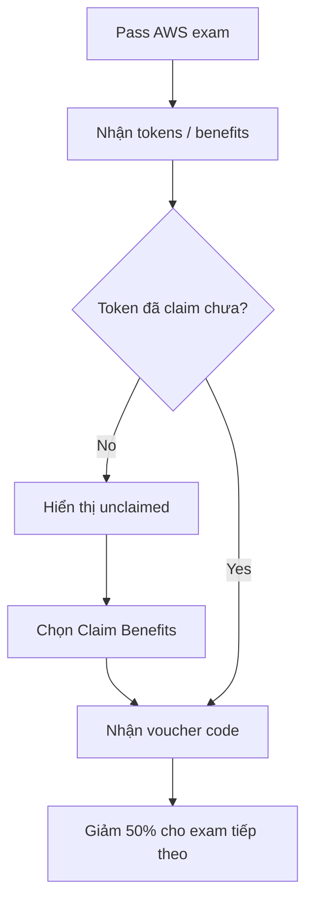

# 391. Save 50% on your AWS Exam Cost!

## 🎯 Giới thiệu
Bài giảng này ցույց cách giảm **50% chi phí AWS exam** nếu bạn đã **đỗ một AWS exam trước đó**. Sau khi pass, bạn sẽ nhận được **tokens / benefits** để claim **voucher code** cho kỳ thi tiếp theo.

## 1. Cách nhận 50% off voucher 🏷️
- Khi bạn **pass một AWS exam**, hệ thống sẽ cấp **tokens**.
- Các token chưa dùng sẽ hiển thị là **unclaimed**.
- Mỗi token có **expiry date**.
- Để lấy voucher, chọn **Claim Benefits**.
- Sau khi claim, benefit sẽ chuyển sang trạng thái **claimed** và hiển thị **voucher code**.

## 2. Cách áp dụng voucher khi thanh toán 💳
- Vào **cart** khi chuẩn bị thanh toán.
- Chọn **Proceed to Checkout**.
- Ở phần payment, nhập **voucher promo code** vào ô được cung cấp.
- Dùng đúng **code** đã lấy từ phần benefits.
- Sau khi áp dụng, tổng chi phí sẽ được **giảm**.

## 3. Điểm cần nhớ cho kỳ thi AWS 🎓
- Đây là một **trick** để tiết kiệm chi phí thi AWS.
- Điều kiện là bạn phải **đã pass ít nhất một AWS exam** trước đó.
- Voucher có **thời hạn**, nên cần dùng trước khi hết hạn.
- Cần thao tác theo đúng luồng: **Claim Benefits -> lấy code -> nhập vào checkout**.

## 📊 Bảng tóm tắt
| Tiêu chí | Mô tả |
|----------|------|
| Điều kiện | Đã pass một AWS exam trước đó |
| Lợi ích | Giảm 50% cho kỳ thi tiếp theo |
| Cách nhận | Chọn **Claim Benefits** để lấy **voucher code** |
| Trạng thái | Token có thể là **unclaimed** hoặc **claimed** |
| Lưu ý | Có **expiry date** cho benefit |
| Cách dùng | Nhập code ở bước **Proceed to Checkout** |

## 💡 Mẹo ghi nhớ cho kỳ thi AWS
- Nhớ chuỗi hành động: **Pass exam -> Claim Benefits -> Copy code -> Apply at checkout**.
- Từ khóa cần nhớ: **tokens**, **unclaimed**, **claimed**, **voucher code**, **promo code**.
- Nếu thấy câu hỏi về giảm giá thi AWS, hãy nghĩ ngay đến **benefit token** sau khi đỗ exam.

## ✅ Kết luận
Sau khi bạn **pass AWS exam**, bạn có thể nhận **voucher code giảm 50%** cho lần thi tiếp theo bằng cách **claim benefits** và nhập code vào lúc thanh toán. Đây là cách trực tiếp để tiết kiệm chi phí thi AWS.
