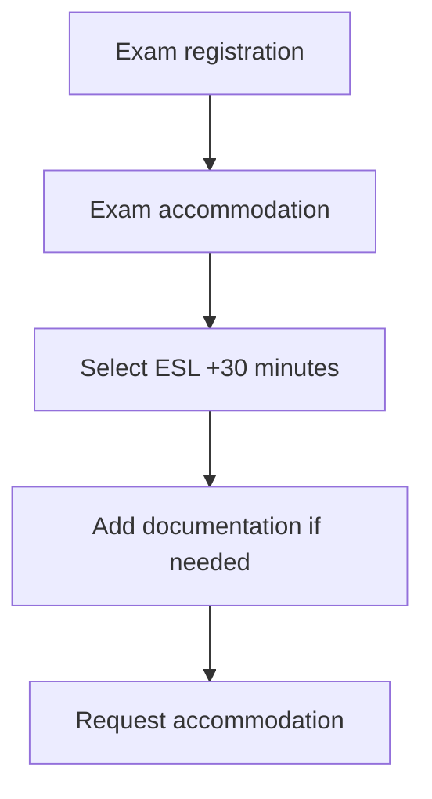

# 392. Get an Extra 30 Minutes on your AWS Exam - Non Native English Speakers only

## 🎯 Giới thiệu
- Nếu bạn không phải native English speaker, bạn có thể **request exam accommodation** để được thêm **30 minutes** cho bài thi AWS.
- Luồng này được thực hiện trong phần **exam registration** ở bên trái, thông qua mục **exam accommodation**.
- Mục tiêu là giúp người thi có thêm thời gian làm bài khi dùng **ESL +30 minutes**.

## 1. Cách request thêm 30 phút
- Vào **exam registration**.
- Chọn **exam accommodation**.
- Chọn **ESL +30 minutes**.
- Nếu cần, có thể **add documentation**.
- Gửi yêu cầu **request the accommodation**.

## 2. Sau khi được chấp thuận
- Khi accommodation được **approved**, nó **doesn't expire**.
- Sau đó bạn có thể đi tiếp để **schedule exam**.
- Nếu trước đó đã có lịch thi, bạn cần **cancel** lịch cũ trước.
- Tiếp theo, hãy **schedule exam again**.
- Lúc này, **30 minutes accommodation** sẽ được tính vào bài thi.

## 3. Lưu ý thêm về accommodation khác
- Nếu cần accommodation khác, bạn có thể **directly request it from Pearson View exam on their websites**.
- Theo transcript, đây là cách được dùng **most usually** bởi các non-native English speaker.

## 📊 Bảng tóm tắt
| Tiêu chí | Mô tả |
|----------|------|
| Đối tượng | Non-native English speaker |
| Loại hỗ trợ chính | **ESL +30 minutes** |
| Cách thực hiện | Vào **exam registration** -> **exam accommodation** |
| Có thể nộp thêm | **Documentation** nếu cần |
| Sau khi duyệt | **Approved** và **doesn't expire** |
| Việc cần làm tiếp theo | Hủy lịch cũ rồi **schedule exam again** |
| Hỗ trợ khác | Có thể request trực tiếp từ **Pearson View** |

## 💡 Mẹo ghi nhớ cho kỳ thi AWS
- Nhớ chuỗi hành động: **Exam registration -> Exam accommodation -> ESL +30 minutes -> schedule lại**.
- Nếu đã đặt lịch thi trước đó, hãy nhớ **cancel** rồi mới **reschedule**.
- Điểm quan trọng hay gặp trong ôn thi: accommodation được **approved** thì **doesn't expire**.
- Từ khóa cần nhớ: **ESL +30 minutes**, **exam accommodation**, **Pearson View**.

## ✅ Kết luận
- Lecture này hướng dẫn cách xin thêm **30 minutes** cho bài thi AWS nếu bạn không phải native English speaker.
- Quy trình chính là request **ESL +30 minutes**, chờ **approval**, rồi **cancel** lịch cũ và **schedule exam again** để áp dụng accommodation.
