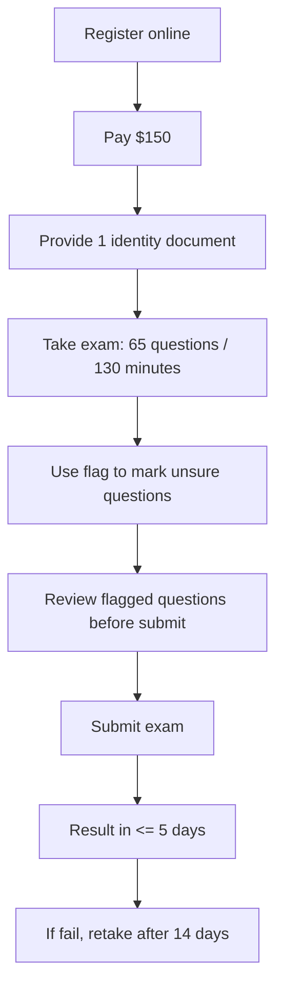

# 393. How does the exam work-

## 🎯 Giới thiệu
Bài giảng này giải thích cách kỳ thi AWS diễn ra từ lúc đăng ký đến khi nhận kết quả. Các ý chính cần nhớ là: quy trình đăng ký, quy định trong phòng thi, cấu trúc bài thi, cách chấm điểm và thời gian thi lại nếu không đậu.

## 1. Quy trình đăng ký và yêu cầu đầu vào 📝
- Đăng ký online.
- Thanh toán **$150** để đăng ký thi.
- Khi đi thi, cần cung cấp **1 giấy tờ tùy thân**.
- Có thể là **ID** hoặc **passport**.
- Sau khi đăng ký, bạn sẽ nhận email với đầy đủ chi tiết.

## 2. Quy định trong phòng thi và hình thức thi 🎧
- Không được:
  - ghi chú,
  - dùng bút,
  - nói chuyện.
- Nếu thi tại nhà:
  - phải **scan phòng** để chứng minh phòng hoàn toàn trống.
- Bài thi gồm:
  - **65 questions**
  - trong **130 minutes**

## 3. Chấm điểm, review và thi lại ✅
- Nếu không chắc về câu nào, có thể dùng **flag feature** để đánh dấu.
- Cuối bài thi có thể quay lại các câu đã flag để xem lại và sửa câu trả lời.
- Sau khi **submit exam**:
  - không thể thay đổi bất kỳ câu trả lời nào.
- Điều kiện đậu:
  - ít nhất **720/1000**.
- Kết quả:
  - biết trong vòng **5 ngày**,
  - thường **ít hơn 5 ngày** nhưng không có ngay lập tức.
- Bạn sẽ nhận email thông báo điểm để tải trên **certification website**.
- Không bao giờ biết đáp án nào đúng/sai.
- Nếu rớt, có thể thi lại sau **14 ngày**.

## 📊 Bảng tóm tắt
| Tiêu chí | Mô tả |
|----------|------|
| Đăng ký | Đăng ký online |
| Lệ phí | $150 |
| Giấy tờ | 1 identity document như ID hoặc passport |
| Quy định | Không ghi chú, không dùng bút, không được nói |
| Thi tại nhà | Phải scan phòng để xác nhận phòng trống |
| Số câu hỏi | 65 questions |
| Thời gian | 130 minutes |
| Cờ đánh dấu | Dùng `flag` để đánh dấu câu chưa chắc |
| Nộp bài | Nộp xong không được sửa đáp án |
| Điểm đậu | 720/1000 |
| Nhận kết quả | Trong vòng 5 ngày, thường sớm hơn |
| Biết đáp án đúng/sai | Không bao giờ được biết |
| Thi lại | Sau 14 ngày nếu fail |

## 💡 Mẹo ghi nhớ cho kỳ thi AWS
- Nhớ 3 con số quan trọng: **$150**, **65 questions**, **130 minutes**.
- Nhớ ngưỡng đậu: **720/1000**.
- Nhớ quy tắc sau khi nộp: **không thể đổi đáp án**.
- Dùng **flag** cho câu chưa chắc để quay lại review trước khi submit.
- Nếu fail, chờ **14 days** rồi thi lại.
- Ôn kỹ những phần còn nghi ngờ trước ngày thi, vì bài thi không cho ghi chú và không có thông tin đúng/sai sau khi chấm.

## ✅ Kết luận
Kỳ thi AWS được tổ chức theo quy trình rõ ràng: đăng ký online, thanh toán lệ phí, xác minh danh tính, làm bài 65 câu trong 130 phút, có thể flag để xem lại trước khi nộp. Để đậu, cần đạt ít nhất 720/1000, và kết quả sẽ có trong vài ngày.
