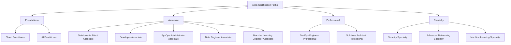

# 394. AWS Certification Paths

## 🎯 Giới thiệu
- Bài giảng này giới thiệu các **AWS certification paths** theo từng loại vai trò.
- AWS có nhiều cấp độ chứng chỉ:
  - **Foundational**
  - **Associate**
  - **Professional**
  - **Specialty**
- Lộ trình học sẽ khác nhau tùy theo mục tiêu nghề nghiệp, như:
  - Solutions Architect
  - Operations
  - DevOps
  - Security
  - Networking
  - Data Analytics
  - AI / ML

## 1. 🧭 Tổng quan các cấp chứng chỉ AWS
- Transcript nhấn mạnh rằng người học có thể đi theo từng **track** khác nhau thay vì học một lộ trình cố định cho tất cả.
- Nếu đã có nền tảng về cloud và IT, **Cloud Practitioner** có thể không bắt buộc, nhưng vẫn là một chứng chỉ tốt để bắt đầu.
- Với người làm việc liên quan đến AI, transcript nhiều lần đề xuất thêm **AI Practitioner Foundational**.
- Các chứng chỉ thường được nhắc đến như nền tảng cho nhiều track:
  - **Cloud Practitioner Foundational**
  - **AI Practitioner Foundational**
  - **Solutions Architect Associate**
  - **Developer Associate**
  - **SysOps Administrator Associate**
  - **DevOps Engineer Professional**
  - **Security Specialty**
  - **Advanced Networking Specialty**
  - **Data Engineer Associate**
  - **Machine Learning Engineer Associate**
  - **Machine Learning Specialty**

## 2. 🛠️ Các lộ trình theo vai trò
### Solutions Architect / Architecture
- Mục tiêu: **design, develop, manage cloud infrastructure and assets**
- Lộ trình:
  - **Cloud Practitioner**
  - **AI Practitioner Foundational** nếu muốn leverage AI
  - **Solutions Architect Associate**
  - **Solutions Architect Professional**
  - Deep dive: **Security Specialty**

### Application Architecture
- Mục tiêu liên quan đến:
  - user interface
  - middleware
  - infrastructure
- Lộ trình:
  - **Cloud Practitioner**
  - **Developer Associate**
  - **DevOps Engineer Professional**
  - Deep dive: **Solutions Architect Professional**

### Operations / System Administrator
- Mục tiêu: install, upgrade, maintain computer components and software, integrate automation processes
- Lộ trình:
  - **Cloud Practitioner**
  - **SysOps Administrator Associate**
  - Deep dive: **DevOps Engineer Professional**

### Cloud Engineer
- Mục tiêu: implement and operate network computing infrastructure, implement security systems to maintain data safety
- Lộ trình:
  - **Cloud Practitioner Foundational**
  - **SysOps Administrator Associate**
  - **Security Specialty**
  - Deep dive:
    - **DevOps Engineer Professional**
    - **Advanced Networking Specialty**

### DevOps
- Mục tiêu: embed testing and quality best practices throughout the product lifecycle
- Lộ trình:
  - **Cloud Practitioner**
  - **Developer**
  - **DevOps Engineer**
- Với **cloud DevOps engineer**:
  - **Cloud Practitioner Foundational**
  - **Developer Associate**
  - optional: **SysOps Administrator**
- Với **DevSecOps engineer**:
  - **Cloud Practitioner**
  - **SysOps Administrator Associate**
  - **Machine Learning Associate** nếu làm AI/ML projects
  - **DevOps Engineer**
  - **Security Specialty**

### Security
- Mục tiêu: design computer security architecture, develop cyber security designs, protect information
- Lộ trình:
  - **Cloud Practitioner Foundational**
  - **AI Practitioner Foundational** nếu làm AI/ML systems
  - **SysOps Administrator**
  - **Security Specialty**
  - Deep dive:
    - **DevOps Engineer Professional**
    - **Advanced Networking Specialty**
- Với **cloud security architect**:
  - **Cloud Practitioner**
  - **AI Practitioner Foundational**
  - **Solutions Architect Associate**
  - **Security Specialty**
  - Deep dive: **Solutions Architect Professional**

### Development / Networking
- **Software development engineer**:
  - **Cloud Practitioner**
  - **AI Practitioner Foundational**
  - **Developer Associate**
  - **DevOps Engineer**
- **Network engineer**:
  - **Cloud Practitioner Foundational**
  - **Solutions Architect Associate**
  - **Advanced Networking Specialty**
  - Deep dive: **Security Specialty**

### Data Analytics / AI / ML
- **Cloud data engineer**:
  - **Cloud Practitioner**
  - **Solutions Architect Associate**
  - **Data Engineer**
  - Deep dive: **Security Specialty**
- **Machine learning engineer**:
  - **Cloud Practitioner**
  - **AI Practitioner Foundational**
  - **Solutions Architect Associate**
  - **Machine Learning Engineer Associate**
  - Deep dive:
    - **Data Engineer Associate**
    - **Machine Learning Specialty**
- **Prompt engineer**:
  - **Cloud Practitioner**
  - **AI Practitioner Foundational**
  - **Machine Learning Engineer Associate**
  - Deep dive: **Machine Learning Specialty**
- **Machine learning ops engineer**:
  - **Cloud Practitioner**
  - **AI Practitioner**
  - **Solutions Architect Associate**
  - **Machine Learning Associate**
  - Deep dive:
    - **Data Engineer**
    - **DevOps Engineer**
- **Data scientist**:
  - **Cloud Practitioner Foundational**
  - **AI Practitioner Foundational**
  - **Solutions Architect Associate**
  - **Machine Learning Engineer Associate**
  - **Machine Learning Specialty**

## 3. 🚀 Gợi ý chọn đường học theo mục tiêu
- Nếu muốn vào **architecture**, trọng tâm là:
  - **Solutions Architect Associate**
  - **Solutions Architect Professional**
- Nếu muốn vào **operations**:
  - **SysOps Administrator Associate**
  - **DevOps Engineer Professional**
- Nếu muốn vào **security**:
  - **Security Specialty**
  - có thể kết hợp thêm **Advanced Networking Specialty**
- Nếu muốn vào **AI / ML**:
  - **AI Practitioner Foundational**
  - **Machine Learning Engineer Associate**
  - **Machine Learning Specialty**
- Nếu muốn đi theo **development + DevOps**:
  - **Developer Associate**
  - **DevOps Engineer**

## 📊 Bảng tóm tắt
| Tiêu chí | Mô tả |
|----------|------|
| Mục tiêu tổng quát | Chọn AWS certification path theo vai trò nghề nghiệp |
| Các cấp độ | Foundational, Associate, Professional, Specialty |
| Nền tảng thường gặp | Cloud Practitioner, AI Practitioner Foundational |
| Track kiến trúc | Solutions Architect Associate -> Solutions Architect Professional |
| Track vận hành | SysOps Administrator Associate -> DevOps Engineer Professional |
| Track bảo mật | Security Specialty, có thể đi kèm Advanced Networking Specialty |
| Track AI / ML | Machine Learning Engineer Associate, Machine Learning Specialty |
| Track dev | Developer Associate -> DevOps Engineer |
| Track dữ liệu | Data Engineer Associate |

## 💡 Mẹo ghi nhớ cho kỳ thi AWS
- 🎯 Luôn nhớ: **mỗi role có một lộ trình khác nhau**, không có một đường học duy nhất cho tất cả.
- 🧱 **Cloud Practitioner** là điểm khởi đầu phổ biến trong nhiều track.
- 🤖 Nếu thấy AI / ML trong vai trò, hãy nghĩ đến **AI Practitioner Foundational** trước.
- 🔐 Nếu bài toán có security sâu, ưu tiên **Security Specialty**.
- 🛠️ Nếu liên quan đến automation, CI/CD, lifecycle, hãy nghĩ đến **DevOps Engineer**.
- 🧭 Nếu liên quan đến thiết kế hạ tầng cloud, hãy nghĩ đến **Solutions Architect**.
- 📡 Nếu liên quan đến mạng, hãy nhớ **Advanced Networking Specialty**.
- 📊 Nếu liên quan đến data pipeline và processing, hãy nhớ **Data Engineer**.

## ✅ Kết luận
- Transcript cung cấp bản đồ học AWS certification theo từng vai trò nghề nghiệp.
- Điểm chính là chọn đúng **path** theo mục tiêu:
  - architecture
  - operations
  - security
  - devops
  - networking
  - data analytics
  - AI / ML
- Học theo lộ trình phù hợp sẽ giúp bạn ôn thi AWS hiệu quả và đi đúng hướng nghề nghiệp.
