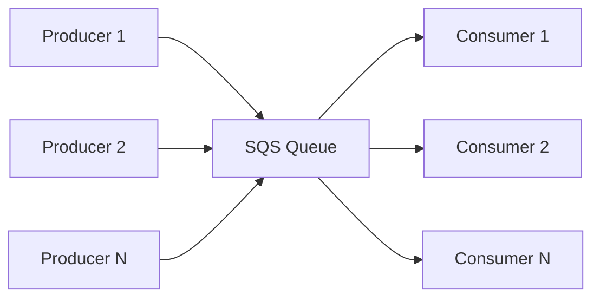
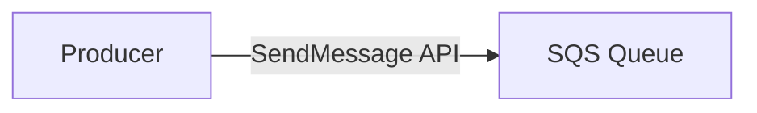
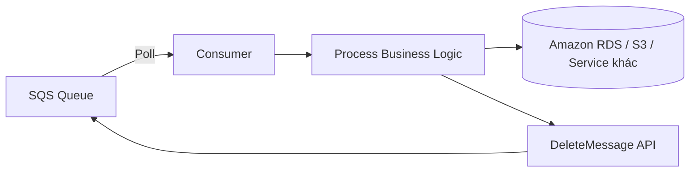
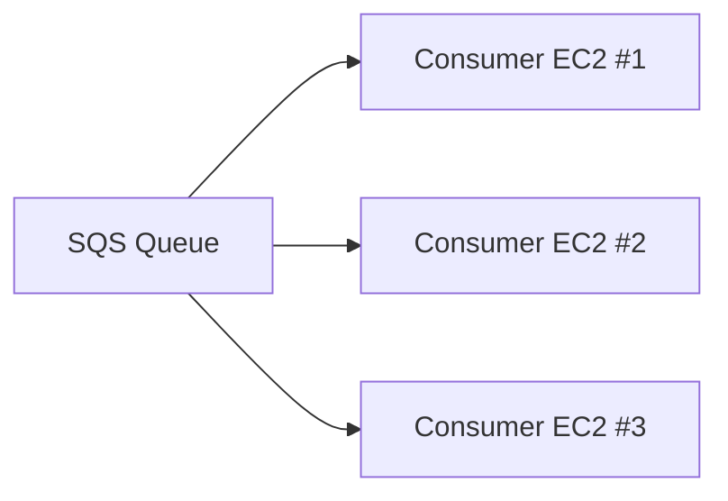
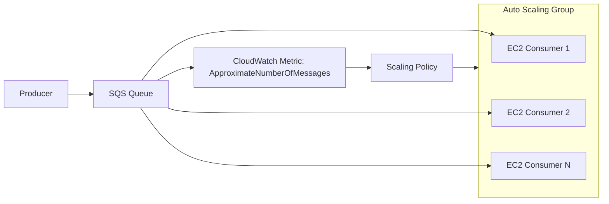
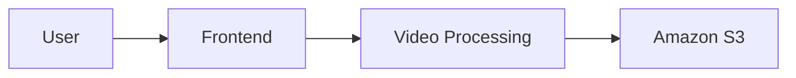
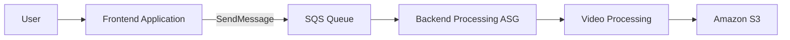

# 179. Amazon SQS (Simple Queue Service) Overview

## 📨 Amazon SQS – Dịch vụ Message Queue giúp Decouple ứng dụng

## 1. **Amazon SQS là gì?**

* **Amazon SQS (Simple Queue Service)** là dịch vụ **Message Queue** được quản lý hoàn toàn (**Fully Managed Service**) trên AWS.
* Mục đích chính là **decouple applications** (tách rời các thành phần của ứng dụng), giúp Producer và Consumer hoạt động độc lập.
* Đây là một trong những dịch vụ lâu đời nhất của AWS và thường xuất hiện trong các bài toán **Application Decoupling**.

---

## 2. 🏗️ Kiến trúc cơ bản của SQS

### Thành phần

* **Producer**: Gửi message vào Queue.
* **SQS Queue**: Lưu trữ tạm thời các message.
* **Consumer**: Đọc, xử lý và xóa message khỏi Queue.

### Luồng hoạt động

---

## 3. 📤 Producer hoạt động như thế nào?

* Producer gửi message vào SQS thông qua **AWS SDK**.
* API sử dụng là **`SendMessage`**.
* Nội dung message có thể là bất kỳ tác vụ nào, ví dụ:

  * `Process Order`
  * `Process Video`
  * `Send Email`

Message sẽ được lưu trong Queue cho đến khi Consumer xử lý và xóa.

### Luồng gửi message

---

## 4. 📥 Consumer hoạt động như thế nào?

* Consumer là ứng dụng do bạn tự viết.
* Có thể chạy trên:

  * **Amazon EC2**
  * **On-Premises Server**
  * **AWS Lambda**
* Consumer sẽ **poll** Queue để lấy message.
* Mỗi lần có thể nhận tối đa **10 messages**.
* Sau khi xử lý thành công phải gọi **DeleteMessage API** để xóa khỏi Queue.

### Luồng xử lý

---

## 5. ⚙️ Đặc điểm của SQS Standard Queue

### 🚀 Unlimited Throughput

* Không giới hạn số lượng message.
* Không giới hạn throughput gửi hoặc nhận message.

---

### ⏳ Message Retention

* Mặc định: **4 ngày**.
* Tối đa: **14 ngày**.
* Nếu Consumer không xử lý và xóa trong khoảng thời gian này thì message sẽ tự động bị xóa.

---

### ⚡ Low Latency

* Publish và Receive thường có độ trễ dưới **10 ms**.

---

### 📦 Giới hạn kích thước

* Mỗi message tối đa **1,024 KB (1 MB)**.

---

## 6. ⚠️ At Least Once Delivery

Do SQS được thiết kế để đạt throughput rất cao nên:

* Một message **có thể được gửi nhiều hơn một lần**.
* Đây gọi là **At Least Once Delivery**.

➡️ Ứng dụng cần được thiết kế theo hướng **Idempotent**, tức xử lý lặp lại nhiều lần vẫn cho cùng kết quả.

---

## 7. ⚠️ Best Effort Ordering

* **SQS Standard Queue không đảm bảo thứ tự tuyệt đối**.
* Message có thể được xử lý không đúng thứ tự gửi.

➡️ Nếu cần đảm bảo thứ tự (**FIFO**) thì phải sử dụng loại Queue khác (**SQS FIFO Queue**).

---

## 8. 🔄 Horizontal Scaling với nhiều Consumer

Có thể triển khai nhiều Consumer đọc Queue song song để tăng throughput.

* Mỗi Consumer nhận một nhóm message khác nhau.
* Nếu Consumer xử lý quá chậm, message có thể được Consumer khác nhận lại.
* Đây cũng là nguyên nhân dẫn đến **At Least Once Delivery**.

---

## 9. 📈 Kết hợp SQS với Auto Scaling Group (ASG)

Một kiến trúc rất phổ biến là cho Consumer chạy trong **Auto Scaling Group**.

AWS cung cấp metric:

* **ApproximateNumberOfMessages** (CloudWatch Metric)

Có thể cấu hình:

* Queue dài ➜ tăng số lượng EC2.
* Queue ngắn ➜ giảm số lượng EC2.

### Kiến trúc

➡️ Đây là mô hình rất hay xuất hiện trong kỳ thi AWS.

---

## 10. 🎬 Ví dụ Decouple Application bằng SQS

### ❌ Không dùng SQS

Frontend vừa nhận request vừa xử lý video.

* Thời gian xử lý lâu.
* Làm chậm phản hồi của người dùng.

---

### ✅ Dùng SQS để Decouple

Frontend chỉ nhận request và đưa vào Queue.

Backend xử lý độc lập.

### Lợi ích

* Frontend phản hồi nhanh.
* Backend có thể scale độc lập.
* Có thể sử dụng loại EC2 tối ưu cho từng workload (ví dụ GPU để xử lý video).
* Hệ thống linh hoạt và dễ mở rộng.

---

## 11. 🔒 Bảo mật của SQS

### Encryption In Transit

* Sử dụng **HTTPS API** để gửi và nhận message.

### Encryption At Rest

* Hỗ trợ mã hóa bằng **AWS KMS**.

### Client-side Encryption

* Có thể tự mã hóa phía client trước khi gửi lên SQS.

### Access Control

* **IAM Policies**: Kiểm soát quyền truy cập API.
* **SQS Access Policies**:

  * Cho phép **Cross-Account Access**.
  * Cho phép các dịch vụ khác như **Amazon SNS** hoặc **Amazon S3 Event Notifications** gửi message vào Queue.

---

# 📊 Tóm tắt nhanh

| Thành phần            | Vai trò                                                       |
| --------------------- | ------------------------------------------------------------- |
| 📤 **Producer**       | Gửi message bằng `SendMessage`                                |
| 📨 **SQS Queue**      | Lưu trữ tạm thời message                                      |
| 📥 **Consumer**       | Poll, xử lý và `DeleteMessage`                                |
| 🚀 Throughput         | Unlimited                                                     |
| 📦 Kích thước message | Tối đa **1,024 KB**                                           |
| ⏳ Retention           | Mặc định **4 ngày**, tối đa **14 ngày**                       |
| ⚠️ Delivery           | **At Least Once Delivery** (có thể trùng lặp)                 |
| 🔀 Ordering           | **Best Effort Ordering** (không đảm bảo thứ tự)               |
| 📈 Scale              | Dễ dàng mở rộng bằng nhiều Consumer và **Auto Scaling Group** |

---

# ✅ Mẹo ghi nhớ cho kỳ thi

* **Amazon SQS = Message Queue + Application Decoupling**.
* **Producer → `SendMessage` → SQS → Consumer → `DeleteMessage`**.
* **Unlimited Throughput**, **Unlimited Messages**.
* **At Least Once Delivery** ⇒ có thể nhận trùng message.
* **Best Effort Ordering** ⇒ không đảm bảo thứ tự.
* Kết hợp **CloudWatch + ApproximateNumberOfMessages + Auto Scaling Group** để tự động scale Consumer.
* Kiến trúc phổ biến: **Frontend → SQS → Backend Processing → Amazon S3/RDS** để xử lý bất đồng bộ (asynchronous).
