# 3. Creating an AWS Account

## 🎯 Giới thiệu

Bài học hướng dẫn quy trình tạo **AWS Account** để học và thực hành trên **AWS Management Console**. Nội dung tập trung vào các bước đăng ký, chọn **Account Plan**, xác minh danh tính và đăng nhập bằng **Root User**.

## 1. Bắt đầu tạo AWS Account

* Truy cập trang chủ AWS và chọn **Create account**.
* Nhập các thông tin ban đầu:
  * **Root User Email Address**.
  * **AWS Account Name**.
* **Root User** là tài khoản có quyền cao nhất trong AWS, vì vậy cần bảo mật thông tin đăng nhập cẩn thận.

## 2. Thiết lập Root User Password

* Tạo mật khẩu cho **Root User**.
* Mật khẩu phải có ít nhất **8 ký tự**.
* Mật khẩu cần chứa ít nhất **3 trong 4** nhóm ký tự:
  * Chữ hoa `A-Z`.
  * Chữ thường `a-z`.
  * Số `0-9`.
  * Ký tự đặc biệt.
* Cần lưu mật khẩu an toàn và tránh làm mất.

## 3. Chọn Account Plan

AWS cung cấp hai lựa chọn chính trong bài học:

| Account Plan | Đặc điểm |
|--------------|----------|
| **Free Plan** | Phù hợp để học tập; không phát sinh chi phí sau khi hết credit nếu không nâng cấp; tài khoản có thể tự đóng nếu không nâng cấp |
| **Paid Plan** | Phù hợp để chạy **workload production**; có thể phát sinh thanh toán khi vượt mức credit |

* AWS thường cấp khoảng **100 USD credit** ban đầu.
* Có thể nhận tối đa khoảng **200 USD credit** tùy chương trình áp dụng.
* Với mục tiêu học AWS, **Free Plan** thường là đủ.

## 4. Nhập thông tin liên hệ và xác minh thanh toán

* Chọn loại tài khoản, ví dụ **Personal**.
* Nhập họ tên và thông tin liên hệ theo yêu cầu của AWS.
* Dù chọn **Free Plan**, AWS vẫn yêu cầu nhập **Credit Card** để:
  * Xác minh danh tính.
  * Hỗ trợ **Fraud Prevention**.
* Trong **Free Plan**, thẻ không bị tính phí sử dụng dịch vụ nếu chưa nâng cấp lên **Paid Plan**.
* AWS có thể tạm giữ khoảng **1 USD** để xác minh và hoàn lại sau đó.

## 5. Xác minh số điện thoại và chọn Support Plan

* Cung cấp số điện thoại để xác minh danh tính.
* AWS gửi mã xác thực để hoàn tất bước xác minh.
* Khi được yêu cầu chọn **Support Plan**, người học nên chọn **Basic Support (Free)**.

## 6. Kích hoạt và đăng nhập AWS Management Console

* Sau khi hoàn tất đăng ký, AWS sẽ kích hoạt tài khoản.
* Khi kích hoạt xong, người dùng nhận email xác nhận.
* Sau đó có thể đăng nhập vào **AWS Management Console** bằng **Root User Email** và password đã tạo.
* Trong lần đăng nhập đầu tiên, AWS có thể hiển thị một số gợi ý cấu hình bảo mật; có thể bỏ qua và thiết lập sau.

```mermaid
flowchart LR
    A[Create Account] --> B[Root User Email]
    B --> C[Root User Password]
    C --> D[Choose Account Plan]
    D --> E[Contact Information]
    E --> F[Credit Card Verification]
    F --> G[Phone Verification]
    G --> H[Basic Support]
    H --> I[Account Activation]
    I --> J[AWS Management Console]
```

## 📊 Bảng tóm tắt

| Tiêu chí | Mô tả |
|----------|------|
| Tài khoản chính | **Root User** với **Root User Email Address** |
| Mật khẩu | Ít nhất **8 ký tự**, gồm tối thiểu **3 trong 4** nhóm ký tự |
| Account Plan để học | **Free Plan** |
| Credit | Khoảng **100 USD credit** ban đầu, có thể tối đa khoảng **200 USD credit** tùy chương trình |
| Credit Card | Dùng để xác minh danh tính và **Fraud Prevention** |
| Khoản giữ tạm | Có thể khoảng **1 USD**, sau đó được hoàn lại |
| Xác minh bổ sung | Số điện thoại |
| Support Plan phù hợp | **Basic Support (Free)** |
| Công cụ truy cập | **AWS Management Console** |

## 💡 Mẹo ghi nhớ cho kỳ thi AWS

* **Root User** có quyền cao nhất, nên cần bảo mật kỹ.
* **Free Plan** vẫn có thể yêu cầu **Credit Card** để xác minh.
* Khi học AWS, chọn **Free Plan** và **Basic Support (Free)** là lựa chọn phù hợp theo bài học.

## ✅ Kết luận

Để tạo **AWS Account**, cần đăng ký bằng **Root User Email**, tạo password đạt yêu cầu, chọn **Account Plan**, nhập thông tin liên hệ, xác minh bằng **Credit Card** và số điện thoại, chọn **Basic Support (Free)**, sau đó chờ kích hoạt để đăng nhập **AWS Management Console**.
