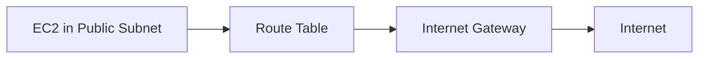
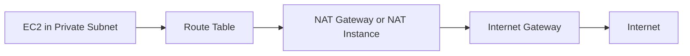

# 108. VPC, Subnets, IGW and NAT

## 🎯 Giới thiệu
Bài học giới thiệu các khái niệm nền tảng của **VPC** và **Subnets**, sau đó giải thích vai trò của **Internet Gateway** và **NAT Gateway / NAT Instance**.

**VPC** là **Virtual Private Cloud**, tức là một private network nằm trong AWS Cloud, cho phép triển khai các resources bên trong nó.

## 1. 📌 VPC là gì?
**VPC** là một private network trong AWS Cloud.

Các điểm chính:

- **VPC** là một resource theo **Region**.
- Nếu sử dụng 2 **AWS Regions**, sẽ có 2 **VPC** khác nhau.
- **VPC** là một logical construct.
- Bên trong **VPC**, bạn triển khai các resources như **EC2 instances**.
- **VPC** có một dải IP gọi là **CIDR range**.
- **CIDR range** là dải IP được phép sử dụng trong **VPC**.

## 2. 📂 Subnets trong VPC
**Subnets** dùng để chia nhỏ network bên trong **VPC**.

Các điểm cần nhớ:

- **Subnets** được định nghĩa ở cấp **Availability Zone / AZ**.
- Một **VPC** có thể có nhiều **Subnets**.
- Có thể launch **EC2 instances** trong subnet mong muốn.
- Subnet đại diện cho một phần chia mạng trong **VPC**.

### Public Subnet
**Public subnet** là subnet có thể truy cập Internet.

- Resources trong public subnet có thể truy cập **World Wide Web**.
- Internet cũng có thể truy cập resources trong public subnet nếu cấu hình cho phép.
- Public subnet có route trực tiếp đến **Internet Gateway**.

### Private Subnet
**Private subnet** là subnet không truy cập trực tiếp từ Internet.

- EC2 instance trong private subnet không được Internet truy cập trực tiếp.
- Mục tiêu là tăng tính bảo mật và giữ private cho resources.
- Private subnet có thể truy cập Internet thông qua **NAT Gateway** hoặc **NAT Instance**.

## 3. 🚦 Route Tables
**Route tables** dùng để định nghĩa network flow:

- Giữa các subnets.
- Từ subnet ra Internet.
- Từ private subnet đi qua **NAT Gateway / NAT Instance**.
- Từ public subnet đi qua **Internet Gateway**.

Nói đơn giản, **route tables** quyết định traffic sẽ đi đâu trong network của **VPC**.

## 4. 🌐 Internet Gateway / IGW
**Internet Gateway** giúp instances trong subnet kết nối với Internet.

Các ý chính:

- **Internet Gateway** nằm ở cấp **VPC**.
- Public subnet có route đến **Internet Gateway**.
- Chính route đến **Internet Gateway** làm cho subnet trở thành **public subnet**.
- EC2 instance trong public subnet có thể đi ra Internet thông qua **Internet Gateway**.

## 5. 🔒 NAT Gateway và NAT Instance
**NAT Gateway** hoặc **NAT Instance** cho phép instances trong **private subnet** truy cập Internet nhưng vẫn private.

Use case trong bài:

- EC2 instance trong private subnet cần truy cập Internet để lấy software updates.
- Nhưng Internet không được truy cập trực tiếp vào EC2 instance đó.

### NAT Gateway
- Được quản lý bởi AWS.
- Không cần tự lo provisioning hoặc scaling.
- Được deploy trong **public subnet**.

### NAT Instance
- Có cùng mục đích với **NAT Gateway**.
- Nhưng là self-managed.
- Người dùng phải tự quản lý.

### Luồng truy cập Internet từ Private Subnet

## 6. 🧱 Default VPC
Bài học nhắc đến **default VPC** được tạo sẵn khi sử dụng AWS Cloud.

Các điểm chính:

- Có một **default VPC** trong mỗi **Region**.
- Default VPC thường có **public subnets**.
- Có một **public subnet per AZ**.
- Trong default VPC, thường không có private subnets.

## 📊 Bảng tóm tắt

| Tiêu chí | Mô tả |
|----------|------|
| **VPC** | Private network trong AWS Cloud |
| Phạm vi VPC | Theo **Region** |
| **Subnet** | Phân chia network bên trong VPC |
| Phạm vi Subnet | Theo **Availability Zone / AZ** |
| **Public Subnet** | Có route đến **Internet Gateway**, có thể truy cập Internet |
| **Private Subnet** | Không truy cập trực tiếp từ Internet |
| **Route Table** | Định nghĩa traffic flow giữa subnets và Internet |
| **Internet Gateway** | Cho public subnet truy cập Internet |
| **NAT Gateway** | AWS-managed, cho private subnet truy cập Internet |
| **NAT Instance** | Self-managed, cùng mục đích với NAT Gateway |
| **Default VPC** | Có sẵn trong mỗi Region, thường có public subnet per AZ |

## 💡 Mẹo ghi nhớ cho kỳ thi AWS
- **Public subnet** = subnet có route đến **Internet Gateway**.
- **Private subnet** = không bị Internet truy cập trực tiếp.
- Private subnet muốn đi ra Internet thì dùng **NAT Gateway** hoặc **NAT Instance**.
- **NAT Gateway** là managed by AWS, còn **NAT Instance** là self-managed.
- **VPC** thuộc **Region**, còn **Subnet** thuộc **AZ**.

## ✅ Kết luận
Bài học giải thích cách **VPC** là private network trong AWS, cách **Subnets** chia nhỏ network theo **AZ**, cách **Internet Gateway** giúp public subnet truy cập Internet, và cách **NAT Gateway / NAT Instance** cho phép private subnet truy cập Internet trong khi vẫn giữ tài nguyên private.
