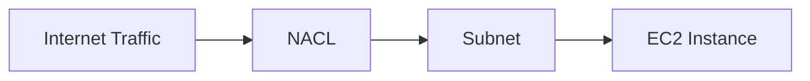
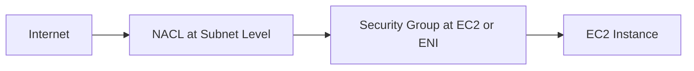
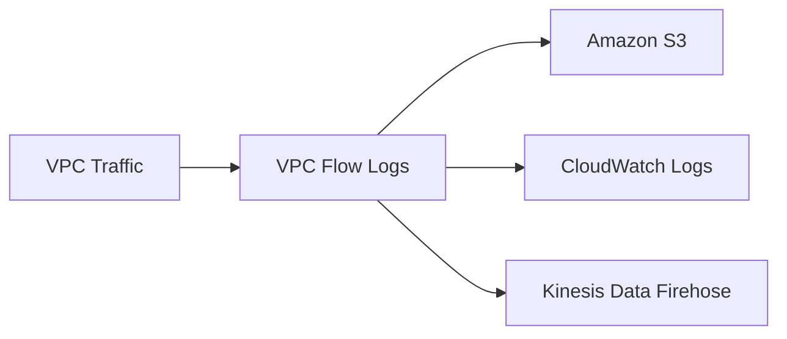

# 109. NACL, SG, VPC Flow Logs

## 🎯 Giới thiệu
Sau khi đã hiểu cách định nghĩa network trong **VPC**, bài học này tập trung vào network security với:

- **Network ACL / NACL**
- **Security Groups / SG**
- **VPC Flow Logs**

Đây là các thành phần quan trọng giúp kiểm soát, bảo vệ và troubleshoot traffic trong **VPC**.

## 1. 🛡️ Network ACL / NACL
**NACL** hay **Network ACL** là firewall kiểm soát traffic **from and to subnets**.

Các điểm chính:

- Gắn ở cấp **subnet level**.
- Có thể có cả **allow rules** và **deny rules**.
- Rules của **NACL** chỉ bao gồm **IP addresses**.
- Có thể explicit allow hoặc explicit deny traffic từ một IP address hoặc nhiều IP addresses.
- Là lớp phòng thủ đầu tiên trước khi traffic đi đến **EC2 instance**.
- Traffic từ Internet vào public subnet sẽ đi qua **NACL** trước.

## 2. 🔒 Security Groups / SG
**Security Groups** là firewall kiểm soát traffic đến và đi từ:

- **ENI / Elastic Network Interface**
- **EC2 instance**

Các điểm chính:

- Gắn vào **EC2 instance** hoặc **ENI**.
- Chỉ có **allow rules**.
- Có thể reference:
  - **IP addresses**
  - Other **Security Groups**
- Là lớp phòng thủ thứ hai sau **NACL**.
- Security Groups đã được học trước đó trong course.

## 3. ⚖️ So sánh NACL và Security Groups
Bài học nhấn mạnh sự khác biệt giữa **NACL** và **Security Groups**.

| Tiêu chí | Security Group | NACL / Network ACL |
|----------|----------------|--------------------|
| Cấp áp dụng | **EC2 instance** hoặc **ENI** | **Subnet level** |
| Loại rules | Chỉ **allow rules** | **Allow rules** và **deny rules** |
| Reference | **IP addresses** hoặc other **Security Groups** | Chỉ **IP addresses** |
| Stateful / Stateless | **Stateful** | **Stateless** |
| Return traffic | Tự động được allow | Cần allow cả inbound và outbound |
| Vai trò | Lớp bảo vệ ở instance/ENI | Lớp bảo vệ đầu tiên ở subnet |

### Stateful vs Stateless
- **Security Group** là **stateful**: nếu traffic đi vào được allow, return traffic sẽ tự động được allow.
- **NACL** là **stateless**: cần cấu hình allow cho cả traffic vào và ra.

## 4. 🧱 Default NACL trong Default VPC
Trong **default VPC**:

- Default **NACL** cho phép mọi traffic đi vào.
- Default **NACL** cho phép mọi traffic đi ra.
- Vì vậy trong course trước đó không cần thay đổi **NACL**.
- Bài này cũng không làm hands-on với **NACL**.

## 5. 📜 VPC Flow Logs
**VPC Flow Logs** dùng để capture thông tin về IP traffic đi vào các interfaces.

Có thể có:

- **VPC Flow Logs**
- **Subnet Flow Logs**
- **ENI Flow Logs / Elastic Network Interface Flow Logs**

Mục đích:

- Monitor traffic trong **VPC**.
- Troubleshoot connectivity issues.
- Kiểm tra tại sao subnet không truy cập được Internet.
- Kiểm tra tại sao subnet có thể hoặc không thể nói chuyện với subnet khác.
- Xem traffic được **allowed** hoặc **denied**.

## 6. 🔎 VPC Flow Logs ghi nhận những gì?
**VPC Flow Logs** có thể capture network information từ các thành phần AWS-managed như:

- **Elastic Load Balancers**
- **ElastiCache**
- **RDS**
- **Aurora**

Khi gặp connectivity issues, bài học khuyên nên xem **VPC Flow Logs** ngay.

## 7. 🚀 Đích gửi dữ liệu VPC Flow Logs
Dữ liệu **VPC Flow Logs** có thể được gửi đến:

- **Amazon S3**
- **CloudWatch Logs**
- **Kinesis Data Firehose**

## 📊 Bảng tóm tắt

| Tiêu chí | Mô tả |
|----------|------|
| **NACL** | Firewall ở **subnet level** |
| NACL rules | **Allow** và **deny** |
| NACL reference | Chỉ **IP addresses** |
| NACL state | **Stateless** |
| **Security Group** | Firewall ở **EC2 instance / ENI** |
| SG rules | Chỉ **allow rules** |
| SG reference | **IP addresses** hoặc other **Security Groups** |
| SG state | **Stateful** |
| **VPC Flow Logs** | Ghi log IP traffic cho **VPC**, **Subnet**, **ENI** |
| Flow Logs destination | **Amazon S3**, **CloudWatch Logs**, **Kinesis Data Firehose** |

## 💡 Mẹo ghi nhớ cho kỳ thi AWS
- **NACL = Subnet level + allow/deny + stateless**.
- **Security Group = EC2/ENI level + allow only + stateful**.
- Nếu cần troubleshoot network traffic trong **VPC**, nghĩ đến **VPC Flow Logs**.
- **VPC Flow Logs** cho biết traffic được allowed hay denied.

## ✅ Kết luận
Bài học giới thiệu 2 lớp bảo vệ trong **VPC**: **NACL** ở cấp subnet và **Security Groups** ở cấp **EC2 instance / ENI**. Ngoài ra, **VPC Flow Logs** giúp ghi nhận network traffic để monitor và troubleshoot connectivity issues trong AWS.
