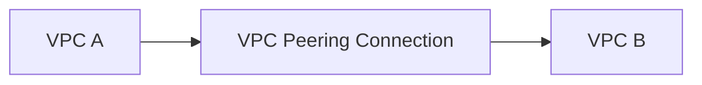
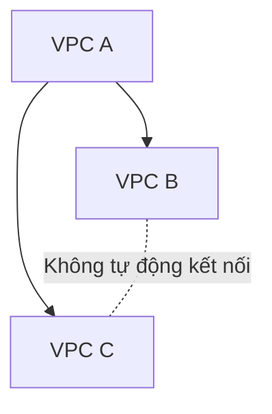
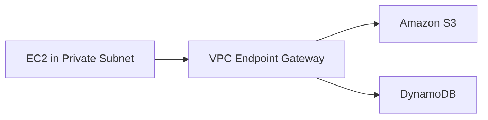
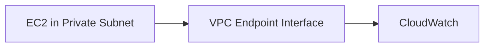
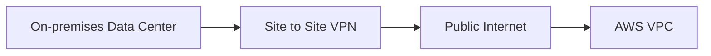
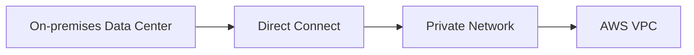

# 110. VPC Peering, Endpoints, VPN, DX

## 🎯 Giới thiệu
Bài học giải thích cách thiết lập connectivity giữa **VPC** và các cấu trúc khác, bao gồm:

- **VPC Peering**
- **VPC Endpoints**
- **Site to Site VPN**
- **Direct Connect / DX**

Mục tiêu là hiểu cách kết nối private giữa các VPC, giữa VPC với AWS services, và giữa on-premises data center với AWS.

## 1. 🔗 VPC Peering
**VPC Peering** dùng để kết nối 2 **VPC** với nhau một cách private thông qua AWS network.

Use case trong bài:

- Có **VPC A** và **VPC B**.
- Chúng có thể ở:
  - 2 accounts khác nhau.
  - 2 Regions khác nhau.
- Muốn chúng hoạt động như thể nằm trong cùng một network.
- Cần tạo **VPC Peering connection** giữa A và B.

### Điều kiện quan trọng
Để kết nối được 2 VPC:

- IP ranges của 2 VPC không được overlap.
- Nếu IP ranges overlap, network sẽ không biết phải route đến đâu.
- Vì vậy, các VPC cần có dải IP khác nhau.

## 2. ⚠️ VPC Peering không transitive
**VPC Peering** là **not transitive**.

Ví dụ:

- **VPC A** peering với **VPC B**.
- **VPC A** peering với **VPC C**.
- Điều đó không có nghĩa là **VPC B** có thể nói chuyện với **VPC C**.

Nếu muốn **VPC B** giao tiếp với **VPC C**, cần tạo riêng một **VPC Peering connection** giữa B và C.

## 3. 🚪 VPC Endpoints
**VPC Endpoints** cho phép kết nối đến AWS services bằng private network thay vì public internet.

Các ý chính:

- AWS services là public.
- EC2 instances thường nói chuyện với AWS services qua public network.
- Khi EC2 instances nằm trong private subnet và không muốn đi qua public internet, dùng **VPC Endpoint**.
- **VPC Endpoint** giúp tăng security và giảm latency khi access AWS services.
- Khi đề thi hỏi private connection từ trong VPC đến AWS service, đáp án thường là **VPC Endpoint**.

## 4. 🧭 VPC Endpoint Gateway
**VPC Endpoint Gateway** được dùng cho:

- **Amazon S3**
- **DynamoDB**

Luồng trong bài:

Điểm cần nhớ:

- Traffic không đi qua Internet.
- EC2 instance truy cập **S3** và **DynamoDB** một cách private.

## 5. 🔌 VPC Endpoint Interface
**VPC Endpoint Interface** dùng cho các AWS services còn lại.

Ví dụ trong bài:

- Tạo **VPC Endpoint Interface** trong private subnet.
- Endpoint này sử dụng **ENI**.
- EC2 instance có private access đến **CloudWatch**.

## 6. 🏢 Site to Site VPN
**Site to Site VPN** dùng để kết nối **on-premises data center** với **AWS VPC**.

Đặc điểm:

- Kết nối từ on-premises **VPN appliance** đến AWS.
- Connection được tự động encrypted.
- Traffic đi qua **public Internet**.
- Dễ thiết lập và nhanh.
- Có thể setup trong vài phút.
- Đây là encrypted connection qua public Internet đến **VPC**.

## 7. ⚡ Direct Connect / DX
**Direct Connect** cũng dùng để kết nối **on-premises data center** với **AWS VPC**, nhưng theo cách khác.

Đặc điểm:

- Là physical connection.
- Không đi qua public Internet.
- Private connection.
- Secure và fast.
- Đi qua private network.
- Mất ít nhất khoảng 1 tháng để thiết lập vì cần có công việc triển khai private connectivity đến AWS.

## 8. ⚖️ So sánh Site to Site VPN và Direct Connect

| Tiêu chí | Site to Site VPN | Direct Connect |
|----------|------------------|----------------|
| Mục đích | Kết nối on-premises với AWS VPC | Kết nối on-premises với AWS VPC |
| Đường truyền | Qua **public Internet** | Qua **private network** |
| Bảo mật | Automatically encrypted | Private, secure |
| Tốc độ triển khai | Nhanh, vài phút | Ít nhất khoảng 1 tháng |
| Kiểu kết nối | VPN connection | Physical connection |
| Tính chất | Dễ setup, nhanh | Secure và fast hơn theo private route |

## 📊 Bảng tóm tắt

| Thành phần | Mô tả |
|------------|------|
| **VPC Peering** | Kết nối private giữa 2 VPC |
| Điều kiện VPC Peering | IP ranges không được overlap |
| VPC Peering transitive? | Không, **not transitive** |
| **VPC Endpoint** | Private access từ VPC đến AWS services |
| **Endpoint Gateway** | Dùng cho **S3** và **DynamoDB** |
| **Endpoint Interface** | Dùng cho các services khác, ví dụ **CloudWatch**, qua **ENI** |
| **Site to Site VPN** | Encrypted connection qua public Internet |
| **Direct Connect / DX** | Physical private connection, secure và fast |

## 💡 Mẹo ghi nhớ cho kỳ thi AWS
- **VPC Peering**: nhớ **không overlap IP** và **not transitive**.
- Private access từ **VPC** đến AWS services = **VPC Endpoint**.
- **Gateway Endpoint** = **S3 + DynamoDB**.
- **Interface Endpoint** = services khác, ví dụ **CloudWatch**, dùng **ENI**.
- On-premises đến AWS nhanh qua Internet encrypted = **Site to Site VPN**.
- On-premises đến AWS private physical connection = **Direct Connect**.

## ✅ Kết luận
Bài học trình bày các lựa chọn connectivity quan trọng trong AWS. **VPC Peering** kết nối các VPC với điều kiện IP không overlap và không transitive. **VPC Endpoints** cho phép private access đến AWS services. **Site to Site VPN** kết nối on-premises với AWS qua public Internet có encryption, còn **Direct Connect** cung cấp physical private connection secure và fast nhưng cần nhiều thời gian để thiết lập.
