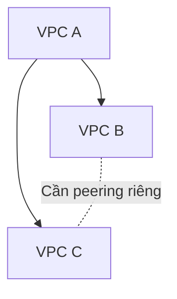
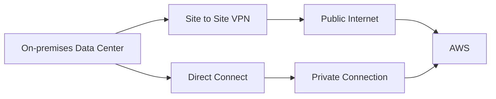

# 111. VPC Cheat Sheet & Closing Comments

## 🎯 Giới thiệu
Đây là bài tổng kết section **VPC Fundamentals**. Giảng viên nhấn mạnh section này khá nặng và không có hands-on, nhưng với **AWS Certified Developer**, bạn chỉ cần nhớ một số concepts chính để xử lý các câu hỏi về **VPC** trong exam.

## 1. 📌 VPC / Virtual Private Cloud
**VPC** là viết tắt của **Virtual Private Cloud**.

Các điểm cần nhớ:

- Course đã sử dụng **default VPC** khi tạo **EC2 instances**.
- Có một **default VPC** cho mỗi **AWS Region** đang sử dụng.
- **VPC** là nền tảng network để triển khai resources trong AWS.

## 2. 📂 Subnets
**Subnets** là network partition của **VPC**.

Các điểm chính:

- **Subnets** gắn với một **Availability Zone** cụ thể.
- Đây là nơi launch **EC2 instances**.
- Subnet chia nhỏ network bên trong **VPC**.

## 3. 🌐 Internet Gateway
**Internet Gateway** cho phép instances trong **public subnets** truy cập Internet.

Các điểm chính:

- Được định nghĩa ở cấp **VPC level**.
- Giúp public subnet có Internet access.

## 4. 🔒 NAT Gateways và NAT Instances
**NAT Gateways** và **NAT Instances** cung cấp Internet access cho **private subnets**.

Các điểm chính:

- EC2 instances trong private subnets có thể đi ra Internet.
- Private subnets vẫn giữ tính private, không bị truy cập trực tiếp từ Internet.

## 5. 🛡️ NACL và Security Groups
### NACL / Network ACL
- Là firewall rules ở cấp **subnet**.
- **Stateless**.
- Có rules cho cả **inbound** và **outbound**.

### Security Groups
- Là firewall ở cấp **EC2 instance** hoặc **ENI**.
- **Stateful**.
- Có thể reference other **Security Groups**.

## 6. 🔗 VPC Peering
**VPC Peering** cho phép kết nối 2 **VPC** với nhau.

Các điểm cần nhớ:

- 2 VPC được kết nối phải có IP ranges không overlap.
- **VPC Peering** là **not transitive**.
- Nếu muốn nhiều VPC kết nối với nhau, cần tạo peering connection giữa từng cặp VPC cần giao tiếp.

## 7. 🚪 VPC Endpoints
**VPC Endpoints** cung cấp private access đến AWS services từ bên trong **VPC**.

Các điểm chính:

- Không cần đi qua public Internet.
- Sẽ được gặp lại trong các bài sau với một số services.
- Đây là khái niệm quan trọng khi cần private access đến AWS services.

## 8. 📜 VPC Flow Logs
**VPC Flow Logs** cung cấp network traffic logs.

Mục đích:

- Debug khi gặp **access denied**.
- Debug khi traffic bị block hoặc allowed trong **VPC**.
- Theo dõi network traffic trong VPC.

## 9. 🏢 Kết nối On-premises Data Center đến AWS
Có 2 cách chính được nhắc lại:

### Site to Site VPN
- VPN connection qua **public Internet**.
- Dùng để kết nối on-premises data center với AWS.

### Direct Connect
- Direct private connection đến AWS.
- Dùng khi muốn private connection thay vì đi qua public Internet.

## 📊 Bảng tóm tắt nhanh

| Thành phần | Cần nhớ |
|------------|---------|
| **VPC** | **Virtual Private Cloud**, có **default VPC** trong mỗi Region |
| **Subnets** | Gắn với **Availability Zone**, là network partition của VPC |
| **Internet Gateway** | Cho **public subnets** truy cập Internet |
| **NAT Gateway / NAT Instance** | Cho **private subnets** truy cập Internet |
| **NACL** | Stateless firewall rules ở subnet level |
| **Security Groups** | Stateful firewall ở EC2 instance hoặc ENI level |
| **VPC Peering** | Kết nối 2 VPC, không overlap IP, **not transitive** |
| **VPC Endpoints** | Private access đến AWS services trong VPC |
| **VPC Flow Logs** | Network traffic logs để debug allowed/blocked traffic |
| **Site to Site VPN** | VPN connection qua public Internet |
| **Direct Connect** | Direct private connection đến AWS |

## 💡 Mẹo ghi nhớ cho kỳ thi AWS
- **VPC = network container** trong AWS.
- **Subnet = nằm trong AZ**.
- **Public subnet = Internet Gateway**.
- **Private subnet đi Internet = NAT Gateway / NAT Instance**.
- **NACL = subnet + stateless**.
- **Security Group = EC2/ENI + stateful**.
- **VPC Endpoint = private access đến AWS services**.
- **Site to Site VPN = public Internet encrypted**.
- **Direct Connect = private direct connection**.

## ✅ Kết luận
Bài học tổng kết toàn bộ section **VPC Fundamentals**. Với kỳ thi **AWS Certified Developer**, bạn không cần quá căng thẳng về chi tiết sâu, nhưng cần nhớ các khái niệm chính: **VPC**, **Subnets**, **Internet Gateway**, **NAT Gateway / NAT Instance**, **NACL**, **Security Groups**, **VPC Peering**, **VPC Endpoints**, **VPC Flow Logs**, **Site to Site VPN** và **Direct Connect**.
