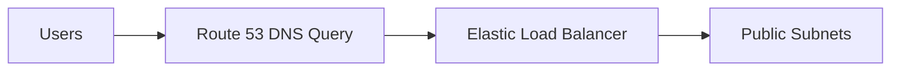
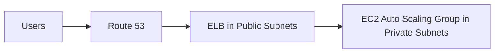
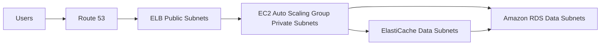
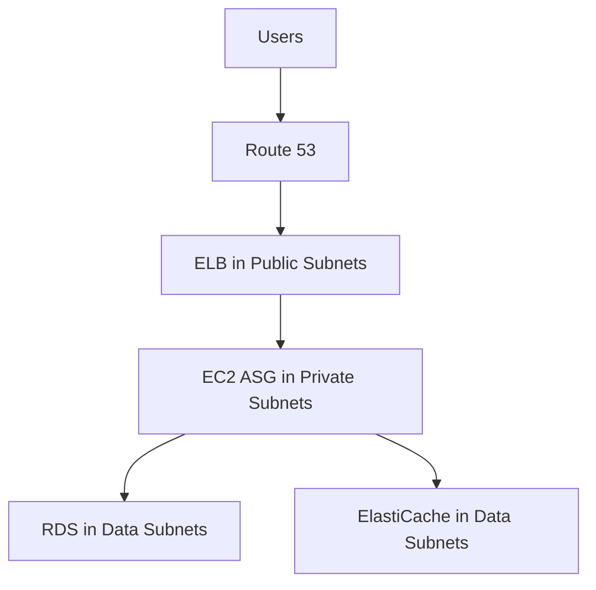
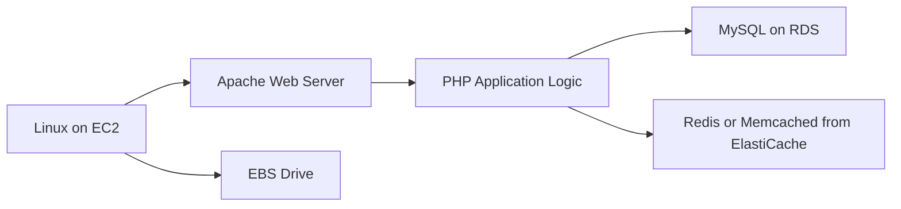
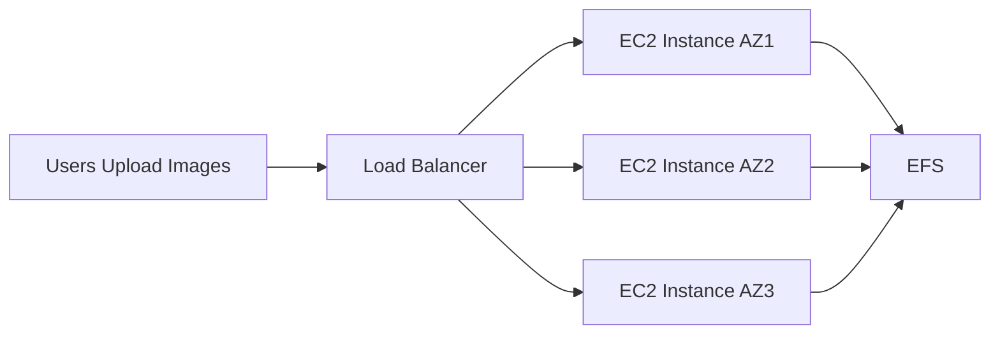

# 112. Three Tier Architecture

## 🎯 Giới thiệu
Bài học giải thích lý do cần học các khái niệm **VPC**: để hiểu kiến trúc phổ biến **Three Tier Solution Architecture** trên AWS.

Kiến trúc này thường xuất hiện trong các scenario questions ở kỳ thi.

## 1. 🌐 Tier 1: Load Balancer Tier
Người dùng muốn truy cập web application, vì vậy kiến trúc sử dụng **Elastic Load Balancer / ELB**.

Các điểm chính:

- **ELB** được spread across multiple **Availability Zones**.
- Vì **ELB** cần publicly accessible nên được deploy trong **public subnets**.
- Người dùng truy cập **ELB** thông qua DNS query.
- **Route 53** được dùng để biết vị trí của **ELB**.
- Sau đó user trực tiếp nói chuyện với **Elastic Load Balancer**.

## 2. 🖥️ Tier 2: Application / Compute Tier
**Elastic Load Balancer** phân phối traffic đến **EC2 instances**.

Các điểm chính:

- **EC2 instances** nằm trong **Auto Scaling Group**.
- **Auto Scaling Group** được deploy trong **private subnets**.
- Lý do: compute tier không cần public access từ Internet, chỉ cần nhận traffic từ **ELB**.
- Kiến trúc có 3 **AZ** với **EC2 instances** trong mỗi AZ.
- **ELB** có thể gửi traffic từ public subnet đến private subnet thông qua **route tables**.
- Compute side được isolate trong private subnets nên secure hơn.

## 3. 💾 Tier 3: Data Tier
Data tier là private subnet sâu hơn, đôi khi được gọi là **data subnets**.

Các thành phần trong data tier:

- **Amazon RDS**
- **ElastiCache**

### Amazon RDS
- Được dùng làm database.
- Hỗ trợ đọc và ghi data.
- **EC2 instances** kết nối đến **RDS**.

### ElastiCache
- Có thể cache data từ **RDS**.
- Có thể store và retrieve in-memory session data của **EC2 instances** cho web application.

## 4. 🧱 Tổng quan Three Tier Solution Architecture
Kiến trúc gồm 3 tầng:

1. **Load Balancer Tier**
   - Publicly accessible.
   - Chứa **Elastic Load Balancer** trong public subnets.

2. **Application / Compute Tier**
   - Private.
   - Chứa **EC2 instances** trong **Auto Scaling Group**.

3. **Data Tier**
   - Private hơn, còn gọi là **data subnets**.
   - Chứa **Amazon RDS** và **ElastiCache**.

## 5. 🐧 LAMP Stack on EC2
Bài học cũng nhắc đến **LAMP Stack on EC2**.

**LAMP** gồm:

| Thành phần | Ý nghĩa trong bài |
|------------|-------------------|
| **Linux** | Operating system dùng cho **EC2 instances** |
| **Apache** | Web server chạy trên Linux trên EC2 |
| **MySQL** | Database, có thể dùng **MySQL on RDS** |
| **PHP** | Application logic để render web pages, chạy trên EC2 |

Có thể bổ sung:

- **Redis** hoặc **Memcached** từ **ElastiCache** để thêm caching technology.
- **EBS drive** attached to **EC2 instances** để store data locally, cache locally, application data hoặc software.

## 6. 📝 Wordpress on AWS
Bài học đưa ra ví dụ triển khai **Wordpress on AWS**.

Kiến trúc đơn giản gồm:

- **Load balancer tier**
- **Application tier**

Use case:

- Users gửi images đến **EC2 instances** thông qua **load balancer**.
- Các **EC2 instances** cần share images với nhau.
- Use case phù hợp là **EFS**.

### Vì sao dùng EFS?
**EFS** là network file system / network drive.

- Tạo **Elastic Network Interfaces** trong mỗi **AZ**.
- EC2 instances có thể store images trên **EFS**.
- Các EC2 instances khác cũng có thể access images đó.

## 7. 🧩 Full Wordpress Architecture trên AWS
Bài học nhắc rằng AWS website có một full architecture cho Wordpress.

Các thành phần được nhắc đến:

- **NAT gateways**
- **Internet gateways**
- **Auto Scaling Groups**
- Different **subnets**
- **Aurora**
- **EFS**
- **CloudFront**
- **S3**

Giảng viên lưu ý:

- Đến thời điểm này, bạn nên hiểu gần như toàn bộ architecture.
- Những thứ chưa cần hiểu ngay là **CloudFront** và **S3**, sẽ được học sau.

## 📊 Bảng tóm tắt nhanh

| Tiêu chí | Mô tả |
|----------|------|
| Kiến trúc chính | **Three Tier Solution Architecture** |
| Tier 1 | **ELB** trong **public subnets** |
| Tier 2 | **EC2 Auto Scaling Group** trong **private subnets** |
| Tier 3 | **RDS** và **ElastiCache** trong **data subnets** |
| DNS | **Route 53** dùng để resolve đến **ELB** |
| Bảo mật | Compute tier không public, chỉ nhận traffic từ **ELB** |
| LAMP | **Linux**, **Apache**, **MySQL**, **PHP** |
| Caching | **Redis** hoặc **Memcached** từ **ElastiCache** |
| Local storage | **EBS drive** attached to EC2 |
| Wordpress shared files | Dùng **EFS** để share images giữa EC2 instances |
| Architecture mở rộng | Có thể có **NAT gateways**, **Internet gateways**, **Auto Scaling Groups**, **Aurora**, **EFS**, **CloudFront**, **S3** |

## 💡 Mẹo ghi nhớ cho kỳ thi AWS
- **Three Tier Architecture** thường xuất hiện trong scenario questions.
- **ELB** public, **EC2 ASG** private, **RDS/ElastiCache** ở data subnets.
- Web traffic đi: **Users → Route 53 → ELB → EC2 ASG → RDS/ElastiCache**.
- Wordpress cần share uploaded images giữa EC2 instances thì dùng **EFS**.
- **LAMP** = **Linux + Apache + MySQL + PHP**.

## ✅ Kết luận
Bài học kết nối các khái niệm **VPC**, **Subnets**, **Route Tables**, **ELB**, **Auto Scaling Group**, **RDS**, **ElastiCache**, **EFS** vào các kiến trúc thực tế. Kiến trúc **Three Tier Solution Architecture** là mô hình quan trọng cần nhớ cho exam: **ELB** ở public subnets, **EC2 Auto Scaling Group** ở private subnets, và **RDS / ElastiCache** ở data subnets.
