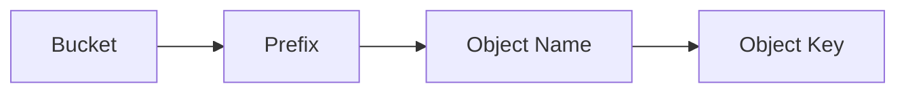

# 113. S3 Overview

## 🎯 Giới thiệu

Amazon S3 là một trong các building block chính của AWS, được giới thiệu như dịch vụ lưu trữ có khả năng mở rộng gần như vô hạn. Rất nhiều website và dịch vụ AWS sử dụng Amazon S3 làm nền tảng lưu trữ hoặc tích hợp.

## 1. 📌 Use Cases của Amazon S3

- Backup và storage cho files hoặc disks.
- Disaster Recovery bằng cách đưa dữ liệu sang region khác.
- Archival để lưu trữ lâu dài và truy xuất sau với chi phí thấp hơn.
- Hybrid Cloud Storage cho dữ liệu on-premises mở rộng lên cloud.
- Host applications và media như video, images.
- Data Lake cho Big Data Analytics.
- Deliver software updates.
- Hosting static websites.

Ví dụ trong transcript:

- NASDAQ lưu trữ 7 năm dữ liệu trong S3 Glacier.
- Sysco chạy analytics trên dữ liệu để lấy business insights từ Amazon S3.

## 2. 📂 Buckets

- Amazon S3 lưu objects/files trong buckets.
- Bucket giống như directory trong cloud.
- Bucket được định nghĩa ở cấp region.
- S3 có global interface để xem buckets ở nhiều regions, nhưng từng bucket vẫn thuộc một region cụ thể.

### Bucket Naming

- Trước đây bucket name cần globally unique trên toàn thế giới, mọi regions và mọi accounts.
- Hiện có Account Regional namespace:
  - Cho phép dùng lại cùng bucket name giữa regions/accounts.
  - AWS thêm suffix để đảm bảo bucket name đầy đủ là duy nhất.

### Naming Constraints

- Không dùng uppercase.
- Không dùng underscore.
- Không đặt giống IP address.
- Phải bắt đầu bằng lowercase letter hoặc number.
- Không bắt đầu bằng prefix `XN`.
- Không kết thúc bằng suffix `-s3alias`.
- Cách an toàn: dùng letters và numbers, giữ tên đơn giản.

## 3. 💾 Objects và Keys

- Object là file được lưu trong S3.
- Mỗi object có key.
- Object key là full path của file.

Ví dụ:

- `my_file.txt` là key ở top-level bucket.
- `my_folder/another_folder/my_file.txt` là key có prefix và object name.

Trong S3, không có khái niệm directory thật sự:

- Console UI có thể hiển thị như folders.
- Thực tế mọi thứ là key.
- Key có thể chứa slash `/`.
- Key gồm prefix và object name.

## 4. 🔎 Object Details

- Object value là nội dung/body của file.
- Max object size trong transcript: 50 TB.
- Nếu file lớn hơn 5 GB, phải dùng Multi-Part Upload.
- Ví dụ file 5 TB cần ít nhất 1.000 parts, mỗi part 5 GB.

Object có thể có:

- Metadata: key-value pairs, do system hoặc user set.
- Tags: Unicode key-value pairs, tối đa 10 tags.
- Tags hữu ích cho security và lifecycles.
- Version ID nếu bật versioning.

## 📊 Bảng tóm tắt

| Tiêu chí | Mô tả |
|----------|------|
| Dịch vụ | Amazon S3 |
| Mục đích chính | Storage cho objects/files |
| Container | Bucket |
| Phạm vi bucket | Region level |
| Object identifier | Key, gồm prefix và object name |
| Folder trong S3 | Chỉ là cách UI hiển thị key có slash |
| File lớn hơn 5 GB | Phải dùng Multi-Part Upload |
| Metadata | Key-value pairs |
| Tags | Tối đa 10 Unicode key-value pairs |

## 💡 Mẹo ghi nhớ cho kỳ thi AWS

- S3 bucket thuộc region, dù console có global interface.
- S3 không có directory thật; hãy nghĩ mọi object là một key.
- File > 5 GB cần Multi-Part Upload.
- Tags trong S3 quan trọng cho security và lifecycles.

## ✅ Kết luận

Amazon S3 là dịch vụ object storage cốt lõi của AWS. Cần nắm rõ buckets, objects, keys, prefix, object name, naming rules, metadata, tags và Multi-Part Upload để học các phần S3 tiếp theo.
