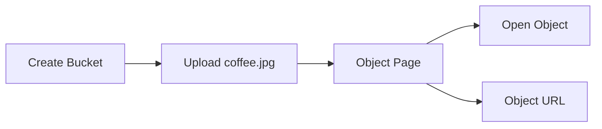
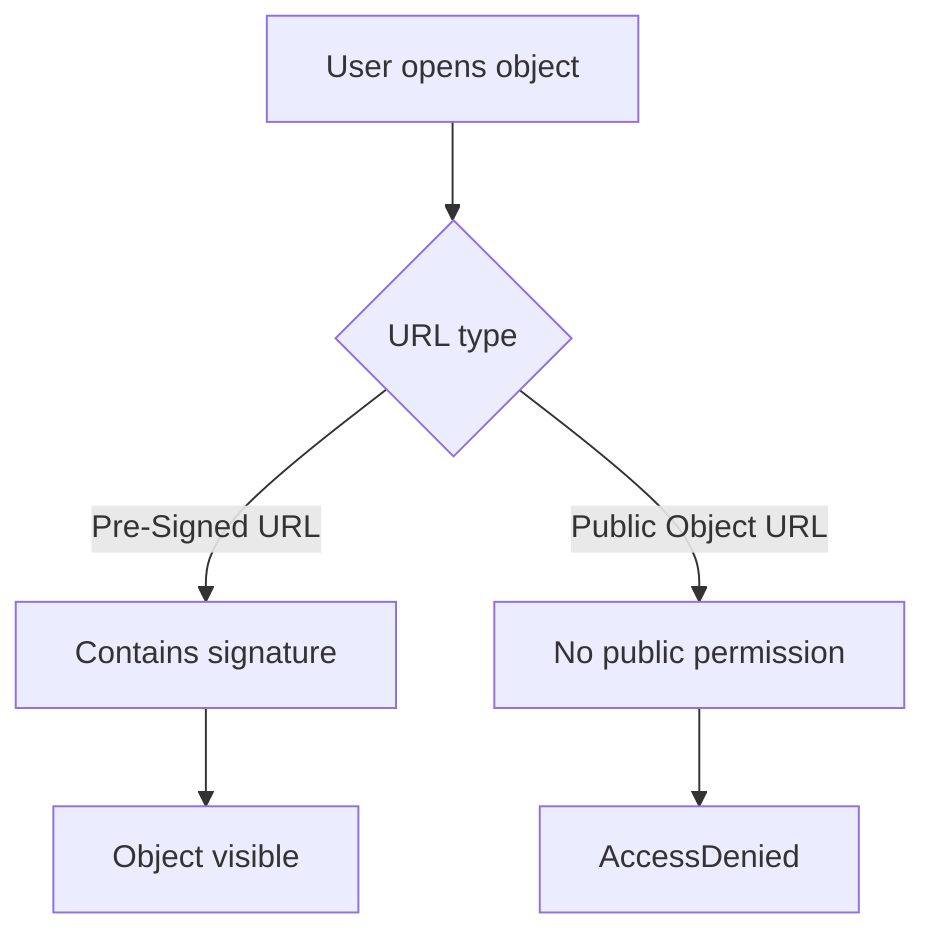

# 114. S3 Hands On

## 🎯 Giới thiệu

Bài thực hành tạo S3 bucket, upload objects, xem object bằng pre-signed URL, hiểu vì sao public URL bị `AccessDenied`, tạo folder và xóa folder trong Amazon S3.

## 1. 📂 Tạo S3 Bucket

Khi tạo bucket:

- Bucket được tạo trong một region cụ thể, ví dụ Europe (Ireland) `eu-west-1`.
- Có thể đổi region ở region selector.
- Bucket type gồm:
  - General purpose: loại phổ biến và được khuyến nghị cho hầu hết access patterns.
  - Directory: dùng cho low-latency use cases, không dùng trong demo.

### Namespace

- Global namespace: bucket name phải globally unique.
- Account Regional namespace:
  - Có suffix gồm account và region.
  - Đảm bảo bucket name đầy đủ có thể dùng được.
  - Được giới thiệu là cách được khuyến nghị về sau trong transcript.

## 2. 🔒 Cấu hình bảo mật mặc định

Trong demo, các thiết lập được giữ gần như mặc định:

- Object Ownership: ACL disabled, được khuyến nghị.
- Block all public access: bật để tăng bảo mật.
- Bucket Versioning: tắt, sẽ học sau.
- Tags: không cần trong demo.
- Default encryption: server-side encryption với Amazon S3 managed key.
- Bucket Key: bật.

⚠️ Ý chính: bucket ban đầu không public, chỉ người có quyền mới upload/xem được object.

## 3. 💾 Upload Object

Luồng thực hành:

- Upload file `coffee.jpg` vào bucket.
- Object xuất hiện trong tab Objects.
- Object page hiển thị thông tin như upload time, size, type và object URL.

## 4. 🔐 Public URL vs Pre-Signed URL

Khi click `Open`, file hiển thị được vì URL là S3 pre-signed URL:

- URL dài và có signature.
- Signature xác minh người request có credentials hợp lệ.
- S3 cho phép hiển thị vì người dùng có quyền xem object của mình.

Khi dùng object URL public:

- Trả về `AccessDenied`.
- Lý do: bucket/object chưa được public.

## 5. 📁 Folders trong S3 Console

- Tạo folder `images`.
- Upload `beach.jpg` vào folder đó.
- Console hiển thị trải nghiệm giống cloud storage quen thuộc.
- Có thể xóa folder và mọi object bên trong.
- Khi xóa trong demo, cần nhập `permanently delete`.

## 📊 Bảng tóm tắt

| Tiêu chí | Mô tả |
|----------|------|
| Bucket type dùng trong demo | General purpose |
| Namespace mới | Account Regional namespace |
| Object Ownership | ACL disabled |
| Public access ban đầu | Blocked |
| Encryption | Server-side encryption với Amazon S3 managed key |
| URL mở được | S3 pre-signed URL |
| Public Object URL | Bị `AccessDenied` nếu bucket chưa public |

## 💡 Mẹo ghi nhớ cho kỳ thi AWS

- `Open` trong console có thể dùng pre-signed URL nên xem được object dù object chưa public.
- Public URL chỉ hoạt động nếu bucket/object được cấp quyền public phù hợp.
- ACL disabled là thiết lập được khuyến nghị trong demo.

## ✅ Kết luận

Bài hands-on cho thấy cách tạo bucket, upload object, phân biệt pre-signed URL với public URL, và thao tác folder trong S3 console. Điểm quan trọng là S3 mặc định bảo mật: object không public nếu chưa cấu hình quyền public.
